<!-- SLIDE 1: Title -->
# Factuality Degradation in Iterative LLM Rewriting

### Pilot Results — 15 Questions · MuSiQue Dataset

 

**Anna Sacchet** &nbsp;·&nbsp; 2026-05-05

---

<!-- SLIDE 2: Research Questions -->
## Research Questions

RQ1 — Baseline degradation

<b>When an LL
M rewrites the same text multiple times (t₀ → t₃), does the factual accuracy of the text get worse
over time? How much does it change, and how
fast?</b> 

RQ2 — Instruction factors

<b>Does the type of rewriting instruction (style-oriented vs. content-oriented) affect how much factual
accuracy is lost? Does the complexity of the original text (2-hop, 3-hop, or 4-hop) also play a role?</b> 

RQ3 — Intervention

<b>If we add a Self-Refine cycle after each rewriting step — where the model checks its own output and
corrects factual errors — does this reduce the factual degradation compared to rewriting without any
correction?</b> 

---

<!-- SLIDE 3: Setup part 1 -->
## Experimental Setup

**Dataset:** MuSiQue (Trivedi et al., 2022) — multi-hop QA.
Each question requires connecting 2, 3, or 4 facts distributed across separate paragraphs.

**Input text E₀:** 20 paragraphs per question — 2–4 *supporting* + 16–18 *distractors*

**Pilot:** 15 questions · 5×2-hop · 5×3-hop · 5×4-hop · seed = 42

**Rewriting pipeline:** E₀ → E₁ → E₂ → E₃ — same instruction applied at each step

**Scale:** 15 questions × 4 instructions × 3 wordings = **180 chains** · 720 rewrites

---

<!-- SLIDE 3b: Instruction wordings -->
## The 3 Wordings per Instruction

| Group | Instruction | Run 0 | Run 1 | Run 2 |
|-------|-------------|-------|-------|-------|
| **Style** | `formality` | "Make the text more formal." | "Rephrase it to be more formal." | "Too conversational, rephrase it to be more formal." |
| **Style** | `paraphrase` | "Paraphrase this." | "Reword this text." | "Use different wording." |
| **Content** | `elaborate` | "Elaborate on the content, adding relevant details while staying faithful to the source text." | "Expand the text with more context, without introducing information that is not supported by the original." | "Add more detail, keeping every fact grounded in the source material." |
| **Content** | `shorten` | "Make wording more concise." | "Rephrase for clarity and conciseness." | "Improve accuracy, clarity, and conciseness of language." |

Wordings drawn from OpenRewriteEval (Shu et al., 2023). Each run uses a different surface form of the same instruction to reduce prompt sensitivity.

---

<!-- SLIDE 3c: OpenFactScore intro -->
## From FActScore to OpenFactScore

> Lage, L. F. & Ostermann, S. (2025). *OpenFActScore: Open-Source Atomic Evaluation of Factuality in Text Generation.* Philipps-Universität Marburg · DFKI · Saarland University.

**FActScore** (Min et al., 2023) evaluates factuality as a two-stage pipeline:
1. **AFG** — Atomic Fact Generation: decompose text into individual atomic claims
2. **AFV** — Atomic Fact Validation: verify each claim against a trusted knowledge source

Score = proportion of atomic claims supported by the knowledge source.

**OpenFactScore** replaces the original closed models (InstructGPT, ChatGPT) with open-source models for both AFG and AFV.

| Component | Original FActScore | OpenFactScore |
|-----------|:-----------------:|:------------:|
| AFG | InstructGPT | OLMo-2-1124-7B-SFT |
| AFV | GPT-4o mini | Gemma-3-4b-it |
| Knowledge source | Wikipedia | E₀ (original paragraphs) |

- OFS become reproducible and also no API costs. Gemma+OLMo achieves **0.99 Pearson correlation** with original FActScore
- Using E₀ as knowledge source measures grounding in the source text directly *(this is supported and documented in the repository)*

---

<!-- SLIDE 4: Metrics -->
## Metrics: Three Complementary Perspectives

**OpenFactScore** *(direct fact verification)*
Eₜ is decomposed into atomic claims (AFG: OLMo-2-1124-7B-SFT), each verified against E₀ as the knowledge source (AFV: Gemma-3-4b-it). Score = proportion of claims supported by E₀.

**BERTScore** *(semantic drift)*
Cosine similarity between Eₜ and E₀ in RoBERTa-large embedding space (layer 17).
Two modes: *baseline* sim(Eₜ, E₀) measures cumulative drift; *consecutive* sim(Eₜ, Eₜ₋₁) measures single-step change.

**Answer F1** *(indirect, task-based)*
The rewritten text Eₜ is given to a QA model (OLMo-3.1-32B-Instruct), which answers the original question. Token-level F1 vs. the gold answer (SQuAD-style normalization).

---

<!-- SLIDE 5: Why not E0 -->
## QA Performance on E₀: A Problematic Baseline

At step 0, F1 is already low — not because the facts are missing, but because the QA model struggles to answer from E₀. MuSiQue is a hard dataset by design: the best model achieves only ~47 F1 (Trivedi et al., 2022).

Of the 180 chains, only **84 are answerable** (F1 > 0 at step 1) and are used in all subsequent analyses. The remaining 96 have F1 = 0 at step 1 and are excluded.

| Hop | Mean F1 at step 0 | Questions with F1 = 0 |
|-----|:-----------------:|:---------------------:|
| 2-hop | 0.400 | 3 / 5 |
| 3-hop | 0.189 | 3 / 5 |
| 4-hop | 0.280 | 2 / 5 |
| **Overall** | **0.290** | **8 / 15** |

In 11 out of 96 chains with F1=0 at step 1, F1 rises at a later step — possibly because a subsequent rewrite produces a style the QA model handles better, rather than because the facts themselves return.

---

<!-- SLIDE 7: Token count -->
## How Much Does the Text Change in Length?

| Instruction | Group | Step 0 | Step 1 | Step 2 | Step 3 |
|-------------|:-----:|:------:|:------:|:------:|:------:|
| `elaborate` | Content | 2311 | 1506 | 1543 | 1638 |
| `formality` | Style | 2311 | 1310 | 1229 | 1197 |
| `paraphrase` | Style | 2311 | 926 | 830 | 788 |
| `shorten` | Content | 2311 | 603 | 505 | 464 |

All instructions compress E₀ drastically at step 1 — from ~2311 tokens to 464–1506. 

- **`elaborate`** is the only instruction that grows after step 1 (1506 → 1638)
- **`shorten`** reaches 464 tokens by step 3 — 80% compression from E₀. 
- **`paraphrase` and `formality`** continue to shrink slightly, converging toward a stable length.

---

<!-- SLIDE 8: OFS — graph -->
## OpenFactScore by Instruction Type

OFS answers: *"are the claims in the rewritten text still grounded in E₀?"*

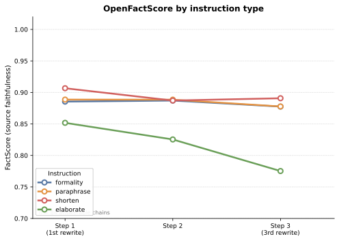

Proportion of atomic claims in Eₜ supported by E₀ · AFG: OLMo-2-1124-7B-SFT · AFV: Gemma-3-4b-it · 84 answerable chains

---

<!-- SLIDE 9: OFS — interpretation -->
## OpenFactScore: What Each Instruction Does

| Instruction | Step 1 | Step 2 | Step 3 | Drop |
|-------------|:------:|:------:|:------:|:----:|
| `paraphrase` | 0.889 | 0.889 | 0.878 | −0.011 |
| `formality` | 0.885 | 0.887 | 0.878 | −0.008 |
| `shorten` | 0.907 | 0.887 | 0.891 | −0.016 |
| `elaborate` | 0.852 | 0.825 | 0.775 | **−0.076** |

- **`paraphrase` and `formality`**: OFS drops slightly but remains high (≥0.878). Style rewrites introduce few unsupported claims.
- **`shorten`**: small OFS drop (−0.016). Compression *removes* content but does not *invent* new content.
- **`elaborate`**: steady decline, accelerating at step 3 (−0.076 total). Each elaboration step adds details that E₀ does not support.

---

<!-- SLIDE 10: BERTScore vs E0 — by instruction graph -->
## BERTScore sim(Eₜ, E₀) — Drift by Instruction

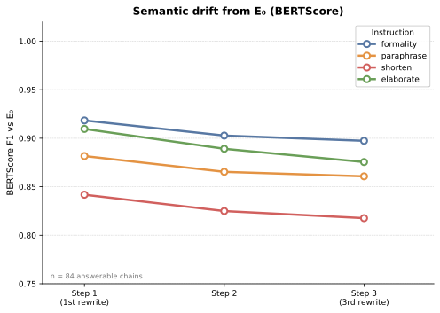

BERTScore F1 sim(Eₜ, E₀) — cumulative drift from the original · roberta-large layer 17 · 84 answerable chains

---

<!-- SLIDE 10b: BERTScore vs E0 — by instruction table -->
## BERTScore sim(Eₜ, E₀) — Numbers by Instruction

| Instruction | Step 1 | Step 2 | Step 3 | Total drift |
|-------------|:------:|:------:|:------:|:-----------:|
| `formality` | 0.918 | 0.903 | 0.897 | −0.021 |
| `elaborate` | 0.910 | 0.889 | 0.875 | −0.035 |
| `paraphrase` | 0.882 | 0.865 | 0.861 | −0.021 |
| `shorten` | 0.842 | 0.825 | 0.818 | −0.024 |

All instructions drift away from E₀ monotonically. `shorten` starts furthest (0.842) — the aggressive compression already diverges structurally at step 1. `elaborate` accumulates the largest total drift (−0.035).

---

<!-- SLIDE 10c: BERTScore vs E0 — by hop graph -->
## BERTScore sim(Eₜ, E₀) — Drift by Hop Count

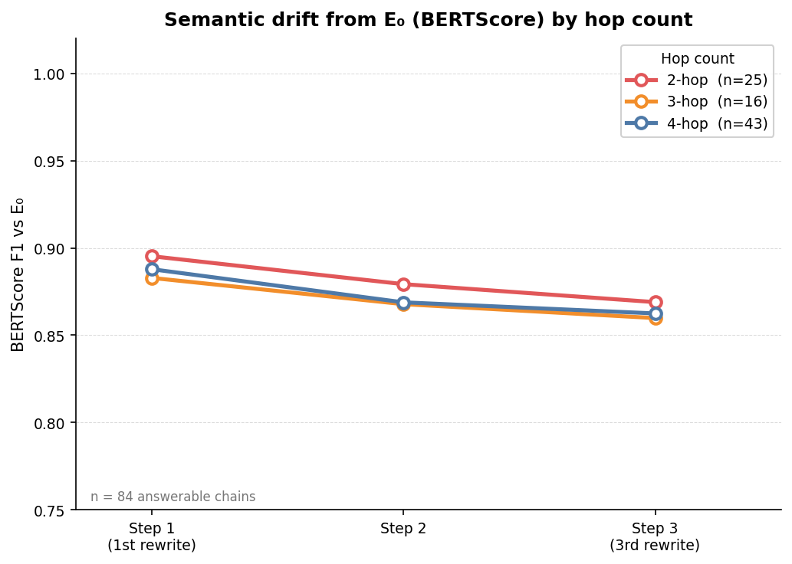

BERTScore F1 sim(Eₜ, E₀) — cumulative drift from the original · roberta-large layer 17 · 84 answerable chains · one line per hop count

---

<!-- SLIDE 11: BERTScore across iterations — by instruction graph -->
## BERTScore sim(Eₜ, Eₜ₋₁) — Steps Become More Conservative

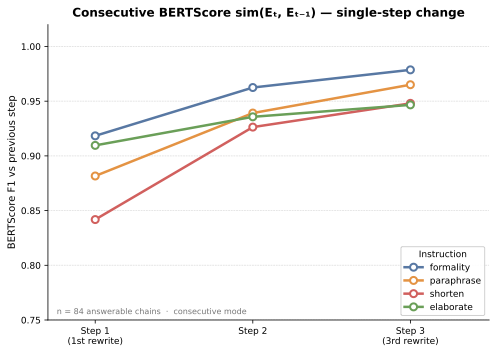

Consecutive BERTScore sim(Eₜ, Eₜ₋₁) — single-step change · roberta-large layer 17 · 84 answerable chains

---

<!-- SLIDE 11a: BERTScore consecutive — numbers -->
## BERTScore sim(Eₜ, Eₜ₋₁) — Numbers

Each individual step introduces smaller and smaller changes — yet the cumulative drift from E₀ keeps growing. 

| Step | Consecutive BERTScore |
|------|-----------------------|
| Step 1 | 0.889 |
| Step 2 | 0.941 |
| Step 3 | 0.960 |

---

<!-- SLIDE 11b: BERTScore across iterations — by hop graph -->
## BERTScore sim(Eₜ, Eₜ₋₁) — By Hop Count

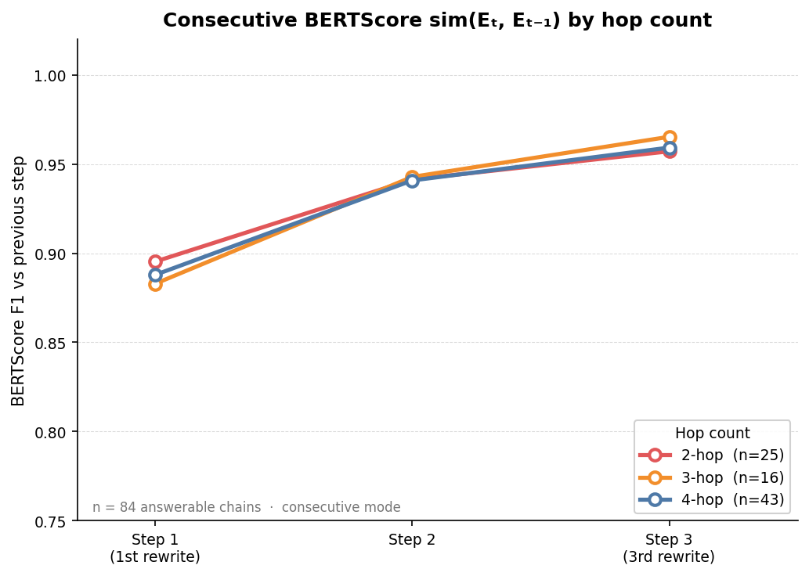

Consecutive BERTScore sim(Eₜ, Eₜ₋₁) — single-step change · roberta-large layer 17 · 84 answerable chains · one line per hop count

---

<!-- SLIDE 12: Style vs Content -->
## Style vs Content: Two Groups, Two Trajectories

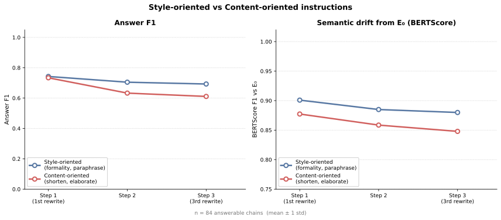

Left: Answer F1 · Right: BERTScore · blue = style-oriented · red = content-oriented · 84 answerable chains

Both metrics agree: content-oriented instructions (shorten + elaborate) cause significantly more degradation than style-oriented ones (formality + paraphrase). The gap opens at step 1 and widens. **What you ask the model to change matters more than how many times you ask it.**

---

<!-- SLIDE 13: F1 by instruction — graph -->
## Answer F1: Rewriting Degrades QA Performance

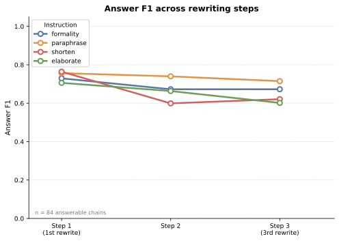

84 answerable chains · mean ± 1 std · QA model: OLMo-3.1-32B-Instruct

**Yes** — F1 drops with every instruction. The amount varies strongly: `shorten` loses 0.143 points over 3 steps, `paraphrase` only 0.042.

---

<!-- SLIDE 14: F1 by instruction — table -->
## Answer F1: Numbers in Detail

| Instruction | Step 1 | Step 2 | Step 3 | Drop t1→t3 | Chains that drop |
|-------------|:------:|:------:|:------:|:----------:|:----------------:|
| `paraphrase` | 0.757 | 0.740 | 0.715 | −0.042 | 10% |
| `formality` | 0.730 | 0.673 | 0.673 | −0.057 | 14% |
| `elaborate` | 0.706 | 0.663 | 0.602 | −0.104 | 23% |
| `shorten` | 0.764 | 0.599 | 0.621 | **−0.143** | **25%** |

- **`shorten`** — fastest and largest drop. F1 falls −0.165 in a single step (step 1→2) as compression physically removes the key facts. Slight recovery at step 3 is noise.
- **`elaborate`** — steady, gradual degradation across all 3 steps. Adding detail iteratively dilutes and distorts the original facts.
- **`formality`** — drops at step 1→2, then stabilises. Register changes stop introducing damage after the first pass.
- **`paraphrase`** — most resilient. Rephrasing without structural changes preserves factual content well.

Content-oriented instructions degrade factuality <b>2–3× more</b> than style-oriented ones.

---

<!-- SLIDE 15: F1 by hop — table -->
## Answer F1 by Hop Count: Numbers

| Hop | Step 1 | Step 2 | Step 3 | Drop t1→t3 | Answerable chains |
|-----|:------:|:------:|:------:|:----------:|:-----------------:|
| 2-hop | **1.000** | 0.920 | 0.909 | −0.091 | 25 |
| 3-hop | 0.690 | 0.591 | 0.631 | −0.059 | 16 |
| 4-hop | 0.604 | 0.552 | **0.510** | −0.094 | 43 |

- **2-hop**: all answerable chains start at perfect F1 = 1.000 — simple questions with short answers are robust but still degrade to 0.909 by step 3.
- **4-hop**: starts already impaired (0.604) and falls monotonically to 0.510. With 4 facts to connect, each rewrite has more opportunities to break a reasoning link.
- **3-hop**: non-monotonic pattern (recovery at step 3) — likely noise from only 16 answerable chains across 5 questions.

Questions requiring more reasoning steps are more vulnerable to iterative rewriting.

---

<!-- SLIDE 16: F1 by hop — graph -->
## Answer F1 by Hop Count

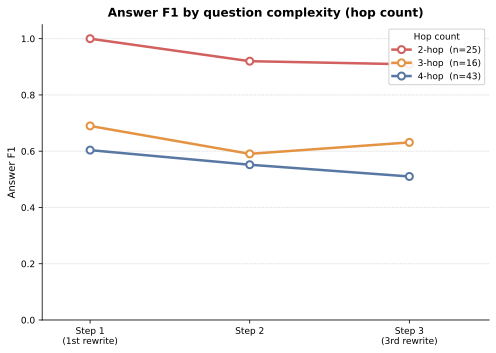

84 answerable chains · mean ± 1 std · one line per hop count

---

<!-- SLIDE 17: Heatmap -->
## Per-Question View: F1 Heatmap

<table style="border:none; width:100%; border-collapse:collapse;">
<tr>
<td style="border:none; width:52%; vertical-align:middle; padding-right:24px;">

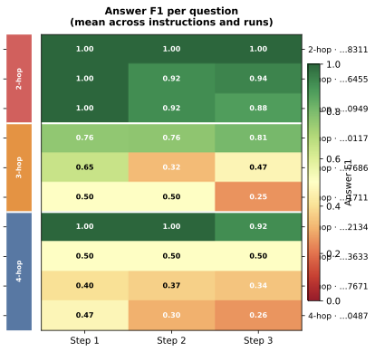

</td>
<td style="border:none; vertical-align:middle; font-size:18px;">

Each row is one question; each column is a rewriting step. Color encodes mean F1 (averaged across all instructions and runs).

</td>
</tr>
</table>

---

<!-- SLIDE 18: Dissociation — graph -->
## The Text Changes More Than the QA Score Suggests

The QA model can still extract an answer in many cases — but the underlying text has drifted further from E₀ than F1 alone would suggest.

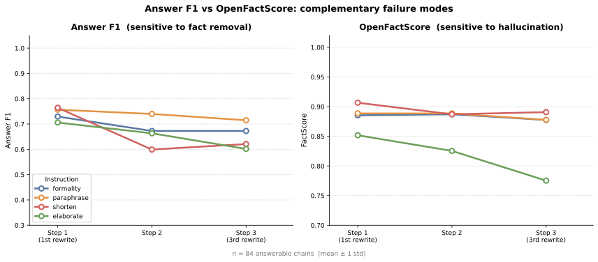

Left: Answer F1 · Right: OpenFactScore · same 84 answerable chains

---

<!-- SLIDE 16b: F1 vs OFS by hop -->
## F1 and OFS by Hop Count

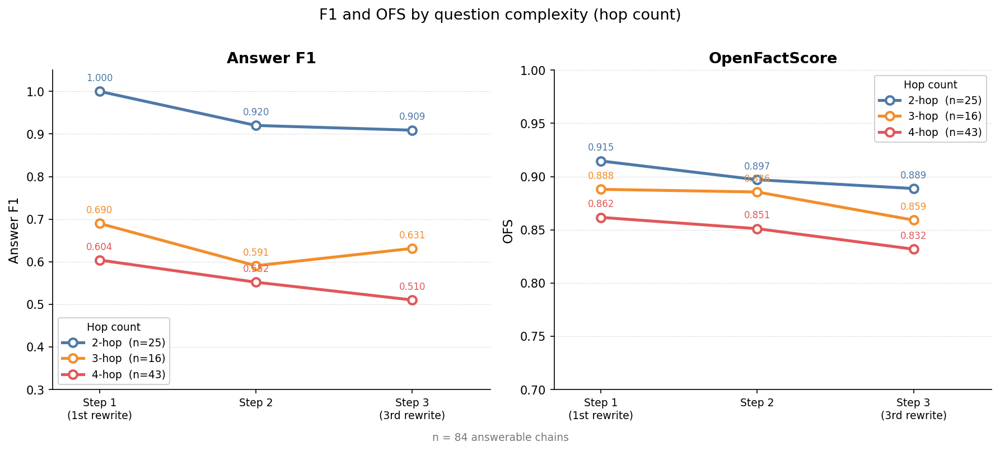

Left: Answer F1 · Right: OpenFactScore · 84 answerable chains · one line per hop count

---

<!-- SLIDE 22: Conclusions -->
## Conclusions *(preliminary — 15 questions)*

**Iterative rewriting appears to degrade factuality — but the failure mode varies by instruction.**

Content instructions — preliminary evidence

<code>shorten</code>: F1 drops sharply while OFS stays stable — consistent with fact removal, though not confirmed directly. 
<code>elaborate</code>: OFS declines steadily — suggests the model adds claims not grounded in E₀.

Style instructions

<code>formality</code> and <code>paraphrase</code> show limited degradation on both metrics across 3 steps.

Degradation appears cumulative

Each individual step looks conservative (consecutive BERTScore → 0.96), yet cumulative drift grows monotonically. More hops correlates with higher vulnerability: F1 at step 3 ranges from 0.909 (2-hop) to 0.510 (4-hop).

<b>One metric is not enough.</b> F1 and OFS appear to capture complementary failure modes — both are needed to characterise degradation fully.

---

<!-- SLIDE 23: Limitations -->
## Limitations

- **Small pilot** — 15 questions total; 3-hop patterns (16 answerable chains from 5 questions) are likely noise and should not be over-interpreted
- **F1 normalization** — SQuAD-style handles minor orthographic variation well (e.g. "September 11, 1962" = "11 September 1962" → F1=1.0) but not semantic paraphrases (e.g. "1400 years ago" vs "1,400 years" → F1=0.8); factuality may be slightly underestimated

---

<!-- SLIDE 24: Next Steps -->
## Next Steps

**RQ3 — Self-Refine** *(pipeline ready, under debugging)*
The pipeline is implemented and smoke-tested end-to-end. However, initial results show an unexpected pattern: token count drops sharply across iterations, suggesting the refiner is compressing the text rather than correcting it — leading to heavy information loss between steps.