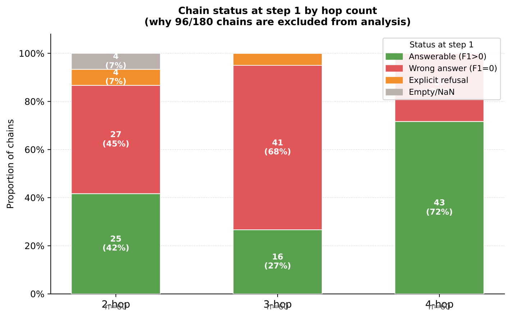
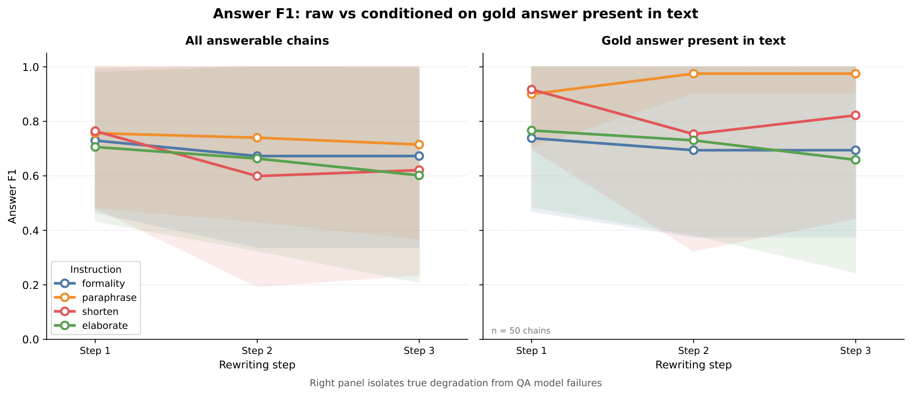

<!-- SLIDE 1: Title -->
# Factuality Degradation in Iterative LLM Rewriting

### Pilot Results — 15 Questions · MuSiQue Dataset

 

**Anna Sacchet** · Master's Thesis · University of Udine · DMIF

Model: OLMo-3.1-32B-Instruct &nbsp;·&nbsp; 2026-05-02

---

<!-- SLIDE 2: Research Questions -->
## Research Questions

RQ1 — Baseline degradation

<b>Does iterative rewriting degrade factuality?</b> 
When an LLM rewrites the same text 3 times (E₀ → E₁ → E₂ → E₃), does factual accuracy decrease with each step?

RQ2 — Instruction factors

<b>What type of instruction causes more degradation?</b> 
Style-oriented (paraphrase, formality) vs. content-oriented (shorten, elaborate). Does question complexity (2-hop vs 4-hop) also matter?

RQ3 — Intervention (in progress)

<b>Can Self-Refine mitigate degradation?</b> 
A critic model checks each rewrite and corrects factual errors before the next step.

---

<!-- SLIDE 3: Setup part 1 -->
## Experimental Setup

**Dataset:** MuSiQue (Trivedi et al., 2022) — multi-hop QA.
Each question requires connecting 2, 3, or 4 facts distributed across separate paragraphs.

**Input text E₀:** 20 paragraphs per question — 2–4 *supporting* + 16–18 *distractors* · ~2311 tokens

**Pilot:** 15 questions · 5×2-hop · 5×3-hop · 5×4-hop · seed = 42

**Rewriting pipeline:** E₀ → E₁ → E₂ → E₃ — same instruction applied at each step

| Group | Instruction | What it asks the model to do |
|-------|-------------|------------------------------|
| **Style** | `formality` | Change register (informal ↔ formal) |
| **Style** | `paraphrase` | Rephrase without changing content |
| **Content** | `shorten` | Compress — keep only essentials |
| **Content** | `elaborate` | Expand with more detail |

**Scale:** 15 questions × 4 instructions × 3 wordings = **180 chains** · 720 rewrites

---

<!-- SLIDE 4: Metrics -->
## Metrics: Three Complementary Perspectives

**Answer F1** *(indirect, task-based)*
The rewritten text Eₜ is given to a QA model (OLMo-3.1-32B-Instruct), which answers the original question. Token-level F1 vs. the gold answer (SQuAD-style normalization).
→ Sensitive to **fact removal** — if the key fact is gone, F1 drops to 0.

**BERTScore** *(semantic drift)*
Cosine similarity between Eₜ and E₀ in RoBERTa-large embedding space (layer 17).
Two modes: *baseline* sim(Eₜ, E₀) measures cumulative drift; *consecutive* sim(Eₜ, Eₜ₋₁) measures single-step change.
→ Sensitive to **cumulative semantic drift**, independent of QA model behavior.

**OpenFactScore** *(direct fact verification)*
Eₜ is decomposed into atomic claims (AFG: OLMo-2-1124-7B-SFT), each verified against E₀ as the knowledge source (AFV: Gemma-3-4b-it). Score = proportion of claims supported by E₀.
→ Sensitive to **hallucination** — new claims that E₀ does not support.

The three metrics are <b>complementary</b>: a text can look fine on one metric while failing another. This becomes the central finding.

---

<!-- SLIDE 5: Why not E0 -->
## The Starting Point Problem: Why Not E₀?

E₀ contains all 20 MuSiQue paragraphs — 2–4 relevant facts buried among 16–18 distractors in ~2311 tokens.
The QA model cannot reliably reason over this noisy, long input.

| Hop | Mean F1 at step 0 | Questions with F1 = 0 |
|-----|:-----------------:|:---------------------:|
| 2-hop | 0.400 | 3 / 5 |
| 3-hop | 0.189 | 3 / 5 |
| 4-hop | 0.280 | 2 / 5 |
| **Overall** | **0.290** | **8 / 15** |

8 out of 15 questions score F1 = 0 on the *unmodified* E₀ — not because facts are missing, but because the QA model fails to locate them. This is consistent with the literature: the best model on MuSiQue achieves only ~47 F1 (Trivedi et al., 2022).

<b>Analysis starts from step 1.</b> E₁ is the first coherent rewrite — compact, fluent, and a reliable starting point. We measure factuality loss from E₁ → E₃.

---

<!-- SLIDE 6: The 84/180 filter — graph -->
## Which Chains Are Analysable? The 84/180 Filter

At step 1, **96 out of 180 chains already have F1 = 0** — these cannot measure degradation because they were never answerable to begin with.

---

<!-- SLIDE 7: The 84/180 filter — explanation -->
## Why Are 96 Chains Excluded?

Three distinct reasons a chain scores F1 = 0 at step 1:

| Reason | Count | Interpretation |
|--------|:-----:|----------------|
| **Wrong answer** | 56 | QA model extracts something plausible but incorrect |
| **Explicit refusal** | 36 | Model says *"The context does not provide..."* — the fact may still be in the text, but the model refuses to extract it from a transformed text |
| **Empty / NaN** | 4 | No output — generation failure |

Note: the **36 explicit refusals** are a QA model behavior, not evidence of factual degradation. The gold answer may still be present in the text — the model simply becomes too conservative when the text style changes. The gold-in-text analysis (slide 17) quantifies this directly.

<b>All following analyses use only the 84 answerable chains</b> (F1 > 0 at step 1), drawn from 10 of the 15 questions.

---

<!-- SLIDE 8: F1 by instruction — graph -->
## RQ1: Does Rewriting Degrade Factuality?

84 answerable chains · mean ± 1 std · QA model: OLMo-3.1-32B-Instruct

**Yes** — F1 drops with every instruction. The amount varies strongly: `shorten` loses 0.143 points over 3 steps, `paraphrase` only 0.042.

---

<!-- SLIDE 9: F1 by instruction — table -->
## Answer F1: Numbers in Detail

| Instruction | Step 1 | Step 2 | Step 3 | Drop t1→t3 | Chains that drop |
|-------------|:------:|:------:|:------:|:----------:|:----------------:|
| `paraphrase` | 0.757 | 0.740 | 0.715 | −0.042 | 10% |
| `formality` | 0.730 | 0.673 | 0.673 | −0.057 | 14% |
| `elaborate` | 0.706 | 0.663 | 0.602 | −0.104 | 23% |
| `shorten` | 0.764 | 0.599 | 0.621 | **−0.143** | **25%** |

- **`shorten`** — fastest and largest drop. F1 falls −0.165 in a single step (step 1→2) as compression physically removes the key facts. Slight recovery at step 3 is noise.
- **`elaborate`** — steady, gradual degradation across all 3 steps. Adding detail iteratively dilutes and distorts the original facts.
- **`formality`** — drops at step 1→2, then stabilises. Register changes stop introducing damage after the first pass.
- **`paraphrase`** — most resilient. Rephrasing without structural changes preserves factual content well.

Content-oriented instructions degrade factuality <b>2–3× more</b> than style-oriented ones.

---

<!-- SLIDE 10: F1 by hop — graph -->
## RQ2: Does Question Complexity Matter?

84 answerable chains · mean ± 1 std · one line per hop count

**Yes** — harder questions degrade faster and start lower. 4-hop questions have 4 reasoning links that each rewriting step can break; 2-hop questions only 2.

---

<!-- SLIDE 11: F1 by hop — table -->
## Answer F1 by Hop Count: Numbers

| Hop | Step 1 | Step 2 | Step 3 | Drop t1→t3 | Answerable chains |
|-----|:------:|:------:|:------:|:----------:|:-----------------:|
| 2-hop | **1.000** | 0.920 | 0.909 | −0.091 | 25 |
| 3-hop | 0.690 | 0.591 | 0.631 | −0.059 | 16 |
| 4-hop | 0.604 | 0.552 | **0.510** | −0.094 | 43 |

- **2-hop**: all answerable chains start at perfect F1 = 1.000 — simple questions with short answers are robust but still degrade to 0.909 by step 3.
- **4-hop**: starts already impaired (0.604) and falls monotonically to 0.510. With 4 facts to connect, each rewrite has more opportunities to break a reasoning link.
- **3-hop**: non-monotonic pattern (recovery at step 3) — likely noise from only 16 answerable chains across 5 questions.

Questions requiring more reasoning steps are more vulnerable to iterative rewriting.

---

<!-- SLIDE 12: Heatmap -->
## Per-Question View: F1 Heatmap

Each row is one question; each column is a rewriting step. Color encodes mean F1 (averaged across all instructions and runs). Top rows (2-hop) stay dark throughout. Bottom rows (4-hop) start lighter and fade further right — several collapse to near zero by step 3. The view reveals **within-group heterogeneity**: some questions are resilient regardless of instruction; others degrade quickly regardless of hop count.

---

<!-- SLIDE 13: BERTScore — graph -->
## Semantic Drift: BERTScore

BERTScore F1 sim(Eₜ, E₀) — baseline mode · roberta-large layer 17 · 84 answerable chains

BERTScore measures semantic drift **independently of the QA model**. Every instruction causes monotonic drift from E₀ — no exceptions. The ranking mirrors F1: `shorten` drifts most, `formality` least.

---

<!-- SLIDE 14: BERTScore — interpretation -->
## BERTScore: Cumulative vs Consecutive

| Instruction | Step 1 | Step 2 | Step 3 | Total drift |
|-------------|:------:|:------:|:------:|:-----------:|
| `formality` | 0.918 | 0.903 | 0.897 | −0.021 |
| `elaborate` | 0.910 | 0.889 | 0.875 | −0.035 |
| `paraphrase` | 0.882 | 0.865 | 0.861 | −0.021 |
| `shorten` | 0.842 | 0.825 | 0.818 | −0.024 |

The **consecutive** BERTScore (similarity between Eₜ and Eₜ₋₁) tells a different story:

| Step | Consecutive BERTScore |
|------|-----------------------|
| Step 1 | 0.889 |
| Step 2 | 0.941 |
| Step 3 | 0.960 |

Each individual step introduces smaller and smaller changes — yet the cumulative drift from E₀ keeps growing. This is the signature of **iterative degradation**: every single rewrite looks conservative, but the effects accumulate.

---

<!-- SLIDE 15: Style vs Content -->
## Style vs Content: Two Groups, Two Trajectories

Left: Answer F1 · Right: BERTScore · blue = style-oriented · red = content-oriented · 84 answerable chains

Both metrics agree: content-oriented instructions (shorten + elaborate) cause significantly more degradation than style-oriented ones (formality + paraphrase). The gap opens at step 1 and widens. **What you ask the model to change matters more than how many times you ask it.**

---

<!-- SLIDE 16: OFS — graph -->
## OpenFactScore: Does the Text Invent New Facts?

OFS answers a different question from F1: not *"can you still answer?"* but *"are the claims in the rewritten text still grounded in E₀?"*

Proportion of atomic claims in Eₜ supported by E₀ · AFG: OLMo-2-1124-7B-SFT · AFV: Gemma-3-4b-it · 84 answerable chains

---

<!-- SLIDE 17: OFS — interpretation -->
## OpenFactScore: What Each Instruction Does

| Instruction | Step 1 | Step 2 | Step 3 | Drop |
|-------------|:------:|:------:|:------:|:----:|
| `paraphrase` | 0.909 | 0.907 | 0.909 | −0.000 |
| `formality` | 0.899 | 0.903 | 0.899 | −0.000 |
| `shorten` | 0.902 | 0.893 | 0.894 | −0.008 |
| `elaborate` | 0.872 | 0.846 | 0.807 | **−0.065** |

- **`paraphrase` and `formality`**: OFS is flat across all steps. Style rewrites do not introduce unsupported claims.
- **`shorten`**: almost no OFS drop (−0.008). Compression *removes* content but does not *invent* new content.
- **`elaborate`**: steady decline, accelerating at step 3 (−0.065 total). Each elaboration step adds details that E₀ does not support — these are **hallucinations relative to the source**.

OFS is independent of the QA model. When it drops, the text itself has changed factually — not just the model's ability to extract the answer.

---

<!-- SLIDE 18: Dissociation — graph -->
## Key Finding: F1 and OFS Capture Opposite Failures

Left: Answer F1 · Right: OpenFactScore · same 84 answerable chains · mean ± 1 std

`shorten` (red) dominates on the left — huge F1 drop. `elaborate` (green) dominates on the right — large OFS drop. The two instructions swap ranks between the two metrics.

---

<!-- SLIDE 19: Dissociation — table -->
## The Dissociation: What Is Really Happening

| Instruction | F1 drop | OFS drop | Failure mode |
|-------------|:-------:|:--------:|--------------|
| `shorten` | **−0.143** | −0.008 | Facts are **removed** → answer disappears from text |
| `elaborate` | −0.104 | **−0.065** | Facts are **invented** → hallucination relative to E₀ |
| `formality` | −0.057 | −0.000 | Style change only → both metrics mostly stable |
| `paraphrase` | −0.042 | −0.000 | Rephrasing only → both metrics stable |

The two metrics measure **complementary failure modes**:

- Answer F1 is sensitive to **fact removal** (shortening destroys the answer)
- OpenFactScore is sensitive to **fact invention** (elaboration adds unsupported claims)

Using only one metric misses half the picture. A system that only monitors F1 would not detect the hallucinations introduced by <code>elaborate</code>. A system that only monitors OFS would underestimate how dangerous <code>shorten</code> is.

---

<!-- SLIDE 20: Gold-in-text — graph -->
## How Much of the F1 Drop Is the QA Model Failing?

The QA model sometimes fails even when the gold answer is still in the text. The gold-in-text analysis checks whether the gold string appears literally in Eₜ, then cross-references with F1.

Left: raw Answer F1 · Right: F1 conditioned on gold answer present in text · 84 answerable chains · by instruction

When the gold is physically present, F1 is higher and drops less. The gap between the two curves is the QA model's contribution to the observed degradation.

---

<!-- SLIDE 21: Gold-in-text — table -->
## Gold-in-Text: Separating True Degradation from QA Failure

| Category | N | Meaning |
|----------|:-:|---------|
| **hit** | 228 | Gold present, F1 > 0 — text and QA both work correctly |
| **degraded** | 216 | Gold absent, F1 = 0 — **true factual degradation** |
| **false negative** | 172 | Gold present but F1 = 0 — **QA model failure** on transformed text |
| **parametric memory** | 104 | Gold absent but F1 > 0 — model answers from training knowledge |

172 false negatives: the fact was still in the rewritten text, but the QA model refused to extract it or gave a wrong answer — often because the text style changed.

| | Step 1 | Step 2 | Step 3 | Drop |
|--|:------:|:------:|:------:|:----:|
| F1 raw (answerable chains) | 0.738 | 0.669 | 0.652 | −0.086 |
| F1 conditioned on gold present | 0.817 | 0.764 | 0.760 | **−0.057** |

~0.03 points of the observed drop is the QA model failing on transformed text — not actual factual degradation. True degradation is real but slower than raw F1 suggests.

---

<!-- SLIDE 22: Summary -->
## Summary of Findings

| Finding | Evidence |
|---------|----------|
| ✅ **RQ1: Yes, rewriting degrades factuality** | F1 drops −0.042 to −0.143 by instruction; BERTScore drifts monotonically for all |
| ✅ **Content instructions are more damaging** | `shorten` −0.143, `elaborate` −0.104 vs ≤−0.057 for style |
| ✅ **Degradation is cumulative** | Consecutive BERTScore rises (0.889→0.960) yet baseline BERTScore drops at every step |
| ✅ **More hops = more vulnerable** | F1 at step 3: 2-hop 0.909 → 4-hop 0.510 |
| ✅ **Two distinct failure modes** | `shorten` removes facts (F1↓, OFS stable); `elaborate` adds hallucinations (OFS↓) |
| ✅ **True degradation < raw F1 drop** | Gold-in-text: −0.057 vs −0.086 (0.03 is QA model failure) |

---

<!-- SLIDE 23: Limitations -->
## Limitations

- **Small pilot** — 15 questions total; 3-hop patterns (16 answerable chains from 5 questions) are likely noise and should not be over-interpreted
- **F1 normalization** — SQuAD-style does not handle paraphrastic correct answers; factuality may be slightly underestimated
- **Gold-in-text uses exact string match** — surface variation in correct answers can be counted as degraded when the fact is actually preserved
- **OFS cost** — OpenFactScore runs an LLM per atomic claim; not scalable to the full dataset without batching optimization

---

<!-- SLIDE 24: Next Steps -->
## Next Steps

**RQ3 — Self-Refine** *(running on Homer server)*
15 questions × 180 chains with `--rewriter-temperature 0.0` to match the baseline.
A critic model verifies each rewrite factually; a refiner corrects identified errors before the next step.
Hypothesis: the critic catches the hallucinations from `elaborate` and the fact removals from `shorten`, slowing degradation on both metrics.

**PAU analysis** *(Laban et al., 2024)*
With n=5 repetitions per chain: separates **Performance** (mean F1), **Aptitude** (best-case F1), and **Unreliability** (variance between runs). Can distinguish *capability erosion* (mean drops) from *stability loss* (variance grows) — two different kinds of degradation.

**Scale-up to full MuSiQue dev set**
~1200 questions, balanced across hop counts. Required for statistically robust conclusions on all three RQs and for the final thesis results.
