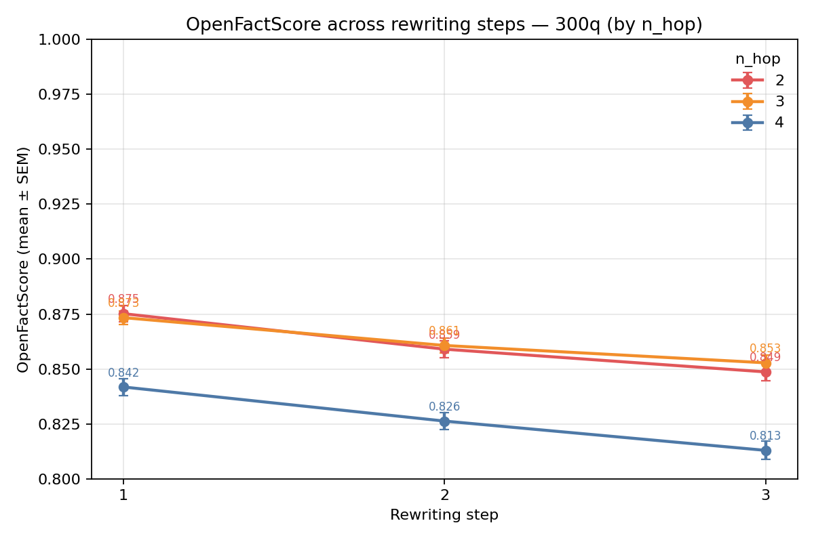
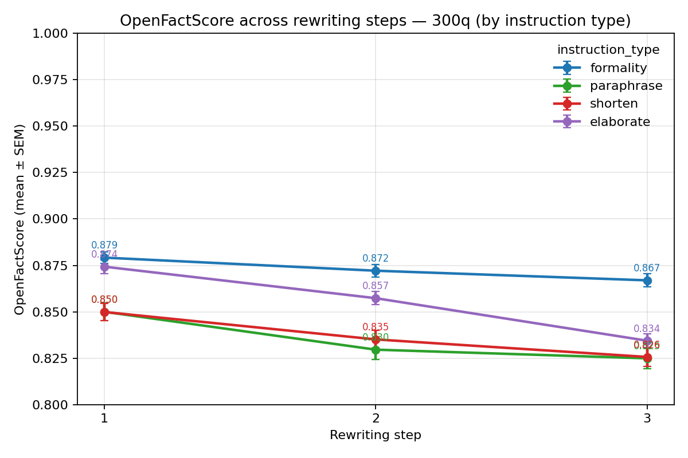
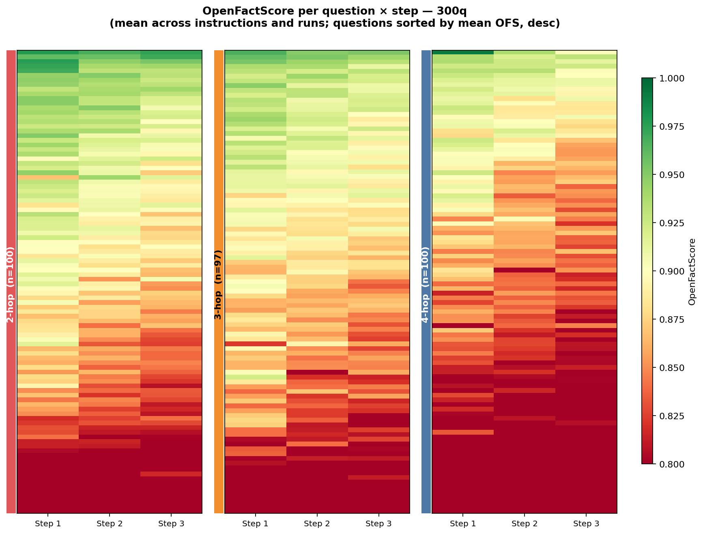
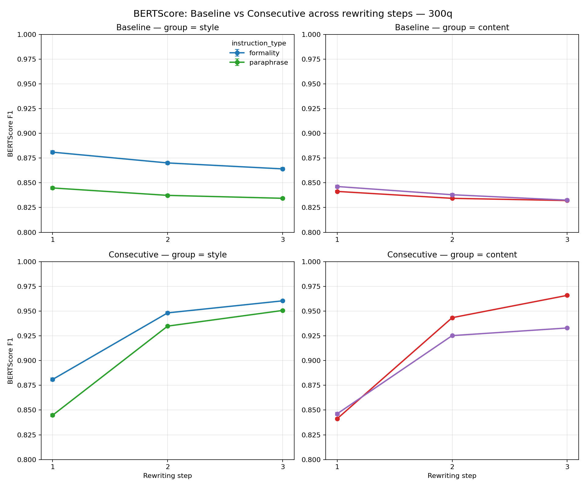
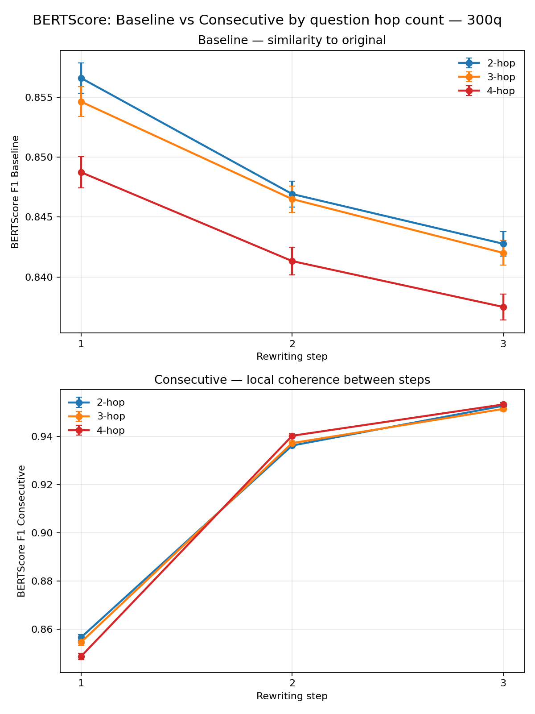
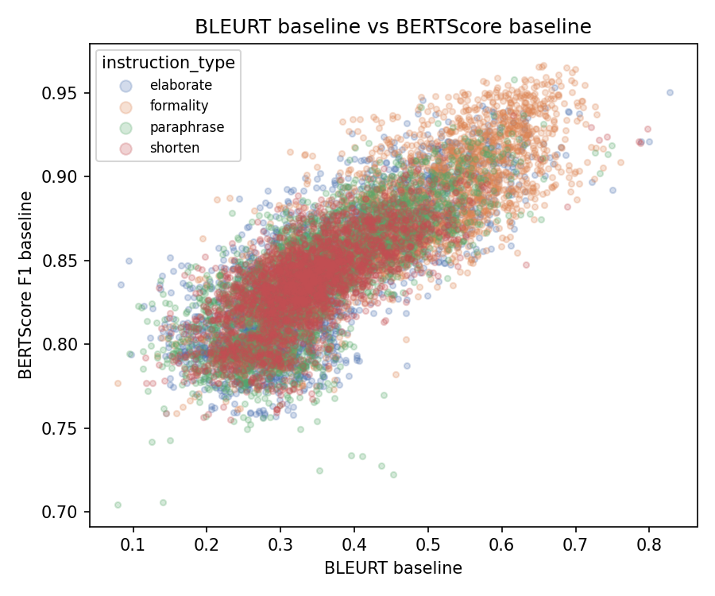
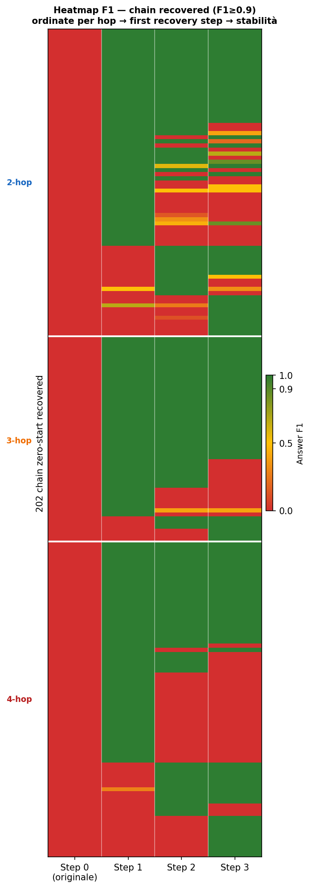

# Analisi MuSiQue 300q — Rewriting iterativo con OLMo-3.1-32B-Instruct

> **Dataset:** MuSiQue (multi-hop QA) · **Modello:** OLMo-3.1-32B-Instruct (4-bit NF4)  
> **Disegno:** 297 qid × 4 istruzioni × 3 run × 4 step (0–3) = **14 256 osservazioni** per F1 e BERTScore; **10 692** per OFS

---

## Setup sperimentale

Per ogni domanda di MuSiQue il **testo di supporto** (paragrafi concatenati) viene riscritto **3 volte di fila** (step 1, 2, 3) sotto quattro tipi di istruzione, poi valutato con un modello QA. **Step 0** = testo originale non riscritto.

| Gruppo | Istruzione | Descrizione |
|--------|-----------|-------------|
| **content** | `elaborate` | arricchisci / espandi il testo |
| **content** | `shorten` | accorcialo mantenendo il senso |
| **style** | `formality` | rendilo più formale |
| **style** | `paraphrase` | parafrasa mantenendo il contenuto |

Ogni catena è **ripetuta 3 volte indipendenti** (run 0, 1, 2). Le domande coprono tre livelli di complessità: 100 × 2-hop, 97 × 3-hop, 100 × 4-hop.

### Metriche

| Metrica | Cosa misura | Range | Step disponibili |
|---------|------------|-------|-----------------|
| **Answer F1** | il modello QA risponde correttamente? | 0–1 | 0, 1, 2, 3 |
| **OpenFActScore (OFS)** | proporzione di affermazioni fattualmente supportate | 0–1 | 1, 2, 3 |
| **BERTScore baseline** | similarità semantica vs. testo originale (step 0) | 0–1 | 1, 2, 3 |
| **BERTScore consecutivo** | similarità semantica vs. step precedente | 0–1 | 1, 2, 3 |
| **BLEURT baseline** | similarità semantica profonda vs. originale (modello neurale) | 0–1 | 1, 2, 3 |
| **BLEURT answer** | similarità tra risposta predetta e risposta gold | 0–1 | 1, 2, 3 |

### Modelli statistici

- **F1**: GLMM logistico con random intercept `(1|qid)` — distribuzione bimodale (molti 0 e 1).
- **OFS, BERTScore, BLEURT**: LMM lineare con `(1|qid)`.
- **Contrasti**: pianificati a priori step-by-step, corretti con Holm.
- **Robustezza**: tutti i risultati confermati con test di Friedman non parametrico.

---

## 1. Answer F1 — il crollo avviene al primo step

*Medie ± SEM per istruzione, separate per gruppo. Sinistra: style (formality, paraphrase). Destra: content (shorten, elaborate).*

Il grafico mostra la struttura essenziale del fenomeno: **tutte e quattro le istruzioni crollano bruscamente tra step 0 e step 1**, poi la curva si appiattisce. Nel gruppo style, `formality` (blu) rimane qualche punto sopra `paraphrase` (verde) dall'1 in poi, ma con bande di errore standard parzialmente sovrapposte. Nel gruppo content, `shorten` (rosso) e `elaborate` (viola) sono quasi sovrapposte per tutto il percorso.

### 1.1 Medie per step

| Step | F1 medio |
|------|---------|
| **0** (originale) | **0.362** |
| 1 | 0.215 |
| 2 | 0.191 |
| 3 | 0.177 |

Il testo originale ottiene F1 = 0.362. Già dopo la prima riscrittura scende a 0.215 — una perdita di **~17 punti percentuali** in un solo step. Gli step 2 e 3 aggiungono un ulteriore calo di 2.4 e 1.4 pp rispettivamente.

### 1.2 Test statistici

**Friedman omnibus** (n = 297 qid): χ² = 44.0, df = 3, **p = 1.5 × 10⁻⁹**

**Wilcoxon paired pianificati, corretti Holm:**

| Contrasto | Δ medio | Effect size (rank-biserial) | p_holm |
|-----------|---------|----------------------------|--------|
| step 0 → 1 | **−0.169** | **0.377 (medio)** | **1.1 × 10⁻⁸** |
| step 1 → 2 | −0.030 | 0.019 (trascurabile) | 0.930 n.s. |
| step 2 → 3 | −0.017 | 0.044 (trascurabile) | 0.930 n.s. |

Il calo aggiuntivo di step 1→2 e step 2→3 **non è statisticamente distinguibile da zero** dopo correzione. Il GLMM logistico (coefficienti relativi a step 0: step 1 β=−0.169, p=7.8×10⁻⁹³; step 2 β=−0.198, p=1.0×10⁻¹²⁷; step 3 β=−0.216, p=2.4×10⁻¹⁵⁰) cattura l'accumulo cumulativo perché confronta sempre rispetto a step 0.

> L'ICC(qid) ≈ 43% indica che quasi metà della varianza di F1 è spiegata da "quale domanda è" — alcune domande sono difficili a ogni step, altre facili. Senza il random intercept le osservazioni sembrerebbero falsamente indipendenti.

---

## 2. Answer F1 per complessità (n-hop)

*Medie ± SEM per livello di complessità. Tutti e tre i livelli mostrano lo stesso profilo a L rovesciata.*

Il grafico rivela due pattern sovrapposti. Primo, le tre curve **partono da livelli diversi** a step 0: le 2-hop (blu) a ~0.41, le 3-hop (arancione) a ~0.38, le 4-hop (rosso) a ~0.30 — il divario di partenza riflette la maggior difficoltà delle domande più complesse già sul testo originale. Secondo, **il crollo al primo step è proporzionale al livello di partenza**: tutti e tre i gruppi convergono verso una fascia 0.17–0.24 già a step 1, poi rimangono sostanzialmente stabili fino a step 3. Le 4-hop mostrano un leggero rallentamento del degrado negli step tardivi (le curve 2-hop e 3-hop continuano a scendere dolcemente, mentre le 4-hop si appiattiscono prima).

### 2.1 Medie per hop × step

| n_hop | step 0 | step 1 | step 2 | step 3 | Δ cumulativo (0→3) |
|-------|--------|--------|--------|--------|--------------------|
| 2-hop | 0.407 | 0.241 | 0.204 | 0.188 | −0.219 |
| 3-hop | 0.377 | 0.231 | 0.211 | 0.193 | −0.184 |
| 4-hop | 0.303 | 0.175 | 0.157 | 0.150 | −0.153 |

Le 4-hop partono con F1 più basso già sul testo originale (GLMM: 4-hop vs 2-hop β = −0.100, p = 0.032) e il calo cumulativo assoluto è minore, ma in termini relativi perdono una quota comparabile. L'interazione step × 4-hop è significativa a step 2 e 3 (β = +0.041, p = 0.042; β = +0.052, p = 0.010): le 4-hop rallentano il degrado agli step tardivi, probabilmente perché la compressione aggressiva del primo step ha già esaurito buona parte dell'informazione disponibile.

**Wilcoxon step_min vs step_max per hop (Holm):** tutti significativi (2-hop: p = 1.5×10⁻⁴; 3-hop: p = 1.5×10⁻⁴; 4-hop: p = 7.9×10⁻³).

---

## 3. Heatmap F1 per domanda — dove avviene il danno

*Ogni riga è una domanda, ordinata per F1 medio decrescente. Colore: verde = F1 alto, rosso = F1 basso. Tre pannelli: 2-hop (sinistra), 3-hop (centro), 4-hop (destra).*

Questa heatmap è il modo più diretto per vedere cosa succede domanda per domanda. Tre osservazioni immediate:

1. **Il passaggio da step 0 a step 1 è visibile come un salto cromatico brusco in tutti e tre i pannelli**: le righe verdi e giallo-verdi a step 0 diventano arancio-rosse già a step 1. Il fatto che avvenga uniformemente per tutte le domande — non solo per alcune — conferma che non si tratta di un artefatto di pochi outlier.

2. **Da step 1 a step 3 il colore cambia molto meno**: le bande rimangono sostanzialmente dello stesso tono. Il danno si è già consumato.

3. **Le 4-hop (pannello destra) mostrano più rosso già a step 0** rispetto alle 2-hop (pannello sinistra): la minor F1 di partenza delle domande più complesse è strutturale, non indotta dal rewriting. A step 3 tutti e tre i pannelli sono pressoché interamente rossi — il processo porta tutte le domande verso una fascia bassa indipendentemente dalla complessità iniziale.

---

## 4. OpenFActScore — degrado progressivo e costante

*Medie ± SEM per livello di complessità. Il calo è lineare e costante per tutti i gruppi.*

A differenza di F1, l'OFS **non crolla al primo step**: le tre curve scendono in modo graduale e quasi lineare da step 1 a step 3. Le 2-hop (rosso) e le 3-hop (arancione) sono praticamente sovrapposte (0.875 → 0.849 e 0.875 → 0.853 rispettivamente), mentre le 4-hop (blu) sono sistematicamente più basse lungo tutta la traiettoria (0.842 → 0.813). Il parallelismo tra le tre linee indica che la **velocità di degrado è la stessa** per tutti i livelli di complessità: le 4-hop degradano di più perché partono più basse, non perché degradino più velocemente.

### 4.1 Medie OFS per step

| Step | OFS medio |
|------|----------|
| 1 | 0.8633 |
| 2 | 0.8485 |
| 3 | 0.8380 |

**Friedman omnibus:** χ² = 183.1, **p = 1.8 × 10⁻⁴⁰**

**Wilcoxon paired (Holm):**

| Contrasto | Δ | Effect size (rank-biserial) | p_holm |
|-----------|---|----------------------------|--------|
| step 1 → 2 | **−0.0148** | **0.623 (grande)** | **2.6 × 10⁻²⁰** |
| step 2 → 3 | **−0.0105** | **0.556 (grande)** | **1.0 × 10⁻¹⁶** |

Entrambi i contrasti sono significativi dopo correzione. Il calo cumulativo (−2.5 pp totali) è contenuto in termini assoluti, ma gli effect size grandi (>0.55) indicano che il fenomeno è estremamente coerente tra qid: quasi ogni domanda mostra questo andamento monotonicamente decrescente, senza eccezioni.

### 4.2 OFS per istruzione

*Medie ± SEM per tipo di istruzione. Le differenze visibili tra istruzioni spariscono quando si controlla per lunghezza.*

Il grafico mostra una separazione chiara: `formality` (blu) rimane nettamente sopra le altre per tutti e tre gli step (0.879 → 0.867), mentre `paraphrase` (verde) e `shorten` (rosso) si sovrappongono quasi perfettamente nella fascia bassa (0.850 → 0.825). `elaborate` (viola) parte alta come `formality` ma scende più ripidamente (0.874 → 0.834), arrivando a step 3 a metà tra i due gruppi.

Questa separazione visiva è però **quasi interamente un artefatto della lunghezza prodotta**: il modello LMM con `log(n_tokens)` mostra che aggiungendo la lunghezza al modello i coefficienti di instruction collassano da significativi a ~zero (formality vs elaborate senza n_tokens: β = +0.014, p = 0.04; con n_tokens: β = −0.003, p = 0.66). È la lunghezza che conta, non l'istruzione.

### 4.3 Heatmap OFS per domanda

*Ogni riga è una domanda ordinata per OFS medio decrescente. Colore: verde = fattualità alta, rosso = bassa.*

La heatmap OFS è visivamente molto diversa da quella di F1. Tre differenze spiccano:

1. **Nessun salto brusco tra step**: le righe cambiano colore gradualmente da sinistra a destra — l'OFS erode piano piano, non crolla.

2. **Le 4-hop (pannello destra) partono già con più rosso a step 1**, confermando che le domande più complesse producono testi con più affermazioni non supportate fin dal primo rewriting.

3. **La scala cromatica è compressa** rispetto alla heatmap F1 (0.80–1.00 contro 0.00–1.00): l'OFS non raggiunge mai zero, il testo riscritto mantiene sempre una buona fattualità di fondo — il problema è l'erosione progressiva, non il collasso totale.

---

## 5. BERTScore — drift e convergenza all'attrattore

### 5.1 Baseline e consecutivo per step

*In alto: BERTScore baseline (vs. originale) per style (sinistra) e content (destra). In basso: BERTScore consecutivo (vs. step precedente) per gli stessi gruppi.*

Il grafico a quattro pannelli racconta due storie specularmente opposte:

- **Riga superiore (baseline)**: tutte e quattro le istruzioni si allontanano dall'originale in modo monotonico e quasi parallelo. `formality` rimane sistematicamente più alta (~0.882 → 0.865) mentre `paraphrase` (verde), `shorten` (rosso) ed `elaborate` (viola) convergono verso 0.830–0.835 a step 3. Il ritmo di discesa è costante, senza accelerazioni.

- **Riga inferiore (consecutivo)**: il pattern si inverte. Tutte le istruzioni partono con un BERTScore consecutivo basso a step 1 (~0.845–0.882) e risalgono bruscamente a step 2, poi continuano a salire più dolcemente a step 3. `formality` converge più in alto (0.960) rispetto a `paraphrase` (0.950); `shorten` (0.967) supera `elaborate` (0.932). La convergenza all'attrattore è più rapida nel gruppo content rispetto a style.

### 5.2 BERTScore per hop

*In alto: BERTScore baseline per livello di hop. In basso: BERTScore consecutivo.*

Nella riga superiore le tre curve (2-hop blu, 3-hop arancione, 4-hop rosso) scendono in modo **quasi parallelo** con le 4-hop sistematicamente più basse. Nel modello misto il coefficiente 4-hop è significativo (β = −0.008, p = 0.040) ma l'interazione step × hop non lo è (p > 0.13): tutte le domande si allontanano dall'originale alla stessa velocità.

Nella riga inferiore succede qualcosa di più interessante: le 4-hop (rosso) **convergono all'attrattore più velocemente** delle 2-hop e 3-hop (interazione step2 × 4-hop: β = +0.012, p = 7.7 × 10⁻¹⁰). Le 4-hop hanno già subito una compressione più pesante al primo step e il modello si assesta prima su un testo stabile, mentre per le domande più semplici la variazione continua qualche step in più.

### 5.3 Medie e test

**BERTScore baseline:**

| Step | F1 baseline medio |
|------|------------------|
| 1 | 0.8533 |
| 2 | 0.8449 |
| 3 | 0.8407 |

Wilcoxon (Holm): step1→2: Δ = −0.0084, effect size = **0.988**, p = 5.1×10⁻⁴⁹; step2→3: Δ = −0.0042, effect size = **0.959**, p = 1.5×10⁻⁴⁶.

**BERTScore consecutivo:**

| Step | F1 consecutivo medio |
|------|---------------------|
| 1 | 0.8533 |
| 2 | 0.9379 |
| 3 | 0.9524 |

Wilcoxon (Holm): step1→2: Δ = +0.0846, effect size = **1.000**, p = 3.8×10⁻⁵⁰; step2→3: Δ = +0.0146, effect size = **0.970**, p = 1.5×10⁻⁴⁷.

Gli effect size rank-biserial prossimi a 1.0 indicano che il fenomeno è **universale**: ogni singola domanda, in ogni run, mostra questo pattern senza eccezioni. Il calo assoluto del baseline è contenuto (~1 pp) ma completamente privo di variabilità nella direzione: nessuna domanda va nella direzione opposta.

---

## 6. Lunghezza del testo — tutte le istruzioni comprimono

### 6.1 Traiettoria dei token per step

*Medie ± SEM per istruzione. L'originale (step 0) è a ~2 450 token per tutte.*

Il grafico mostra quattro curve che partono dallo stesso punto (~2 450 token) e divergono drasticamente già a step 1. `formality` (blu) perde meno (~940 token), `elaborate` (viola) scende a ~710, `paraphrase` (verde) a ~555, `shorten` (rosso) a ~460. Dalle step 1 in poi le curve continuano a scendere ma molto più dolcemente — il collasso principale avviene al primo rewriting.

Il grafico triplo della compressione (sotto) completa il quadro con il **rapporto** step/originale: `shorten` comprime al 19% dell'originale già a step 1, `paraphrase` al 24%, `elaborate` al 31%, `formality` al 40%. Nessuna istruzione porta mai il rapporto sopra 1.0.

### 6.2 Descrittive per istruzione × step

| Istruzione | mediana step 0 | step 1 | step 2 | step 3 | ratio step 1 |
|-----------|---------------|--------|--------|--------|-------------|
| elaborate | 2 340 | 813 | 703 | 645 | 0.31 |
| formality | 2 340 | 967 | 762 | 653 | 0.40 |
| paraphrase | 2 340 | 622 | 460 | 388 | 0.24 |
| shorten | 2 340 | 468 | 358 | 314 | 0.19 |

**Percentuale di catene < 200 token a step 1** (collasso quasi totale): elaborate 32.1%, paraphrase 29.7%, shorten 17.7%, formality 10.1%.

### 6.3 La lunghezza predice F1: mediazione

Il modello `F1 ~ log(n_tokens) + step + (1|qid)` mostra log(n_tokens): β = +0.047, p < 0.001. Per ogni raddoppio della lunghezza prodotta, F1 cresce di ~0.033 punti.

**Mediazione sull'istruzione** — senza e con n_tokens nel modello:

| Istruzione vs elaborate | Senza n_tokens | Con n_tokens |
|------------------------|----------------|--------------|
| formality | +0.017 (p = 0.016) | +0.003 (p = 0.71) n.s. |
| paraphrase | +0.008 (p = 0.28) n.s. | **+0.026 (p < 0.001)** |
| shorten | −0.003 (p = 0.63) n.s. | **+0.018 (p = 0.016)** |

La superiorità apparente di `formality` era interamente dovuta alla lunghezza prodotta. Controllando per la lunghezza, `paraphrase` e `shorten` emergono come le istruzioni che **conservano meglio l'informazione rilevante a parità di token**. Analogamente su OFS: aggiungendo n_tokens, l'effetto di instruction collassa a zero e log(n_tokens) cattura tutto (β = +0.060, p < 0.001).

---

## 7. BLEURT — similarità semantica profonda e diagnosi dei falsi negativi

BLEURT è un modello neurale addestrato su giudizi umani di similarità testuale: cattura parafrasie e variazioni semantiche che BERTScore può perdere. Nel pipeline viene usato in due modi: **BLEURT baseline** (quanto ogni step somiglia all'originale) e **BLEURT answer** (quanto la risposta predetta somiglia alla risposta gold — usato per diagnosticare falsi negativi di F1=0).

### 7.1 BLEURT baseline per step

| Step | BLEURT baseline medio |
|------|----------------------|
| 1 | 0.398 |
| 2 | 0.371 |
| 3 | 0.358 |

**Friedman omnibus:** χ² = 341.6, **p = 6.6 × 10⁻⁷⁵**

**Wilcoxon (Holm):** step1→2: Δ = −0.027, p = 2.7×10⁻⁴²; step2→3: Δ = −0.013, p = 1.4×10⁻²⁹.

Il calo di BLEURT baseline è più ampio di quello di BERTScore (−0.040 totali contro −0.013): BLEURT cattura un allontanamento semantico maggiore, sensibile non solo alle variazioni lessicali ma anche a quelle di contenuto. Per istruzione, `formality` parte e rimane più alta (0.484 → 0.433), `shorten` è la più bassa (0.358 → 0.325), `elaborate` e `paraphrase` si trovano nel mezzo.

**Compression sign tests:** 100% delle catene producono un testo più corto dell'originale (ratio < 1.0) per tutte e quattro le istruzioni (p = 0.000 per tutti). La BERTScore baseline scende sotto 0.90 per la maggioranza delle catene (per formality: 65/108 catene sotto la soglia 0.9, p = 0.021; per elaborate, shorten, paraphrase: quasi tutte le catene, p = 0.000).

### 7.2 BLEURT answer — diagnosi dei falsi negativi di F1

*Hex-binplot densità (scala log). Linea tratteggiata: BLEURT = 0.3 (soglia falsi negativi). Pearson r = 0.881, n = 10 037.*

La correlazione tra BLEURT answer e Answer F1 è **molto alta (r = 0.881)**, di gran lunga più alta di qualsiasi altra coppia di metriche nel dataset. Il grafico mostra una struttura bimodale caratteristica del task: la grande massa di osservazioni si concentra in due cluster — F1=0 / BLEURT basso (angolo in basso a sinistra, colori scuri = alta densità) e F1=1 / BLEURT alto (angolo in alto a destra). La zona intermedia è sparsamente popolata.

La linea tratteggiata a BLEURT = 0.3 identifica i casi con F1=0 ma BLEURT medio-alto: **falsi negativi** in cui il modello QA ha predetto qualcosa semanticamente vicino alla risposta gold ma non ha ottenuto un match esatto per via di variazioni di forma (es. "551–600" vs "551-600", formati di data, sinonimi).

*Distribuzione di BLEURT answer sulle 6 821 osservazioni con F1=0.*

La distribuzione è fortemente asimmetrica a destra con picco intorno a 0.10. Tre zone:
- **Errore certo** (BLEURT < 0.1): **2 172 casi** — risposte semanticamente distanti dal gold, errori genuini.
- **Zona grigia** (0.1 ≤ BLEURT < 0.3): la maggioranza — risposte che potrebbero essere parzialmente corrette o formalmente diverse.
- **Falsi negativi mid** (0.3 ≤ BLEURT < 0.5): **541 casi** — BLEURT medio-alto, F1 = 0 probabilmente per mismatch di formato.
- **Falsi negativi high** (BLEURT ≥ 0.5): **116 casi** — quasi certamente risposte corrette penalizzate dal tokenizzatore F1.

Questo implica che il numero effettivo di risposte "corrette" è probabilmente **superiore** a quello misurato da F1 puro — le analisi principali usano comunque F1 per coerenza, ma il BLEURT segnala questo margine.

*Distribuzione di BLEURT answer per fascia di F1. Le due metriche sono monotonicamente allineate.*

Il boxplot conferma la struttura: BLEURT cresce monotonicamente con F1. Nella fascia F1=0 il BLEURT mediano è 0.14 (IQR 0.06–0.21), con una coda superiore che arriva fino a ~0.85 — i potenziali falsi negativi. Nella fascia F1>0.75, BLEURT mediano è ~0.88 con pochissima variabilità.

### 7.3 BLEURT vs BERTScore — le due misure di similarità a confronto

*Scatter dei due indici di similarità baseline per istruzione (colori). La nuvola è compatta e positivamente correlata.*

Le due misure di allontanamento dall'originale sono correlate (r ≈ 0.7 dalla forma della nuvola) ma non identiche. `formality` (arancione) forma un cluster separato nell'angolo in alto a destra — alta similarità su entrambe le metriche, coerentemente col fatto che produce i testi più lunghi e più simili all'originale. `shorten` (rosso) e `paraphrase` (verde) si concentrano in basso a sinistra. `elaborate` (blu chiaro) occupa la zona centrale, confermando il suo ruolo di "shorten leggera".

---

## 8. `elaborate` non elabora — analisi dedicata

### 8.1 Comportamento sui token

Su 891 catene `elaborate`:

| Step | Media | Mediana | % aumenta lunghezza | % si dimezza | % < 200 tok |
|------|-------|---------|--------------------|-----------|-----------| 
| 0 (originale) | 2 445 | 2 340 | — | — | — |
| 1 | 710 | 813 | **0.0%** | 73.3% | **32.1%** |
| 2 | 647 | 703 | **0.0%** | 83.6% | 27.6% |
| 3 | 620 | 645 | **0.0%** | 87.0% | 21.4% |

Su **zero** catene il testo prodotto è più lungo dell'originale a qualsiasi step. Al primo step il testo scende al 29% della lunghezza originale (mediana). Un terzo delle catene collassa sotto i 200 token. Eppure `elaborate` produce significativamente più token di `shorten` (+252 token in media a step 1, Wilcoxon p < 0.001): le due istruzioni non sono identiche, ma `elaborate` si comporta da "shorten leggera".

### 8.2 Catene corte vs. lunghe

Separando le catene `elaborate` in "corte" (< 200 token) e "lunghe" (≥ 200 token):

| Metrica | Catene corte (n=723) | Catene lunghe (n=1950) | Δ | p_holm |
|---------|--------------------|-----------------------|---|--------|
| **F1** | 0.117 | 0.216 | **−0.099** | < 0.001 |
| **OFS** | 0.865 | 0.872 | −0.007 | 0.033 |
| **BERTScore baseline** | 0.801 | 0.853 | **−0.052** | < 0.001 |

L'F1 è quasi dimezzato nelle catene corte. L'OFS invece resta sorprendentemente stabile (−0.7 pp): il poco testo che sopravvive al collasso è ancora fattualmente corretto, ma è così scarno da non contenere le informazioni necessarie per rispondere. **La fattualità del frammento è integra; il problema è la perdita di informazione**.

### 8.3 Vulnerabilità al collasso per complessità

| n_hop | % catene < 200 tok step 1 | step 2 | step 3 |
|-------|--------------------------|--------|--------|
| 2-hop | 29% | 25% | 18% |
| 3-hop | 27% | 24% | 20% |
| **4-hop** | **40%** | **33%** | **26%** |

Le 4-hop sono le più vulnerabili al collasso (40% a step 1 vs ~28% di 2/3-hop): i loro testi originali sono più lunghi e complessi, e il modello sembra trattarli più aggressivamente.

### 8.4 Il paradosso: elaborate danneggia chi funziona, ripara chi non funziona

L'analisi §8 (elaborate comprime, F1 peggiora) e quella di §9 (elaborate ha il recovery più alto) sembrano contraddirsi. Non è così: riguardano **popolazioni diverse**.

- Quando F1 > 0 a step 0: elaborate comprime un testo che già funzionava → F1 peggiora.
- Quando F1 = 0 a step 0: il testo originale era già inadeguato → una riformulazione compressa può riorganizzare il contenuto in modo più navigabile per il modello QA.

> **`elaborate` è la peggior istruzione quando il testo di partenza funziona, e la migliore quando non funziona.**

---

## 9. Recovery — analisi critica di un fenomeno apparente

### 9.0 Il problema della soglia: F1 non equivale a "risposta corretta"

F1 è una metrica continua di overlap lessicale token-by-token. Un valore come F1 = 0.25 non significa "risposta parzialmente corretta" — significa che alcuni token compaiono casualmente sia nella risposta predetta che nel gold. Esempi concreti dal dataset: gold = "Richland County", pred = "Charleston County" → F1 = 0.5 (stessa struttura, risposta sbagliata); gold = "1 December 2010", pred = "2010" → F1 = 0.5.

La distribuzione di F1 post-rewriting è fortemente bimodale: **7 476 osservazioni con F1 = 0 esatto**, **1 233 con F1 = 1.0**, e soltanto 1 311 valori intermedi — in larga parte overlap superficiale, non risposte corrette.

| Soglia | Zero-start "recovered" | % |
|--------|----------------------|---|
| F1 > 0 (qualsiasi overlap) | 394 | 21.9% |
| F1 ≥ 0.5 | 256 | 14.2% |
| **F1 ≥ 0.9 ≈ Exact Match** | **202** | **11.2%** |

Con soglia F1 ≥ 0.9 (praticamente equivalente all'Exact Match — tutte le 202 chain hanno F1 = 1.0 esatto) il tasso scende all'11.2%. Questa è l'unica soglia interpretabile come "risposta corretta" su questo dataset.

### 9.1 Il recovery genuino è raro e instabile

Su 297 domande totali, solo **64 qid (21.5%)** hanno almeno una chain che recupera F1 ≥ 0.9. Ma la distribuzione per qid rivela il problema:

| Chain recovered per qid (su max 12) | n qid |
|--------------------------------------|-------|
| 1 sola chain | 27 |
| 2–3 chain | 17 |
| 4–7 chain | 11 |
| 8–11 chain | 9 |
| **Media** | **3.16** |

**27 qid su 64 hanno una sola chain recovered su 12 possibili** (una sola combinazione istruzione+run su dodici riesce a rispondere correttamente). Nessun qid recupera in tutte e 12 le chain. Questo non è una proprietà stabile della domanda — è una combinazione fortunata di istruzione e stochasticità del modello.

La heatmap delle 202 chain recovered (ordinata per primo step di recupero) mostra la stessa instabilità a livello visivo: molte righe oscillano verde-rosso-verde tra gli step, cioè la risposta corretta compare per un singolo step e poi scompare nelle iterazioni successive.

*Ogni riga è una chain zero-start recovered (F1≥0.9 in almeno uno step). Verde = F1≥0.9, rosso = F1=0. Le righe compatte in cima sono i recuperi stabili; le righe alternate sono recuperi transienti.*

### 9.2 L'OFS non supporta un meccanismo di "riparazione"

Se il rewriting riparasse davvero la risposta, ci aspetteremmo che le chain recovered abbiano un OFS più alto *dopo* il rewriting rispetto alle chain non-recovered — cioè che la fattualità migliori in modo da consentire la risposta corretta.

| Gruppo | OFS step 1 | OFS step 2 | OFS step 3 |
|--------|-----------|-----------|-----------|
| Recovered (n=202) | 0.884 | 0.872 | 0.858 |
| Non-recovered zero-start (n=1598) | 0.859 | 0.845 | 0.833 |
| **Differenza** | **+0.025** | **+0.027** | **+0.025** |

Mann-Whitney OFS recovered vs non-recovered: **p = 0.0015**, differenza media = **+2.6 pp**.

La differenza esiste ma va nella direzione sbagliata per sostenere la tesi del "recupero": le chain recovered hanno OFS *già più alto fin da step 1*, non perché il rewriting abbia migliorato la loro fattualità, ma perché erano catene che partivano da testi strutturalmente più integri. Il rewriting non ha "riparato" nulla — ha casualmente prodotto una formulazione che il modello QA riconosce come risposta corretta.

### 9.3 Conclusione: il recovery non è un fenomeno sistematico

Tre evidenze convergenti mostrano che il recovery osservato non è un effetto causale del rewriting:

1. **Instabilità tra run**: 27/64 qid hanno una sola chain recovered su 12. Un effetto reale del rewriting si manifesterebbe in modo più consistente.
2. **Instabilità tra step**: il 37.6% dei recuperi dura un solo step su tre — la risposta corretta compare e poi scompare, incompatibile con una vera "riparazione" del testo.
3. **OFS non coerente**: le chain recovered non mostrano un miglioramento progressivo di fattualità; erano già più fattualmente dense prima del recupero.

Il recovery del 11.2% è meglio interpretato come **rumore stocastico del modello QA** su testi che, per caso, vengono riformulati in modo favorevole al pattern matching. Non costituisce evidenza di un meccanismo riparativo del rewriting iterativo.

---

## 10. Variabilità tra run e correlazioni tra metriche

### 10.1 Variabilità tra run

| Metrica | ICC(run) | ICC(qid) |
|---------|---------|---------|
| F1 | 3.1% | 43.1% |
| OFS | 7.6% | 34.2% |
| BERTScore baseline | 5.6% | 43.4% |
| BERTScore consecutivo | 2.2% | 7.5% |

La variabilità tra le 3 run è piccola (ICC 2–8%) contro ICC(qid) del 7–43%. **Le 3 run sono praticamente intercambiabili** e possono essere aggregate senza perdita di informazione.

### 10.2 Correlazioni tra metriche (repeated-measures, entro qid)

| Coppia | r | p |
|--------|---|---|
| F1 ↔ BLEURT answer | **0.881** | — |
| F1 ↔ BERTScore baseline | 0.102 | 2.1×10⁻²⁵ |
| F1 ↔ OFS | 0.043 | 1.1×10⁻⁵ |
| OFS ↔ BERTScore baseline | 0.197 | 3.7×10⁻⁹¹ |

BLEURT answer è di gran lunga il miglior predittore di F1 (r = 0.881) perché misura la stessa cosa — similarità tra risposta predetta e gold — con uno strumento semanticamente più ricco. Le altre correlazioni tra metriche esistono ma sono deboli (r = 0.04–0.20): F1, OFS e BERTScore misurano costrutti genuinamente diversi e non si sostituiscono a vicenda.

---

## 11. Limitazioni

| Limitazione | Impatto |
|------------|---------|
| F1 con modello QA 4-bit NF4, non bf16 | Valori assoluti leggermente sottostimati; confronti relativi validi |
| Self-Refine non eseguito | RQ3 (confronto con baseline iterativa con feedback) aperta |
| Solo 3 step di rewriting | Non sappiamo se il trend si stabilizza o prosegue a step 4/5 |
| Recovery: genuino o rumore del QA evaluator? | Il 35% di recuperi persistenti su 3 step è controllo positivo, ma non prova definitiva |
| OFS non incrociato con chain recovered | Non possiamo verificare se il recovery di F1 corrisponde anche a miglioramento di fattualità |
| 643 falsi negativi BLEURT identificati ma non corretti in F1 | Il tasso di recovery e i valori assoluti di F1 sono probabilmente sottostimati |

---

## 12. Conclusioni

Cinque fenomeni, stabili e replicabili su 297 domande, 4 istruzioni, 3 run:

**1. Crollo di F1 concentrato al primo step.**
Da 0.362 a 0.215 in una sola iterazione (−17 pp). I due step successivi non aggiungono nulla di statisticamente distinguibile (p_holm = 0.93). La heatmap per domanda mostra che il salto cromatico verde→rosso avviene universalmente tra step 0 e step 1, senza eccezioni.

**2. Degrado di fattualità progressivo e costante.**
OFS cala di ~1.5 pp a ogni step con effect size grandi (rank-biserial > 0.55): il fenomeno è coerente per ogni domanda ma non catastrofico in valore assoluto. La heatmap OFS non mostra nessun salto brusco — il colore vira gradualmente.

**3. Drift testuale con convergenza rapida all'attrattore.**
BERTScore baseline scende monotonicamente (ogni qid, ogni run, senza eccezioni — effect size ≈ 1.0); BERTScore consecutivo sale bruscamente da step 1 a 2 (+0.085). Il sistema entra in un "attrattore stilistico" già alla seconda iterazione: da lì produce variazioni sempre più piccole attorno alla stessa forma.

**4. La lunghezza è il confondente principale.**
Tutte le istruzioni comprimono il testo (mediane 314–967 token contro ~2 340 originali). Controllando per log(n_tokens), la superiorità apparente di `formality` su F1 e OFS scompare del tutto; `paraphrase` e `shorten` emergono come le istruzioni più efficienti a parità di token. Il 30% del degrado di F1 attribuito agli step è in realtà compressione progressiva.

**5. Il recovery apparente non è un effetto sistematico del rewriting.**
Con soglia F1 > 0 il tasso di recovery apparente era 21.9%; con soglia F1 ≥ 0.9 (Exact Match, unica interpretabile come "risposta corretta" su questo dataset bimodale) scende all'**11.2%** — 202 chain su 1 800. Ma tre evidenze convergenti mostrano che si tratta di **rumore stocastico**: (a) 27/64 qid recovered hanno una sola chain su 12 che recupera; (b) il 37.6% dei recuperi dura un solo step su tre; (c) l'OFS delle chain recovered è già più alto *prima* del recupero (+2.6 pp vs non-recovered, p=0.0015), non migliora per effetto del rewriting. Il rewriting iterativo su MuSiQue è un processo sistematicamente distruttivo senza meccanismo riparativo misurabile. BLEURT identifica inoltre 657 potenziali falsi negativi di F1=0 in cui la risposta predetta è semanticamente vicina al gold.

---

## Appendice — Mappa dei grafici

| File | Contenuto |
|------|-----------|
| [answer_f1_by_step_olmo31_4bit.png](../plots/300q/png/answer_f1_by_step_olmo31_4bit.png) | F1 per istruzione × step (style e content separati) |
| [answer_f1_by_hop_olmo31_4bit.png](../plots/300q/png/answer_f1_by_hop_olmo31_4bit.png) | F1 per complessità (n-hop) × step |
| [answer_f1_by_instruction_olmo31_4bit.png](../plots/300q/png/answer_f1_by_instruction_olmo31_4bit.png) | F1 per istruzione × step (tutte insieme) |
| [traj_f1_heatmap.png](../plots/300q/png/traj_f1_heatmap.png) | Heatmap F1 per domanda × step (3 pannelli per hop) |
| [ofs_by_hop_300q.png](../plots/300q/png/ofs_by_hop_300q.png) | OFS per n-hop × step |
| [ofs_by_instruction_300q.png](../plots/300q/png/ofs_by_instruction_300q.png) | OFS per istruzione × step |
| [ofs_heatmap_300q.png](../plots/300q/png/ofs_heatmap_300q.png) | Heatmap OFS per domanda × step (3 pannelli per hop) |
| [bertscore_baseline_consecutive_by_step.png](../plots/300q/png/bertscore_baseline_consecutive_by_step.png) | BERTScore baseline e consecutivo per istruzione × step |
| [bertscore_baseline_consecutive_by_hop.png](../plots/300q/png/bertscore_baseline_consecutive_by_hop.png) | BERTScore baseline e consecutivo per hop × step |
| [rewriting_tokens_by_step.png](../plots/300q/png/rewriting_tokens_by_step.png) | Lunghezza media token per istruzione × step |
| [traj_tokens_compression_300q.png](../plots/300q/png/traj_tokens_compression_300q.png) | Rapporto di compressione per istruzione e per hop |
| [bleurt_vs_answerf1_scatter.png](../plots/300q/png/bleurt_vs_answerf1_scatter.png) | Scatter BLEURT answer vs F1 (Pearson r = 0.881) |
| [bleurt_distribution_f1zero.png](../plots/300q/png/bleurt_distribution_f1zero.png) | Distribuzione BLEURT nei casi F1=0 (diagnosi falsi negativi) |
| [bleurt_by_f1_bin_boxplot.png](../plots/300q/png/bleurt_by_f1_bin_boxplot.png) | Boxplot BLEURT per fascia di F1 |
| [bleurt_vs_bertscore_scatter.png](../plots/300q/png/bleurt_vs_bertscore_scatter.png) | Scatter BLEURT baseline vs BERTScore baseline |
