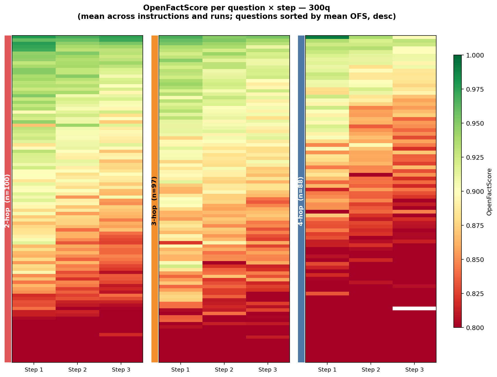

# OpenFActScore 300q — Analisi statistica completa

> Generato il 2026-05-19. Sostituisce le note OFS del [README.md](README.md), che
> erano basate sul sottoinsieme delle sole 55 domande 2-hop.

## 1. Cosa misura l'OpenFActScore (OFS)

Per ogni step di riscrittura il testo viene scomposto in **fatti atomici** (AFG) e
ogni fatto viene verificato contro il testo originale E_0 (AFV). Lo score è:

```
init_score = n_supported / n_facts                       (precision dei fatti)
factscore  = init_score * min(1, n_facts / γ)            (length penalty, γ=10)
```

`factscore` è la metrica analizzata qui. La penalità di lunghezza morde solo per
testi con meno di 10 fatti: in ~10% delle righe `factscore < init_score`.

## 2. Dataset

| Proprietà | Valore |
|---|---|
| Osservazioni | 10.692 righe |
| Domande uniche (qid) | 297 |
| Hop coperti | 2, 3, 4 (100 / 97 / 100 qid) |
| Step | 1, 2, 3 (testo originale = step 0, non riscritto) |
| Run per chain | 3 (run 0/1/2) |
| Istruzioni | content → `elaborate`, `shorten`; style → `formality`, `paraphrase` |

Il CSV è stato ripulito da 3 righe corrotte (marker di merge-conflict Git).
Le figure sono state rigenerate sui dati puliti.

## 3. Metodo

- **Modello**: Linear Mixed Model `factscore ~ C(step)` con intercetta random per
  domanda `(1|qid)`. La struttura random è necessaria: l'ICC per qid è **0.32**,
  cioè un terzo della varianza è tra-domanda.
- **Contrasti**: planned step k → k+1, test di Wilcoxon appaiato (non-parametrico),
  correzione **Holm** per confronti multipli.
- **Effect size**: rank-biserial correlation per i contrasti Wilcoxon.
- **Nota normalità**: Shapiro p ≈ 10⁻⁵⁰ → residui non normali. Con n = 10.692
  l'LMM resta robusto e i contrasti sono comunque non-parametrici.

Script: [`scripts/300q/inference_tests.py`](../../../scripts/300q/inference_tests.py).
Output grezzi: [`stats/inference/`](inference/) (`ofs_step_model.csv`,
`ofs_step_contrasts.csv`, `ofs_lmm_*.csv`).

---

## 4. Risultati

### 4.1 Effetto step — degradazione altamente significativa

| Termine | coef | p |
|---|---|---|
| Intercept (step 1) | 0.863 | — |
| step 2 | **−0.0148** | 5.0 × 10⁻⁹ |
| step 3 | **−0.0253** | 1.3 × 10⁻²³ |

Contrasti appaiati (Wilcoxon, Holm):

| Contrasto | n coppie | diff. media | p (Holm) | rank-biserial |
|---|---|---|---|---|
| step 1 → 2 | 297 | −0.0148 | 2.6 × 10⁻²⁰ | 0.62 |
| step 2 → 3 | 297 | −0.0105 | 1.0 × 10⁻¹⁶ | 0.56 |

**La fedeltà fattuale cala in modo monotono e altamente significativo a ogni
riscrittura.** L'effetto è però **piccolo in magnitudine**: ~2.5 punti percentuali
totali su 3 riscritture.


### 4.2 Step × group — content vs style

`C(group)[style]` p = 0.48 → **nessuna differenza di livello** tra content e style.
L'unica interazione significativa è `step3 : style` (+0.013, p = 0.008): allo step 3
lo style degrada leggermente meno del content. Effetto piccolo.

### 4.3 Step × instruction — il pattern più interessante

**Content** (`elaborate` = riferimento):

| Termine | coef | p |
|---|---|---|
| shorten (livello) | −0.0244 | 9.1 × 10⁻⁷ |
| step3 : shorten | **+0.0157** | 0.026 |

`shorten` parte più basso di `elaborate`, ma degrada *meno per step*: `elaborate`
parte alto e crolla di più.

**Style** (`formality` = riferimento):

| Termine | coef | p |
|---|---|---|
| paraphrase (livello) | −0.0292 | 7.0 × 10⁻¹⁰ |
| step2 (in formality) | −0.0071 | 0.14 (n.s.) |
| step3 (in formality) | −0.0122 | 0.010 |

`paraphrase` parte più basso di `formality`. L'effetto step in `formality` è quasi
nullo → **`formality` è praticamente stabile, l'istruzione più conservativa.**

In sintesi: `formality` stabile · `elaborate` parte alto ma crolla ·
`paraphrase` e `shorten` partono bassi.

### 4.4 Step × hop — nessuna interazione

| Termine | coef | p |
|---|---|---|
| n_hop = 3 (livello) | −0.0018 | 0.87 (n.s.) |
| n_hop = 4 (livello) | −0.0334 | 0.003 |
| step × hop (tutte) | — | da 0.34 a 0.92 (n.s.) |

La **velocità** di degradazione è la stessa a 2/3/4 hop. C'è solo un effetto di
livello: le domande 4-hop partono più basse. Degradazione min→max per hop:
2-hop −0.026, 3-hop −0.021, 4-hop −0.029 (tutte p_Holm < 10⁻⁹).


### 4.5 Heatmap per domanda × step

La variabilità tra domande (ICC 0.32) è visibile: alcune chains restano fedeli,
altre degradano nettamente. La degradazione media è monotona ma non uniforme.



### 4.6 OFS predice la Answer F1?

Modello `F1 ~ factscore + bert_f1_baseline + C(step)` con `(1|qid)`:

| Predittore | coef | p |
|---|---|---|
| factscore | 0.055 | 0.024 |
| bert_f1_baseline | 0.775 | 7.1 × 10⁻²⁰ |

`factscore` è significativo ma **debole**: una volta controllata la similarità
globale (BERTScore), la fedeltà fattuale misurata da OFS contribuisce poco alla
risposta corretta.

---

## 5. Conclusioni

1. La degradazione dell'OFS per step è **statisticamente solidissima** (p fino a
   10⁻²³) ed è ora confermata su **tutti gli hop**, non solo 2-hop.
2. L'effetto è però **modesto in magnitudine**: ~2.5 pp su 3 riscritture.
3. Il pattern per istruzione è il risultato più informativo: `formality` resta
   stabile, `elaborate` parte alto ma è quello che crolla di più.
4. Il numero di hop modula il **livello di partenza** ma non la **velocità** di
   degradazione.
5. OFS e Answer F1 sono correlati solo debolmente: misurano cose diverse.

## 6. Limitazioni e prossimi passi

- **Length penalty**: poiché `n_facts` cala con lo step (75 → 59 → 53), parte del
  calo di `factscore` è accorciamento, non perdita di fedeltà. Confrontare
  `init_score` accanto a `factscore` isolerebbe i due effetti.
- **Errori non tipizzati**: la colonna `n_contradicted` è sempre 0 — l'OFS attuale
  produce solo etichette binarie SUPPORTED / NOT_SUPPORTED. Lo script
  [`factscore_reclassify_300q.py`](../../../scripts/300q/factscore_reclassify_300q.py)
  riclassificherebbe i NOT_SUPPORTED in CONTRADICTION / INVENTED / DISTORTED /
  UNVERIFIABLE.
- **Recall**: [`openfactscore_recall_300q.py`](../../../scripts/300q/openfactscore_recall_300q.py)
  misura quanti fatti di E_0 sopravvivono in E_k — complementare alla precision
  analizzata qui. Non ancora eseguito.
