# La storia del campione 300q — analisi completa

> Documento di sintesi narrativo, generato il 2026-05-19. Mette in fila tutte le
> metriche misurate sul campione 300q e racconta cosa raccontano *insieme*.
> Per i dettagli tecnici dei singoli test vedi:
> - [`README.md`](README.md) — Answer F1 e BERTScore
> - [`OPENFACTSCORE_ANALYSIS.md`](OPENFACTSCORE_ANALYSIS.md) — OpenFActScore
> - [`../../plots/300q/bleurt_answerf1_analysis.md`](../../plots/300q/bleurt_answerf1_analysis.md) — BLEURT

---

## 0. L'esperimento in una frase

Prendiamo 297 domande di MuSiQue (2/3/4-hop), e il loro testo di supporto viene
**riscritto 3 volte di fila** (step 1 → 2 → 3) sotto 4 istruzioni — `elaborate`,
`shorten` (gruppo *content*) e `formality`, `paraphrase` (gruppo *style*) — con 3
run ripetute. Lo step 0 è il testo originale, il baseline. Su ogni step misuriamo
**quanto il testo si è allontanato dall'originale** e **se resta utile/fedele**.

| Campo | Valore |
|---|---|
| Domande (qid) | 297 — 100 a 2-hop, 97 a 3-hop, 100 a 4-hop |
| Step di riscrittura | 1, 2, 3 (più lo step 0 = originale) |
| Istruzioni | elaborate, shorten, formality, paraphrase |
| Run per chain | 3 |
| Metriche | n_tokens · Answer F1 · BERTScore · BLEURT · OpenFActScore |

**La domanda di ricerca:** la riscrittura iterativa degrada il testo? E se sì,
*come* — perde contenuto, perde fedeltà, perde utilità per il QA?

---

## 1. Lunghezza — tutto inizia con la compressione

Il primo fatto, e il più sottovalutato: **nessuna istruzione mantiene la
lunghezza dell'originale.** Il testo originale ha mediana ~2340 token. Già dopo
la prima riscrittura ogni istruzione comprime drasticamente.

| Istruzione | step 1 | step 2 | step 3 | % chains < 200 tok (step 1) |
|---|---|---|---|---|
| elaborate | 710 | 647 | 620 | **32.1%** |
| formality | 935 | 722 | 631 | 10.1% |
| paraphrase | 555 | 420 | 357 | **29.7%** |
| shorten | 458 | 352 | 308 | 17.7% |

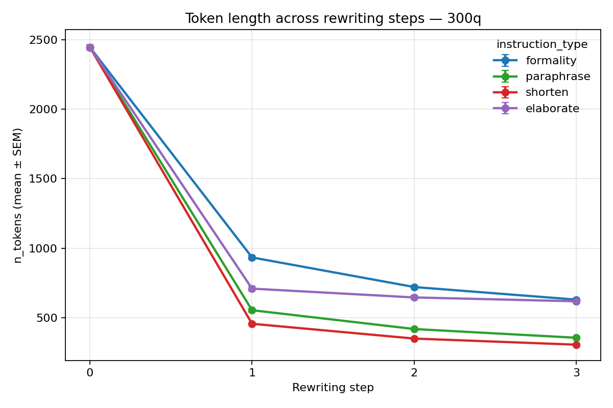

**Cosa salta all'occhio:**
- Anche `elaborate` — che dovrebbe *espandere* — comprime: mediana 813 token
  contro i 2340 dell'originale, e nel 32% dei casi scende sotto i 200 token.
  **Non è un fallimento "tecnico" (rifiuto, troncamento): gli output sono testi
  completi e ben formati — il modello obbedisce alla *forma* dell'istruzione
  (rielabora) ma ignora la *direzione* (allungare).** È la firma della
  **length / brevity bias** da instruction-tuning: il modello regredisce verso
  la lunghezza "tipica" di una buona risposta.
- `formality` comprime di meno (mantiene ~40% dell'originale), `shorten` di più.
- La compressione è **monotona**: ogni step accorcia ancora.

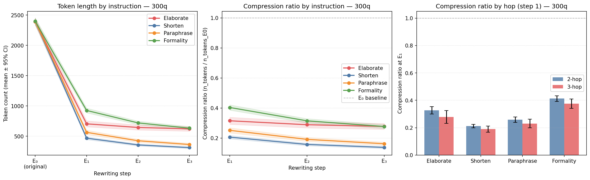

> **Perché conta:** la lunghezza non è un dettaglio cosmetico. È un **confondente**
> di tutto il resto — un testo più corto ha meno contenuto da verificare, meno
> appigli per rispondere. Una parte di ogni degrado che osserveremo è in realtà
> un effetto di compressione. Lo terremo a mente fino alla fine.

### 1.1 La replica su NewsQA — la compressione è del modello, non del dataset

Per escludere che la compressione sia un artefatto di MuSiQue (input lunghi,
ridondanti, multi-hop), abbiamo verificato lo stesso comportamento su **NewsQA**
(100 domande, singoli articoli di news, input mediano ~734 token — 3× più corto).

Confronto del primo step di riscrittura sui due dataset:

| Dataset | Istruzione | step 1 (mediana) | rapporto vs originale | % output più lunghi dell'originale |
|---|---|---|---|---|
| MuSiQue 300q | elaborate | 813 | 0.35 | **0.0%** |
| MuSiQue 300q | formality | 967 | 0.41 | 0.0% |
| MuSiQue 300q | paraphrase | 622 | 0.27 | 0.0% |
| MuSiQue 300q | shorten | 468 | 0.20 | 0.0% |
| NewsQA 100q | elaborate | 442 | 0.60 | 5.3% |
| NewsQA 100q | formality | 486 | 0.66 | 4.0% |
| NewsQA 100q | paraphrase | 332 | 0.45 | 0.0% |
| NewsQA 100q | shorten | 205 | 0.28 | 0.0% |

**Cosa è invariante tra i due dataset** (→ è il modello):
- `elaborate` **non espande mai**: su MuSiQue nessuno degli 891 output supera
  l'originale; su NewsQA solo il 5.3%. L'istruzione "espandi" viene di fatto
  ignorata su entrambi.
- L'ordine delle istruzioni per compressione è **identico**:
  `shorten` < `paraphrase` < `elaborate` < `formality`.

**Cosa cambia** (→ è il dataset): la compressione è molto più forte su MuSiQue
(rapporto ~0.30 vs ~0.66). Spiegazione: l'input MuSiQue è una concatenazione
ridondante di paragrafi multi-hop — più ridondanza in ingresso, più margine di
compressione. NewsQA è un singolo articolo, più denso, meno comprimibile.

> **Conclusione:** la compressione — e in particolare il fallimento di `elaborate`
> nell'espandere — è una proprietà del **modello di rewriting**, non di MuSiQue.
> L'entità scala con la ridondanza dell'input, ma la *direzione* (comprimere) non
> cambia mai. Due dataset con dominio, struttura e lunghezza diversi mostrano lo
> stesso pattern qualitativo.

---

## 2. Answer F1 — l'utilità per il QA crolla subito, poi si stabilizza

Answer F1 misura se un modello QA riesce ancora a rispondere correttamente alla
domanda usando il testo riscritto come contesto.

| Contrasto | diff. media | p (Holm) | effect size |
|---|---|---|---|
| step 0 → 1 | **−0.169** | 1.1 × 10⁻⁸ | 0.38 |
| step 1 → 2 | −0.030 | 0.93 (n.s.) | 0.02 |
| step 2 → 3 | −0.017 | 0.93 (n.s.) | 0.04 |

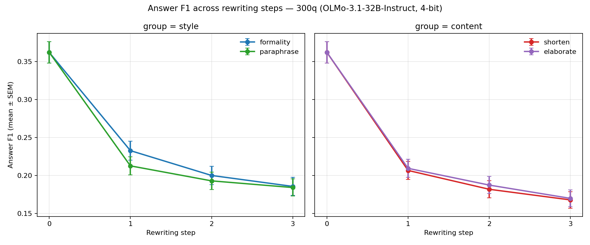

**La storia chiave dell'F1:** il danno è **tutto nel primo passo**. La prima
riscrittura distrugge ~17 punti di F1; le riscritture successive non aggiungono
un degrado statisticamente significativo. Una volta che il testo è stato
riscritto una volta, il danno per il QA è fatto.

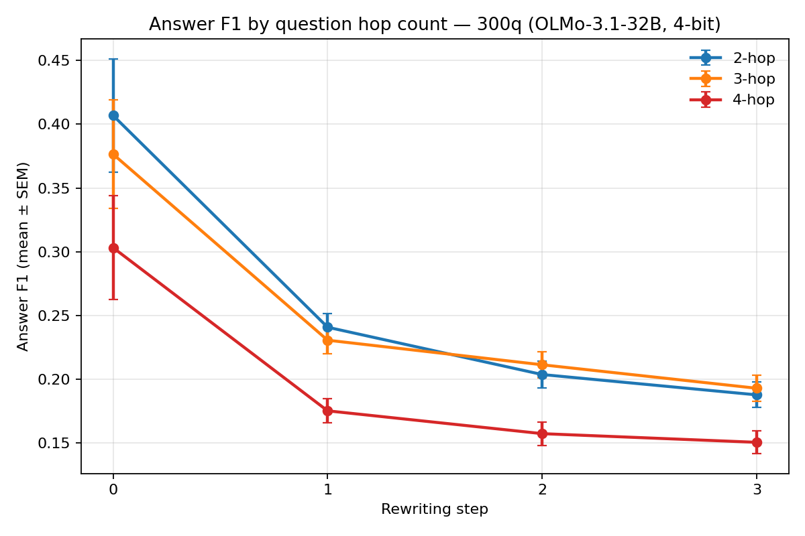

Per complessità: le 4-hop partono già più basse (0.43 vs 0.53 sul testo
originale) e perdono un po' meno in valore assoluto (−0.18 vs −0.23). Domande
più difficili = baseline più basso, non degrado più rapido.

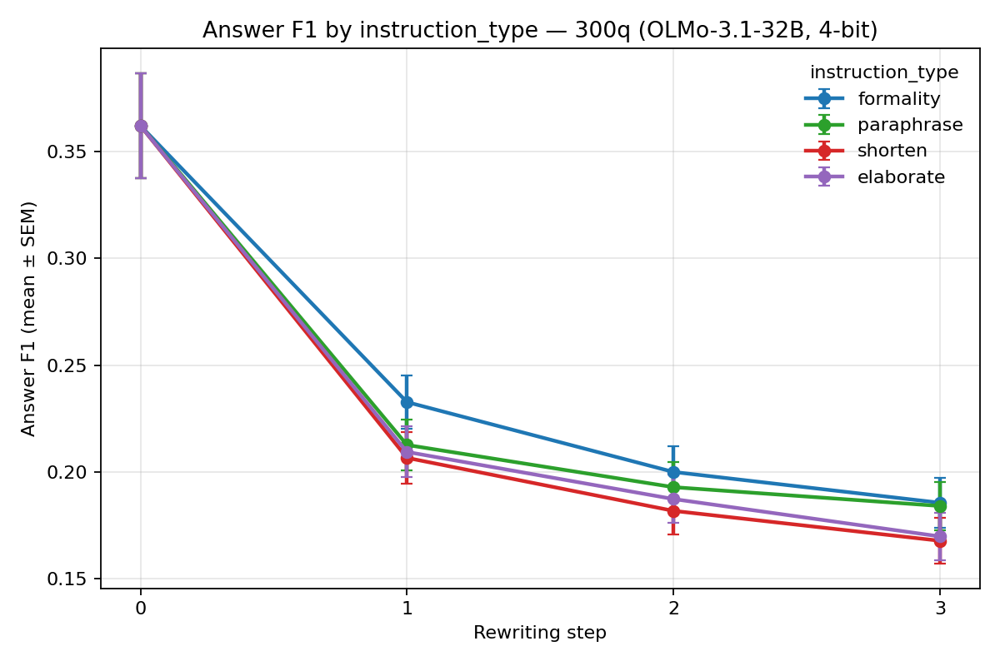

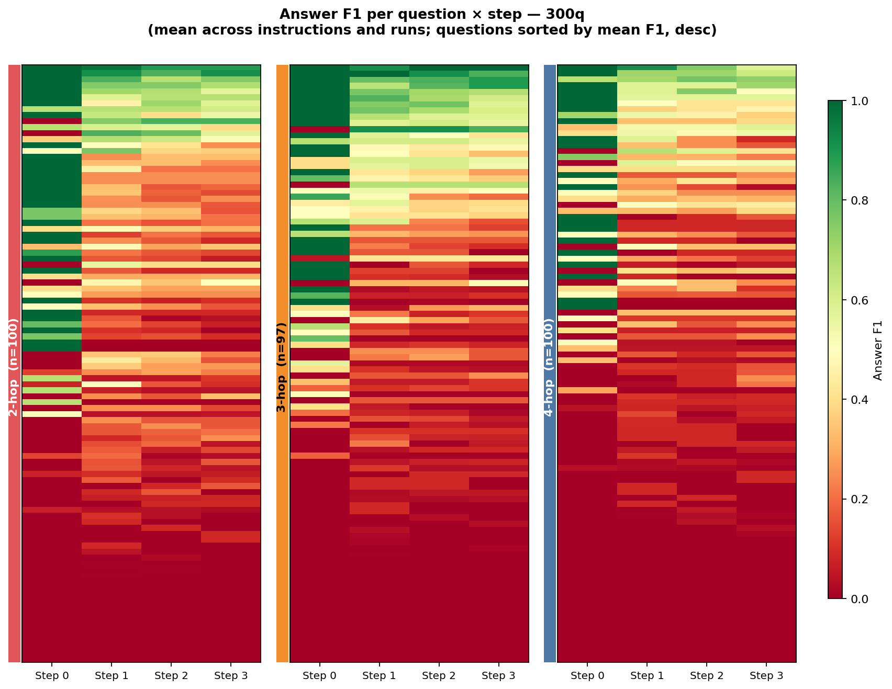

---

## 3. BERTScore — il testo deriva dall'originale ma converge a sé stesso

BERTScore misura la similarità semantica. Lo usiamo in due modi:
- **baseline** = similarità di ogni step con l'originale (step 0)
- **consecutive** = similarità di ogni step con lo step precedente

### 3.1 Baseline: deriva monotona dall'originale

| Contrasto | diff. media | p (Holm) | effect size |
|---|---|---|---|
| step 1 → 2 | −0.0084 | 5.1 × 10⁻⁴⁹ | 0.99 |
| step 2 → 3 | −0.0042 | 1.5 × 10⁻⁴⁶ | 0.96 |

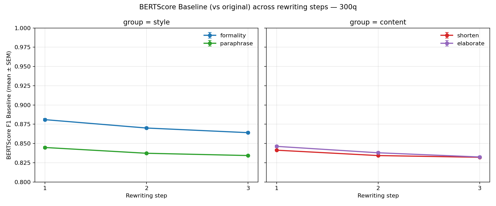

Ogni step si allontana ancora un po' dall'originale — effetto piccolo in
magnitudine ma **fortissimo come consistenza** (effect size ~0.99: quasi ogni
singola chain si allontana). La deriva è reale e universale.

### 3.2 Consecutive: la convergenza verso un attrattore

| Contrasto | diff. media | p (Holm) | effect size |
|---|---|---|---|
| step 1 → 2 | **+0.085** | 3.8 × 10⁻⁵⁰ | 1.00 |
| step 2 → 3 | +0.015 | 1.5 × 10⁻⁴⁷ | 0.97 |

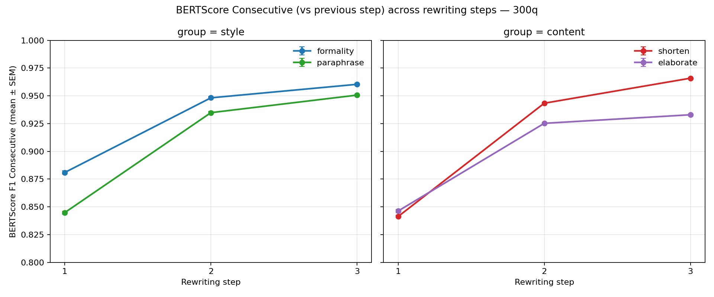

Questo è uno dei risultati più eleganti del campione: il BERTScore *consecutive*
**sale** (0.857 → 0.94 → 0.95). Tradotto: i primi passi cambiano molto il testo,
poi le riscritture cambiano sempre meno. Il modello **converge verso un punto
fisso** — riscrivere ancora produce quasi lo stesso testo.

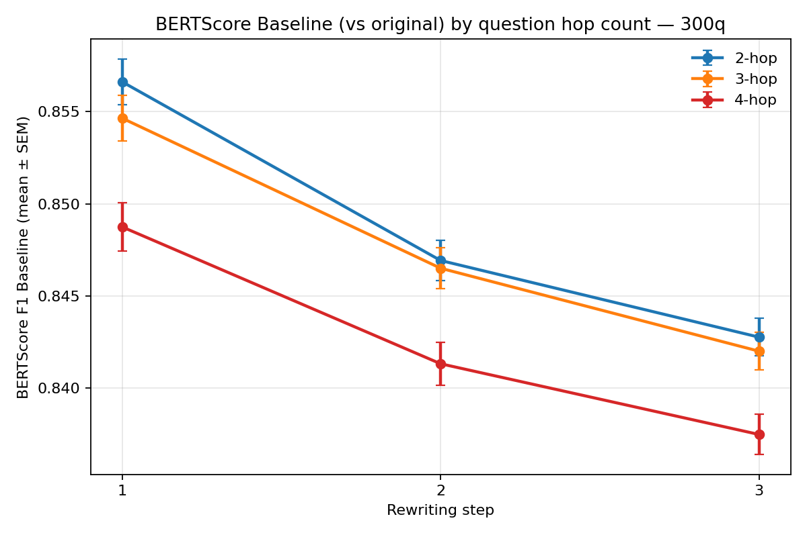
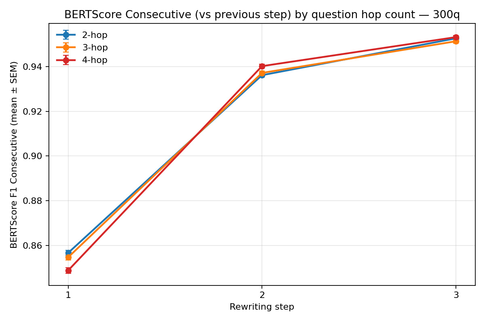

Le 4-hop convergono leggermente più in fretta (interazione step2×hop4 p<10⁻⁹).

---

## 4. BLEURT — validare Answer F1: i falsi negativi sono trascurabili

Sospetto naturale: Answer F1 è una metrica lessicale, potrebbe bocciare risposte
giuste formulate diversamente (`"10-year"` vs `"10 years"`). Per controllare,
calcoliamo BLEURT tra risposta gold e risposta predetta.

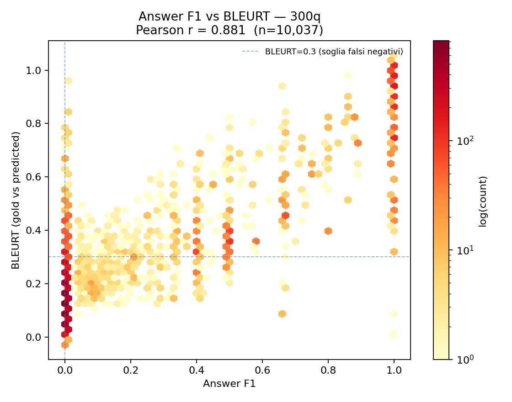

F1 e BLEURT sono **fortemente allineati** (Pearson r = 0.88): quando il modello
sbaglia, sbaglia davvero — la risposta non è nemmeno semanticamente vicina.

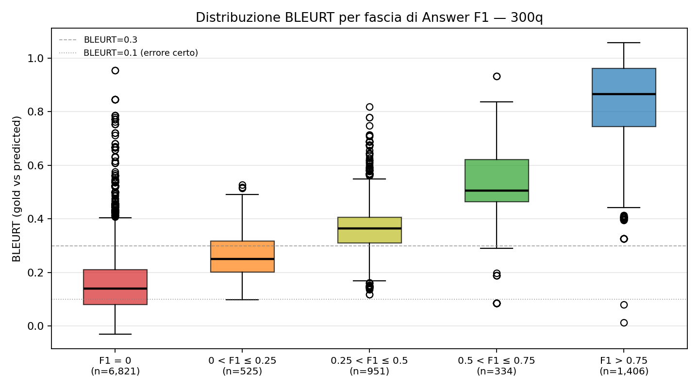

La mediana BLEURT sale in modo monotono con la fascia di F1
(0.14 → 0.25 → 0.37 → 0.51 → 0.87): nessuna inversione, le due metriche misurano
la stessa cosa nella stessa direzione.

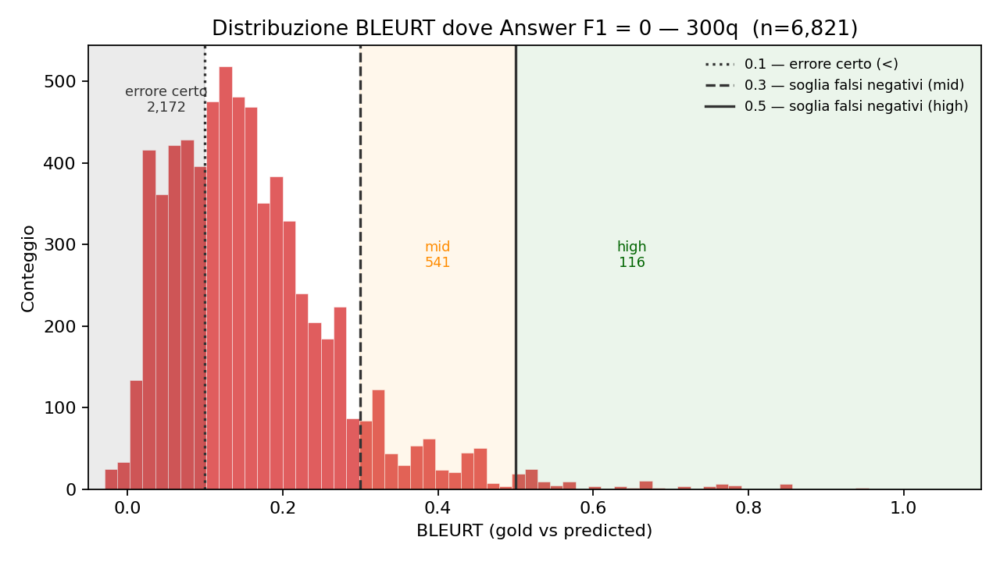

**Il verdetto sui falsi negativi:** sui 6.821 casi con F1=0, solo lo 0.27%
(stima conservativa, BLEURT ≥ 0.7) sono risposte realmente corrette non
matchate. Correggendoli, l'F1 medio passa da 0.207 a 0.210 — **Δ = +0.003,
irrilevante**. Answer F1 è affidabile: il crollo che misura è reale.

---

## 5. OpenFActScore — la fedeltà fattuale degrada, ma lentamente

OFS scompone il testo in fatti atomici e verifica quanti sono supportati
dall'originale. È la metrica di **fedeltà fattuale**.

| Contrasto | diff. media | p (Holm) | effect size |
|---|---|---|---|
| step 1 → 2 | −0.0148 | 2.6 × 10⁻²⁰ | 0.62 |
| step 2 → 3 | −0.0105 | 1.0 × 10⁻¹⁶ | 0.56 |

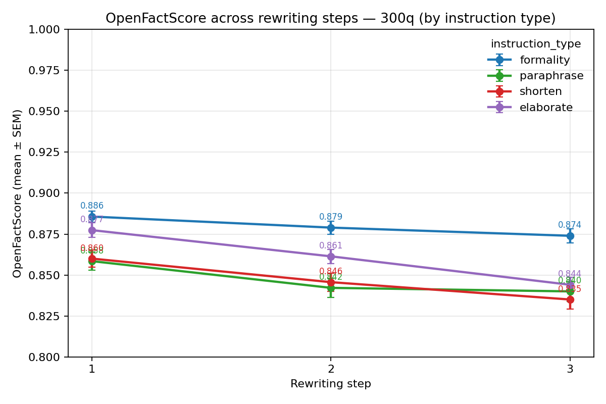
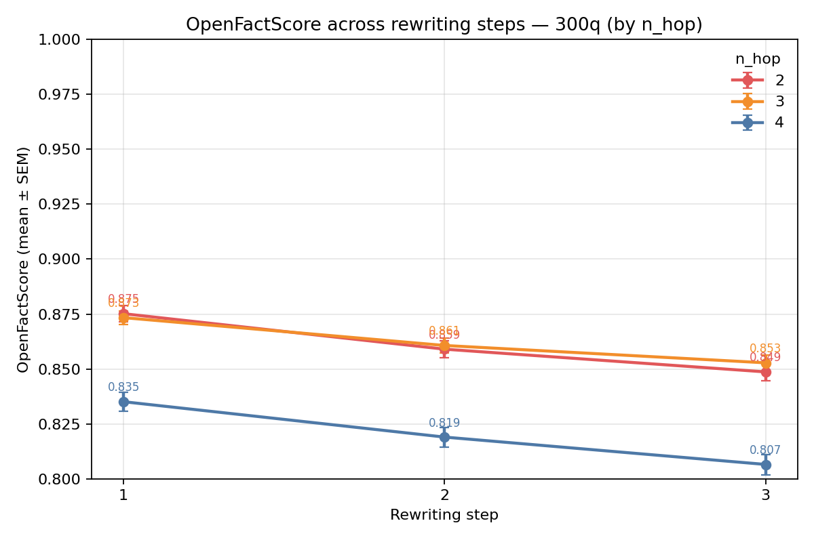

A differenza dell'F1 (tutto il danno al primo passo) e del BERTScore (deriva
costante), l'OFS degrada **monotonamente e gradualmente**: ~2.5 punti su 3
riscritture. Statisticamente solidissimo, ma di magnitudine modesta. `formality`
resta quasi stabile; `elaborate` parte alto ma è quello che crolla di più.
Dettaglio completo in [`OPENFACTSCORE_ANALYSIS.md`](OPENFACTSCORE_ANALYSIS.md).

---

## 6. Le metriche insieme — cosa misurano davvero

Correlazione repeated-measures tra le metriche (rm_corr):

| Coppia | r | p |
|---|---|---|
| factscore ~ bert_f1_baseline | 0.197 | 3.7 × 10⁻⁹¹ |
| answer_f1 ~ bert_f1_baseline | 0.102 | 2.1 × 10⁻²⁵ |
| answer_f1 ~ factscore | 0.043 | 1.1 × 10⁻⁵ |

**Tutte le correlazioni sono significative ma deboli.** Questo è il punto: le tre
metriche **non sono ridondanti**, misurano dimensioni diverse del degrado:
- **BERTScore** → quanto il testo è cambiato (forma)
- **OFS** → quanto il testo è ancora fedele ai fatti (contenuto)
- **Answer F1** → quanto il testo è ancora utile per rispondere (funzione)

Un testo può derivare molto (BERTScore basso) restando fedele (OFS alto), o
restare simile pur diventando inutile per il QA. Servono tutte e tre.

### Variabilità tra run — l'esperimento è stabile

ICC per run da 0.02 a 0.08 su tutte le metriche: la stocasticità tra le 3
ripetizioni è minima. I run sono praticamente intercambiabili → i pattern
osservati non sono rumore.

---

## 7. La storia completa, in tre frasi

1. **La prima riscrittura fa quasi tutto il danno funzionale.** Answer F1 crolla
   di 17 punti allo step 0→1 e poi si stabilizza: il testo riscritto una volta
   ha già perso la sua utilità per il QA.
2. **Le riscritture successive convergono.** Il BERTScore consecutive sale verso
   ~0.95: il modello riscrive sempre verso lo stesso punto fisso. La deriva
   dall'originale continua, ma rallenta.
3. **La fedeltà fattuale si erode piano.** L'OFS cala in modo lento e costante
   (~2.5 pp totali). Il testo non diventa improvvisamente falso — si consuma
   gradualmente.

**E sotto tutto questo c'è la compressione.** Ogni istruzione accorcia il testo
fino a 1/4–1/8 dell'originale. Una parte di ogni degrado misurato è la
conseguenza di un testo che ha semplicemente meno informazione. Isolare
quanto del calo è "danno della riscrittura" e quanto è "effetto lunghezza" è il
filo aperto principale.

---

## 8. Limitazioni e prossimi passi

- **Confondente lunghezza** — i modelli di mediazione (§4.8 del README) iniziano
  a separarlo, ma resta il caveat trasversale a tutte le metriche.
- **Answer F1 in 4-bit** — calcolato con OLMo-3.1-32B in quantizzazione 4-bit
  NF4; i confronti relativi reggono, i valori assoluti potrebbero spostarsi in
  bf16.
- **OFS — errori non tipizzati** — la metrica è binaria (supportato / no); la
  riclassificazione in contraddizione / invenzione / distorsione non è ancora
  stata eseguita.
- **OFS — recall non ancora calcolato** — sapere quanti fatti dell'originale
  *sopravvivono* nella riscrittura (complementare alla precision) chiuderebbe
  il quadro sulla fattualità.

---

## Indice dei file

| Documento | Copre |
|---|---|
| [`STORIA_300q.md`](STORIA_300q.md) | questo file — sintesi narrativa |
| [`README.md`](README.md) | Answer F1, BERTScore, lunghezza — dettaglio test |
| [`OPENFACTSCORE_ANALYSIS.md`](OPENFACTSCORE_ANALYSIS.md) | OpenFActScore — dettaglio test |
| [`../../plots/300q/bleurt_answerf1_analysis.md`](../../plots/300q/bleurt_answerf1_analysis.md) | BLEURT — falsi negativi di F1 |
| [`inference/inference_summary.md`](inference/inference_summary.md) | tabella unica di tutti i p-value |
