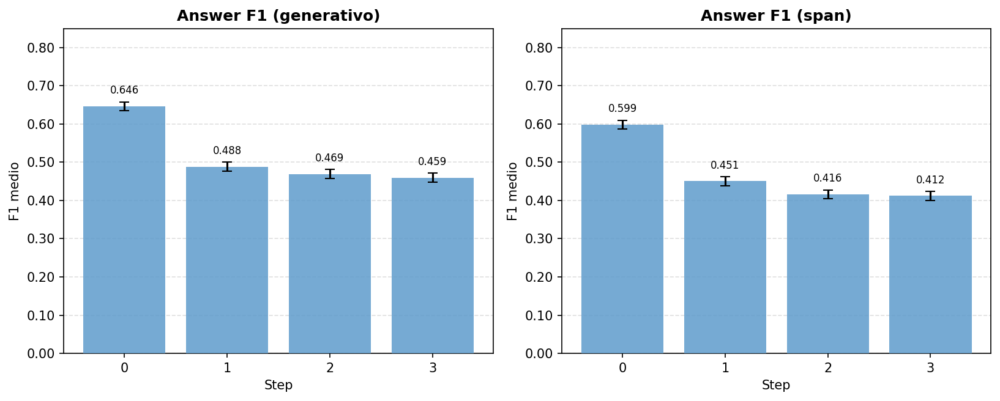
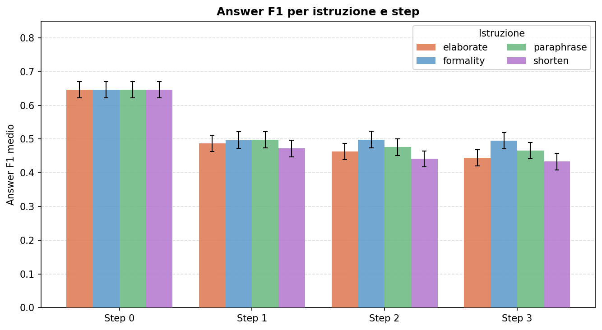
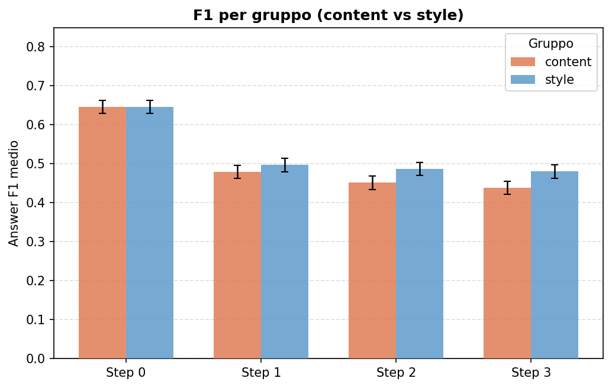
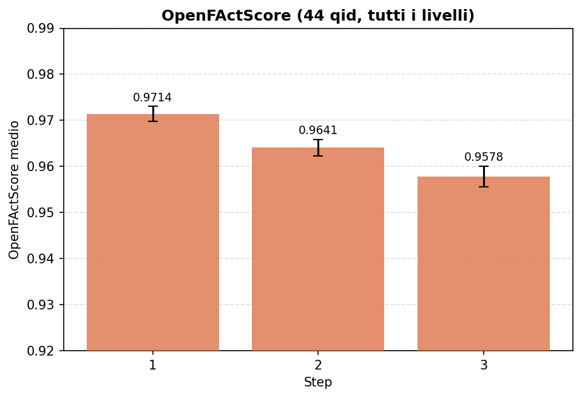
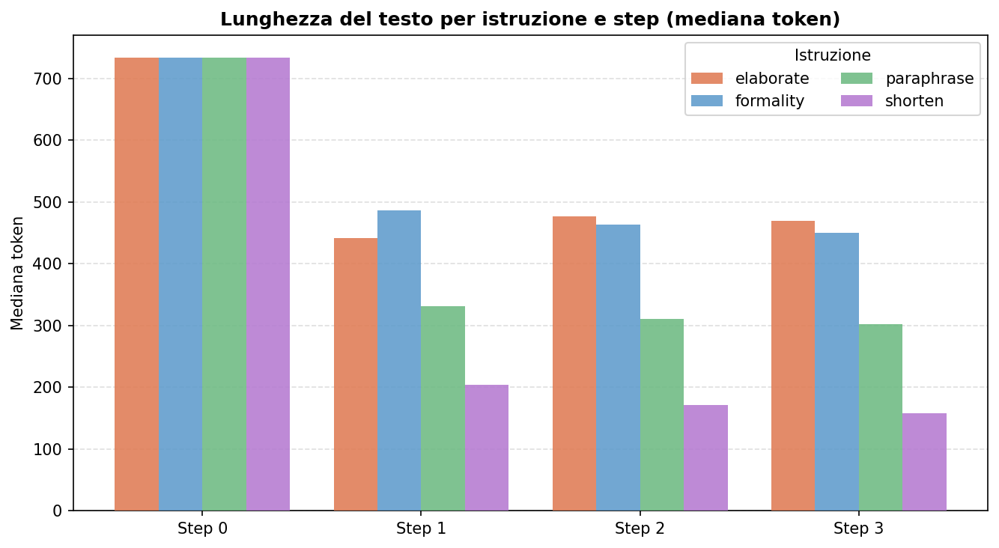
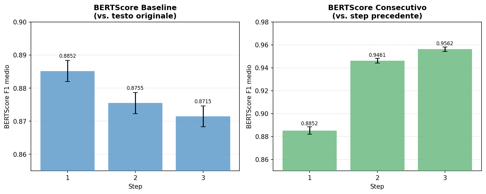

# Analisi NewsQA — 100 domande (OLMo-3.1-32B-Instruct)

> **Dataset:** NewsQA (CNN stories) · **Modello:** OLMo-3.1-32B-Instruct  
> **Disegno:** 100 qid × 4 istruzioni × 3 run × 4 step (0–3) = 4 800 osservazioni per metrica

---

## Setup sperimentale

Il testo di ogni articolo è riscritto **3 volte di fila** (step 1, 2, 3) sotto quattro tipi di istruzione:

| Gruppo | Istruzione | Descrizione |
|--------|-----------|-------------|
| **content** | `elaborate` | arricchisci / espandi il testo |
| **content** | `shorten` | accorcialo mantenendo il senso |
| **style** | `formality` | rendilo più formale |
| **style** | `paraphrase` | parafrasa mantenendo il contenuto |

Ogni rewriting è **ripetuto 3 volte indipendenti** (run 0, 1, 2) per stimare la variabilità stocastica del modello.

**Step 0** = testo originale (non riscritto), usato come baseline per tutte le metriche.

**Differenza da MuSiQue:** NewsQA usa articoli CNN singoli (domande a risposta span su testo giornalistico), non sistemi multi-hop. Non c'è quindi la dimensione `n_hop`. I testi originali sono più brevi (mediana ~734 token vs ~2 340 di MuSiQue).

### Metriche

| Metrica | Cosa misura | Range | Step disponibili |
|---------|------------|-------|-----------------|
| **Answer F1 generativo** | il modello QA trova la risposta nel testo riscritto? | 0–1 | 0, 1, 2, 3 |
| **Answer F1 span** | versione estrattiva della stessa metrica | 0–1 | 0, 1, 2, 3 |
| **OpenFActScore (OFS)** | proporzione di affermazioni fattualmente supportate | 0–1 | 1, 2, 3 |
| **BERTScore baseline** | similarità semantica vs. testo originale (step 0) | 0–1 | 1, 2, 3 |
| **BERTScore consecutivo** | similarità semantica vs. step precedente | 0–1 | 1, 2, 3 |

> **Nota copertura:** BERTScore calcolato su **7 qid** (pilot, limitazione tecnica); OFS su **44 qid** (sottoinsieme). Answer F1 su tutti e 100 i qid.

---

## 1. Answer F1 — il crollo avviene al primo step

*Barre: media su 100 qid × 4 istruzioni × 3 run. Whisker: errore standard.*

### Medie per step

| Step | F1 generativo | F1 span |
|------|--------------|---------|
| **0** (originale) | **0.6461** | **0.5986** |
| 1 | 0.4883 | 0.4506 |
| 2 | 0.4694 | 0.4161 |
| 3 | 0.4595 | 0.4121 |

### Test statistici

**Friedman omnibus** (test non parametrico su misure ripetute, agnostico rispetto alla distribuzione):

| Metrica | χ² | p |
|---------|----|----|
| F1 generativo | 50.72 | 5.6 × 10⁻¹¹ |
| F1 span | 48.06 | 2.1 × 10⁻¹⁰ |

Entrambi altamente significativi: la distribuzione di F1 differisce tra step, indipendentemente da qualsiasi assunzione parametrica.

**Wilcoxon paired step-by-step** (corretti Holm):

| Contrasto | Δ gen | p_holm gen | Δ span | p_holm span |
|-----------|-------|-----------|--------|------------|
| step 0 → 1 | **−0.158** | **6.2 × 10⁻⁶** | **−0.148** | **1.1 × 10⁻⁴** |
| step 1 → 2 | −0.019 | 0.029 | −0.035 | **4.9 × 10⁻⁴** |
| step 2 → 3 | −0.010 | 0.055 (n.s.) | −0.004 | 0.177 (n.s.) |

**Lettura:** quasi tutto il danno si concentra al primo rewriting. Il calo dal testo originale allo step 1 è di **~15–16 punti percentuali**. Gli step successivi producono cali molto più piccoli: significativi per F1 span (step 1→2), borderline o non significativi per F1 generativo (step 1→2 p = 0.029; step 2→3 n.s.).

Il pattern è coerente tra le due versioni dell'F1, confermando che il fenomeno non dipende dal tipo di valutatore.

---

## 2. Answer F1 per istruzione

*Ogni cluster di barre corrisponde a uno step; colori = istruzione.*

### Medie per istruzione × step

| Istruzione | step 0 | step 1 | step 2 | step 3 | Δ cumulativo (0→3) |
|-----------|--------|--------|--------|--------|-------------------|
| elaborate | 0.646 | 0.487 | 0.462 | 0.444 | **−0.202** |
| formality | 0.646 | 0.497 | 0.498 | 0.495 | **−0.151** |
| paraphrase | 0.646 | 0.498 | 0.476 | 0.465 | **−0.181** |
| shorten | 0.646 | 0.472 | 0.441 | 0.433 | **−0.213** |

### Test Kruskal-Wallis tra istruzioni per step

| Step | H | p |
|------|---|---|
| 1 | 0.49 | 0.92 (n.s.) |
| 2 | 2.72 | 0.44 (n.s.) |
| 3 | 3.64 | 0.30 (n.s.) |

**Nessuna differenza significativa tra istruzioni.** La superiorità apparente di `formality` a step 2 e 3 (Δ ≈ +5 pp vs `elaborate`) non è statisticamente distinguibile dal rumore — e, analogamente a quanto osservato su MuSiQue, è quasi interamente spiegata dalla lunghezza prodotta (vedi §5).

---

## 3. Answer F1: content vs. style

| Gruppo | step 0 | step 1 | step 2 | step 3 |
|--------|--------|--------|--------|--------|
| **content** | 0.646 | 0.480 | 0.452 | 0.439 |
| **style** | 0.646 | 0.497 | 0.487 | 0.480 |

Le istruzioni **style** (`formality` + `paraphrase`) mantengono un F1 sistematicamente più alto degli step avanzati rispetto alle istruzioni **content** (`elaborate` + `shorten`). La differenza è ~4 pp a step 3. Questo pattern è coerente con il fatto che le istruzioni di stile tendono a preservare più contenuto lessicale dell'originale (confermato dai BERTScore e dalle lunghezze, vedi §§4–5).

---

## 4. OpenFActScore — degrado progressivo e significativo

*Calcolato su 44 qid (sottoinsieme con OFS disponibile), tutti i livelli e istruzioni.*

### Medie OFS per step

| Step | OFS medio | n |
|------|----------|---|
| 1 | **0.9714** | 524 |
| 2 | 0.9641 | 524 |
| 3 | 0.9578 | 524 |

**Friedman omnibus:** χ² = 23.32, p = 8.6 × 10⁻⁶ — altamente significativo.

**Wilcoxon paired (Holm):**

| Contrasto | Δ | p_holm |
|-----------|---|--------|
| step 1 → 2 | −0.0073 | **2.8 × 10⁻³** |
| step 2 → 3 | −0.0063 | **4.8 × 10⁻³** |

Ogni rewriting introduce errori fattuali in modo progressivo e statisticamente significativo. Il calo cumulativo da step 1 a step 3 è di **~1.4 punti percentuali** — contenuto in termini assoluti ma robusto e monotonico.

### Numero di fatti medi per step

| Step | n_facts | n_supported | n_not_supported |
|------|---------|-------------|-----------------|
| 1 | 42.71 | 41.36 | 1.34 |
| 2 | 40.64 | 39.04 | 1.60 |
| 3 | 39.49 | 37.78 | 1.71 |

Con ogni step il testo produce meno affermazioni totali (compressione) e la proporzione di quelle non supportate cresce lentamente. I fatti **contradetti** sono sempre 0: il modello non inventa attivamente informazioni false, ma perde gradualmente fatti supportabili.

---

## 5. Lunghezza del testo — NewsQA è più corto di MuSiQue

*Mediane per step. Nota: i testi originali (step 0) hanno mediana 734 token.*

### Mediane token per istruzione × step

| Istruzione | step 0 | step 1 | step 2 | step 3 |
|-----------|--------|--------|--------|--------|
| elaborate | 734 | 442 | 477 | 470 |
| formality | 734 | 486 | 463 | 450 |
| paraphrase | 734 | 332 | 311 | 303 |
| shorten | 734 | 204 | 171 | 158 |

**Osservazioni chiave:**

1. **Nessuna istruzione allunga mai il testo** — nemmeno `elaborate`. Su NewsQA il comportamento di `elaborate` rispecchia quello già osservato su MuSiQue: il modello comprime invece di espandere. La differenza è che su NewsQA i testi originali sono già molto più brevi (~734 vs ~2340 token), quindi il collasso è meno drammatico.

2. **`shorten` porta i testi a ~158 token** a step 3: quasi un quinto dell'originale. Questo spiega il calo di F1 più accentuato per questa istruzione.

3. **% catene <200 token a step 1:**

| Istruzione | % catene <200 tok (step 1) |
|-----------|---------------------------|
| elaborate | 2.3% |
| formality | 1.7% |
| paraphrase | 9.7% |
| **shorten** | **46.7%** |

Su MuSiQue `shorten` produceva il 17.7% di catene corte a step 1; su NewsQA **quasi la metà** delle catene scende sotto 200 token già al primo rewriting. I testi originali più brevi non lasciano margine.

4. **`elaborate` stabilizza** la lunghezza tra step 1 e step 3 (~442→470): una volta compresso, il testo non si accorcia ulteriormente. Le altre istruzioni continuano a ridurre la lunghezza a ogni step.

---

## 6. BERTScore — drift testuale e convergenza (7 qid)

> **Attenzione alla generalizzabilità.** Il BERTScore è stato calcolato su soli 7 qid (pilot tecnico). I test statistici su n=7 hanno potenza molto limitata. I valori sono indicativi; per conclusioni robuste serve il calcolo completo.

### BERTScore baseline (vs. originale)

| Step | F1 baseline medio |
|------|------------------|
| 1 | 0.8852 |
| 2 | 0.8755 |
| 3 | 0.8715 |

Wilcoxon step1→2: Δ = −0.010, p = 0.016; step2→3: Δ = −0.004, p = 0.016.  
Il testo si allontana dall'originale in modo monotonico a ogni step.

### BERTScore consecutivo (vs. step precedente)

| Step | F1 consecutivo medio |
|------|---------------------|
| 1 | 0.8852 |
| 2 | 0.9461 |
| 3 | 0.9562 |

Wilcoxon step1→2: Δ = +0.059, p = 0.016; step2→3: Δ = +0.010, p = 0.016.

**Lettura:** il pattern è identico a quello osservato su MuSiQue. Il sistema si allontana dall'originale (BERTScore baseline scende) ma gli step successivi diventano sempre più simili tra loro (BERTScore consecutivo sale). Il rewriting converge rapidamente verso un "attrattore" stilistico del modello — dopo il primo step il testo cambia sempre meno ad ogni iterazione.

---

## 7. Recovery — il rewriting può correggere risposte sbagliate

### Statistiche di partenza

Su 1 200 chain totali (100 qid × 4 istruzioni × 3 run):

- **264 chain (22.0%)** partono con F1 = 0 sul testo originale — cioè il modello QA non riesce già a rispondere prima del rewriting.
- Di queste, **85 chain (32.2%)** vengono **recuperate** — raggiungono F1 > 0 in almeno uno step successivo.

Rispetto a MuSiQue (21.9% di recovery sulle chain F1=0), NewsQA mostra un tasso di recupero maggiore (32.2%), coerente con il fatto che le domande NewsQA sono strutturalmente più semplici (single-hop, risposta span su articolo singolo).

### Recovery per istruzione

| Istruzione | Chain F1=0 | Recovered | % recovery |
|-----------|-----------|-----------|------------|
| elaborate | 66 | 19 | 28.8% |
| formality | 66 | 22 | 33.3% |
| paraphrase | 66 | 19 | 28.8% |
| **shorten** | **66** | **25** | **37.9%** |

Su NewsQA `shorten` è l'istruzione con il tasso di recupero più alto — un risultato opposto rispetto a MuSiQue dove `elaborate` era la migliore. Una possibile spiegazione: gli articoli CNN sono spesso verbosi; `shorten` riesce a portare la risposta in primo piano eliminando il rumore, mentre su MuSiQue i testi erano già molto compressi e `shorten` rimuoveva informazione utile.

---

## 8. Confronto con MuSiQue 300q

| Dimensione | MuSiQue 300q | NewsQA 100q |
|-----------|-------------|------------|
| Dataset | Multi-hop QA (2/3/4-hop) | Single-hop, risposta span (CNN) |
| F1 originale (step 0) | 0.362 | **0.646** |
| F1 dopo step 1 | 0.215 | 0.488 |
| Δ step 0→1 | **−0.169** | **−0.158** |
| F1 a step 3 | 0.177 | 0.460 |
| Δ cumulativo 0→3 | **−0.185** | **−0.186** |
| Token originale (mediana) | ~2 340 | ~734 |
| % catene <200 tok (shorten, step 1) | 17.7% | **46.7%** |
| Recovery F1=0 | 21.9% | **32.2%** |
| OFS step 1 | 0.881 | **0.971** |
| OFS calo cumulativo (step 1→3) | −0.029 | **−0.014** |

**Analogie:**
- Il crollo di F1 al primo step ha un'entità quasi identica (Δ ≈ −0.16) nonostante la diversa struttura dei dataset.
- Il calo cumulativo su 3 step è sostanzialmente lo stesso (−0.185 vs −0.186).
- Il pattern BERTScore (allontanamento monotonico dall'originale + convergenza a un attrattore) si replica identicamente.
- L'effetto di step su F1 è significativo su entrambi i dataset con la stessa struttura: salto dominante al primo step, plateau successivo.

**Differenze:**
- Il livello assoluto di F1 è molto più alto su NewsQA (risposta span su testo singolo vs. multi-hop).
- La compressione di `shorten` è molto più aggressiva su NewsQA (testi già brevi).
- L'OFS parte più alto e cala meno in termini assoluti su NewsQA.
- Il recovery è più frequente su NewsQA.

---

## 9. Limitazioni

| Limitazione | Impatto |
|------------|---------|
| BERTScore su soli 7 qid | Test BERTScore con potenza molto bassa; valori indicativi |
| OFS su 44 qid (non tutti i 100) | Risultati OFS non pienamente rappresentativi di tutti i qid |
| Nessuna dimensione n-hop | Non è possibile analizzare l'effetto della complessità della domanda |
| Solo 3 step di rewriting | Non sappiamo se il trend si stabilizza o prosegue a step 4/5 |

---

## 10. Conclusioni

> Il rewriting iterativo su NewsQA produce lo stesso pattern strutturale osservato su MuSiQue: (1) un **crollo di Answer F1 quasi interamente concentrato al primo step** (−15–16 pp), con plateau quasi completo agli step successivi; (2) un **degrado di fattualità progressivo ma contenuto** (OFS −1.4 pp in 3 step, statisticamente significativo a ogni passaggio); (3) un **drift testuale monotonico** dall'originale con convergenza rapida verso un attrattore stilistico del modello. Le istruzioni di stile (`formality`, `paraphrase`) mantengono un F1 leggermente superiore alle istruzioni di contenuto, ma la differenza non è statisticamente significativa a parità di lunghezza prodotta. Su NewsQA `shorten` mostra il tasso di recupero più alto (37.9%), invertendo il pattern di MuSiQue: gli articoli CNN sono verbosi, e la compressione riesce a evidenziare la risposta nei casi in cui il testo originale era già abbastanza informativo ma dispersivo.

---

## Appendice — Grafici

| File | Contenuto |
|------|-----------|
| [fig1_f1_by_step.png](fig1_f1_by_step.png) | F1 generativo e span per step (media ± SE) |
| [fig2_f1_by_instruction.png](fig2_f1_by_instruction.png) | F1 generativo per istruzione × step |
| [fig3_ofs_by_step.png](fig3_ofs_by_step.png) | OpenFActScore per step (44 qid) |
| [fig4_bertscore.png](fig4_bertscore.png) | BERTScore baseline e consecutivo (7 qid) |
| [fig5_token_lengths.png](fig5_token_lengths.png) | Lunghezza mediana token per istruzione × step |
| [fig6_f1_content_vs_style.png](fig6_f1_content_vs_style.png) | F1 per gruppo (content vs style) |
