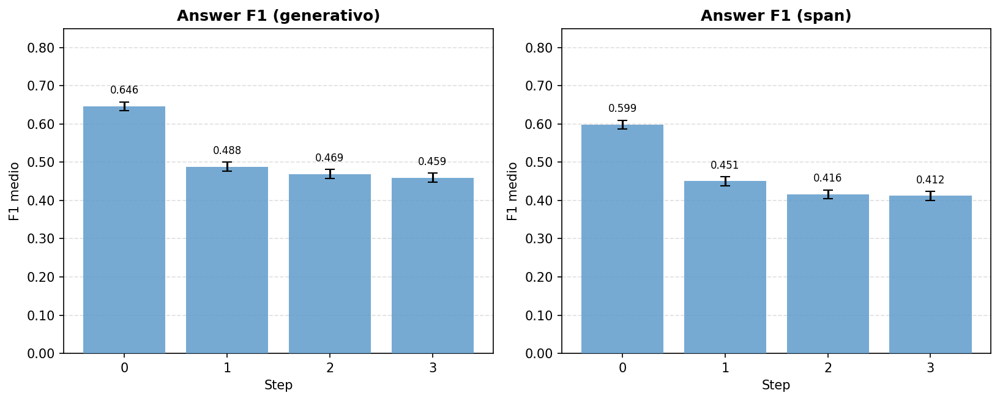
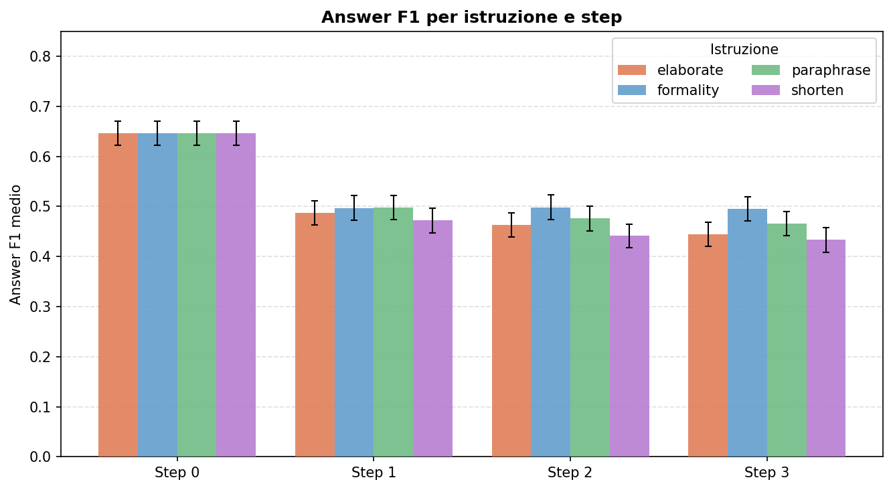
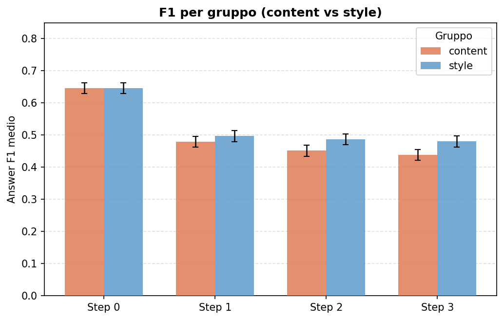
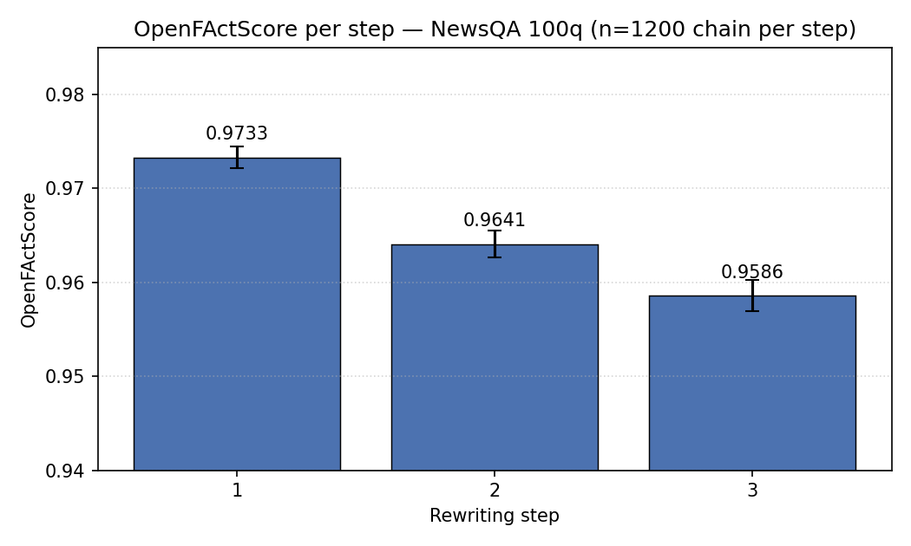
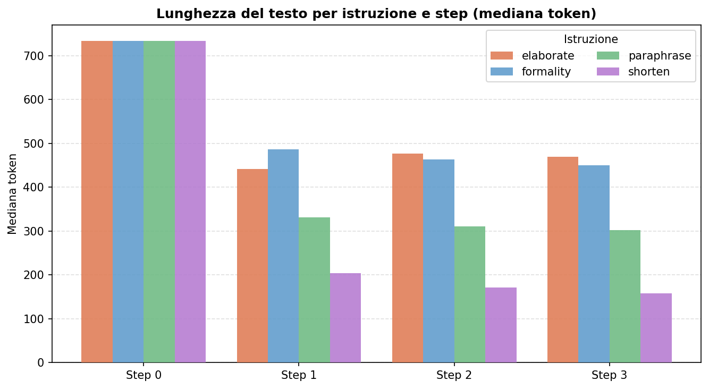
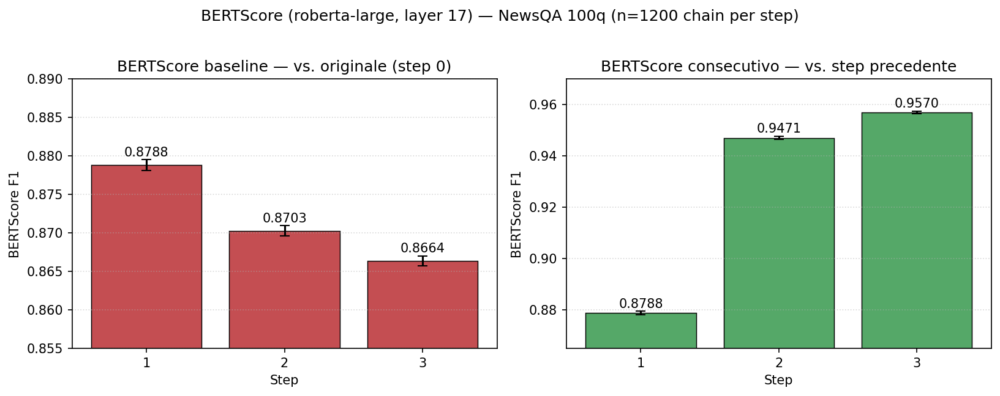

# Analisi NewsQA — 100 domande (OLMo-3.1-32B-Instruct)

> **Dataset:** NewsQA (CNN stories) · **Modello:** OLMo-3.1-32B-Instruct  
> **Disegno:** 100 qid × 4 istruzioni × 3 run × 4 step (0–3) = 4 800 osservazioni per metrica

---

## Setup sperimentale

Il testo di ogni articolo è riscritto **3 volte di fila** (step 1, 2, 3) sotto quattro tipi di istruzione:

| Gruppo | Istruzione | Descrizione |
|--------|-----------|-------------|
| **content** | `elaborate` | arricchisci / espandi il testo |
| **content** | `shorten` | accorcialo mantenendo il senso |
| **style** | `formality` | rendilo più formale |
| **style** | `paraphrase` | parafrasa mantenendo il contenuto |

Ogni rewriting è **ripetuto 3 volte indipendenti** (run 0, 1, 2) per stimare la variabilità stocastica del modello.

**Step 0** = testo originale (non riscritto), usato come baseline per tutte le metriche.

**Differenza da MuSiQue:** NewsQA usa articoli CNN singoli (domande a risposta span su testo giornalistico), non sistemi multi-hop. Non c'è quindi la dimensione `n_hop`. I testi originali sono più brevi (mediana ~734 token vs ~2 340 di MuSiQue).

### Metriche

| Metrica | Cosa misura | Range | Step disponibili |
|---------|------------|-------|-----------------|
| **Answer F1 span** (metrica primaria) | versione estrattiva: il modello QA trova lo span di risposta nel testo riscritto? | 0–1 | 0, 1, 2, 3 |
| **Answer F1 generativo** (di confronto) | versione generativa della stessa metrica | 0–1 | 0, 1, 2, 3 |
| **OpenFActScore (OFS)** | proporzione di affermazioni fattualmente supportate | 0–1 | 1, 2, 3 |
| **BERTScore baseline** (primaria per drift) | similarità contestuale (roberta-large) vs. testo originale (step 0) | 0–1 | 1, 2, 3 |
| **BERTScore consecutivo** | BERTScore vs. step precedente | 0–1 | 1, 2, 3 |
| **BLEURT baseline / consecutivo** (di confronto) | similarità semantica appresa vs. originale / step precedente | ~−2…1 | 1, 2, 3 |

> **Nota copertura:** **tutte** le metriche sono ora calcolate su **tutti e 100 i qid** (1 200 chain × step). BERTScore aggiornato 2026-05-21 (in precedenza pilot su 7 qid).

---

## 1. Answer F1 — il crollo avviene al primo step

*Barre: media su 100 qid × 4 istruzioni × 3 run. Whisker: errore standard. La metrica primaria è **F1 span** (estrattiva); il F1 generativo è riportato come confronto.*

### Medie per step

| Step | F1 span (primaria) | F1 generativo |
|------|-------------------|---------------|
| **0** (originale) | **0.5986** | 0.6461 |
| 1 | **0.4506** | 0.4883 |
| 2 | **0.4161** | 0.4694 |
| 3 | **0.4121** | 0.4595 |

### Test statistici

**Friedman omnibus** su misure ripetute paired (1 200 chain × 4 step):

| Metrica | χ² | p |
|---------|----|----|
| **F1 span** | **419.35** | **1.4 × 10⁻⁹⁰** |
| F1 generativo | 355.86 | 8.1 × 10⁻⁷⁷ |

Entrambi altamente significativi: la distribuzione di F1 differisce tra step, indipendentemente da qualsiasi assunzione parametrica.

**Wilcoxon paired step-by-step** (corretti Holm):

| Contrasto | Δ **span** | p_holm **span** | Δ gen | p_holm gen |
|-----------|-----------|-----------------|-------|-----------|
| step 0 → 1 | **−0.148** | **1.6 × 10⁻³³** | −0.158 | 4.6 × 10⁻⁴⁰ |
| step 1 → 2 | **−0.035** | **3.5 × 10⁻⁷** | −0.019 | 1.4 × 10⁻² |
| step 2 → 3 | −0.004 | 0.226 (n.s.) | −0.010 | 2.2 × 10⁻² |

**Lettura (F1 span):** il calo dominante si concentra al primo rewriting, **−14.8 punti percentuali** dal testo originale allo step 1. Il secondo step aggiunge un calo di −3.5 pp ancora altamente significativo (p<10⁻⁶); dallo step 2 al 3 il sistema si stabilizza (Δ = −0.4 pp, n.s.). Il calo cumulativo step 0→3 è di **−18.6 pp**.

Il pattern è qualitativamente coerente con F1 generativo (Δ 0→3 = −18.7 pp), confermando che il fenomeno non dipende dal tipo di valutatore. F1 generativo mostra un plateau leggermente più "morbido" (continua a calare in modo significativo anche a step 2→3), F1 span ha un plateau più netto a partire da step 2.

---

## 2. Answer F1 per istruzione

*Ogni cluster di barre corrisponde a uno step; colori = istruzione. Metrica: F1 span.*

### Medie F1 span per istruzione × step

| Istruzione | step 0 | step 1 | step 2 | step 3 | Δ cumulativo (0→3) |
|-----------|--------|--------|--------|--------|-------------------|
| elaborate | 0.599 | 0.459 | 0.414 | 0.414 | **−0.185** |
| formality | 0.599 | 0.455 | 0.433 | 0.412 | **−0.186** |
| paraphrase | 0.599 | 0.472 | 0.422 | **0.438** | **−0.161** |
| shorten | 0.599 | 0.416 | 0.395 | 0.384 | **−0.215** |

### Test Kruskal-Wallis tra istruzioni per step (F1 span)

| Step | H | p |
|------|---|---|
| 1 | 3.61 | 0.31 (n.s.) |
| 2 | 1.81 | 0.61 (n.s.) |
| 3 | 2.64 | 0.45 (n.s.) |

**Nessuna differenza significativa tra istruzioni.** Le piccole differenze visibili (es. `paraphrase` migliore a step 3 con 0.438 vs `shorten` 0.384) non sono statisticamente distinguibili dal rumore — analogamente a quanto osservato su MuSiQue, sono in larga parte spiegate dalla lunghezza prodotta (vedi §5).

---

## 3. Answer F1: content vs. style

### F1 span — content vs style

| Gruppo | step 0 | step 1 | step 2 | step 3 |
|--------|--------|--------|--------|--------|
| **content** (`elaborate`+`shorten`) | 0.599 | 0.438 | 0.404 | 0.399 |
| **style** (`formality`+`paraphrase`) | 0.599 | 0.463 | 0.428 | 0.425 |

Le istruzioni **style** mantengono un F1 span sistematicamente più alto degli step avanzati rispetto alle istruzioni **content**. La differenza è di ~2.6 pp a step 3 (0.425 vs 0.399). Questo pattern è coerente con il fatto che le istruzioni di stile tendono a preservare più contenuto lessicale dell'originale (confermato dal BERTScore in §6 e dalle lunghezze in §5).

---

## 4. OpenFActScore — degrado progressivo e significativo

*Calcolato su **tutti e 100 i qid** (1 200 chain per step).*

### Medie OFS per step

| Step | OFS medio | n |
|------|----------|---|
| 1 | **0.9733** | 1 200 |
| 2 | 0.9641 | 1 200 |
| 3 | 0.9586 | 1 200 |

**Friedman omnibus:** χ² = 112.85, p = 3.1 × 10⁻²⁵ — altamente significativo.

**Wilcoxon paired (Holm):**

| Contrasto | Δ | p_holm |
|-----------|---|--------|
| step 1 → 2 | −0.0092 | **9.6 × 10⁻¹⁴** |
| step 2 → 3 | −0.0055 | **5.0 × 10⁻⁵** |

Ogni rewriting introduce errori fattuali in modo progressivo e statisticamente significativo. Il calo cumulativo da step 1 a step 3 è di **~1.47 punti percentuali** — contenuto in termini assoluti ma robusto e monotonico, ora confermato sull'intero campione (non più sul sottoinsieme da 44 qid).

### Numero di fatti medi per step

| Step | n_facts | n_supported | n_not_supported | % non-supportati |
|------|---------|-------------|-----------------|------------------|
| 1 | 41.26 | 40.03 | 1.23 | **3.14%** |
| 2 | 40.04 | 38.45 | 1.59 | **3.94%** |
| 3 | 38.78 | 37.11 | 1.66 | **4.34%** |

Con ogni step il testo produce meno affermazioni totali (compressione) e la proporzione di quelle non supportate cresce monotonicamente da 3.14% a 4.34% (su 21 675 → 20 694 fatti totali per step).

> **Nota sul classificatore.** Il classificatore di OpenFActScore emette solo due etichette agli step 1–3: `SUPPORTED` (61 929 fatti, 96%) e `NOT_SUPPORTED` (2 439 fatti, 4%). La colonna `n_contradicted` è strutturalmente sempre 0: non significa che il modello non contraddica mai l'originale, ma che il classificatore **non distingue** "fatto non rintracciabile" da "fatto in contraddizione con la fonte". Per separare i due casi servirebbe un classificatore NLI a tre classi (entailment / neutral / contradiction). L'analisi qui può quindi documentare solo l'**erosione progressiva** del supporto fattuale, non quanta parte sia inventata.

---

## 5. Lunghezza del testo — NewsQA è più corto di MuSiQue

*Mediane per step. Nota: i testi originali (step 0) hanno mediana 734 token.*

### Mediane token per istruzione × step

| Istruzione | step 0 | step 1 | step 2 | step 3 |
|-----------|--------|--------|--------|--------|
| elaborate | 734 | 442 | 477 | 470 |
| formality | 734 | 486 | 463 | 450 |
| paraphrase | 734 | 332 | 311 | 303 |
| shorten | 734 | 204 | 171 | 158 |

**Osservazioni chiave:**

1. **Nessuna istruzione allunga mai il testo** — nemmeno `elaborate`. Su NewsQA il comportamento di `elaborate` rispecchia quello già osservato su MuSiQue: il modello comprime invece di espandere. La differenza è che su NewsQA i testi originali sono già molto più brevi (~734 vs ~2340 token), quindi il collasso è meno drammatico.

2. **`shorten` porta i testi a ~158 token** a step 3: quasi un quinto dell'originale. Questo spiega il calo di F1 più accentuato per questa istruzione.

3. **% catene <200 token a step 1:**

| Istruzione | % catene <200 tok (step 1) |
|-----------|---------------------------|
| elaborate | 2.3% |
| formality | 1.7% |
| paraphrase | 9.7% |
| **shorten** | **46.7%** |

Su MuSiQue `shorten` produceva il 17.7% di catene corte a step 1; su NewsQA **quasi la metà** delle catene scende sotto 200 token già al primo rewriting. I testi originali più brevi non lasciano margine.

4. **`elaborate` stabilizza** la lunghezza tra step 1 e step 3 (~442→470): una volta compresso, il testo non si accorcia ulteriormente. Le altre istruzioni continuano a ridurre la lunghezza a ogni step.

---

## 6. Drift testuale: BERTScore e BLEURT — allontanamento e convergenza (100 qid)

> **Aggiornamento (2026-05-21):** BERTScore (roberta-large, layer 17) ricalcolato sull'**intero campione** (1 200 chain × 3 step), non più solo sul pilot da 7 qid. BLEURT è disponibile sullo stesso campione e mostra esattamente lo stesso pattern (correlazione Pearson r = 0.69 sul baseline, **r = 0.91 sul consecutivo** tra le due metriche): le due misure dicono la stessa cosa: BERTScore è qui la metrica primaria, BLEURT è riportato a conferma.

### BERTScore baseline (vs. originale, step 0)

| Step | BERTScore F1 baseline | BLEURT baseline (confronto) |
|------|---------------------|----------------------------|
| 1 | **0.8788** | 0.4645 |
| 2 | **0.8703** | 0.4375 |
| 3 | **0.8664** | 0.4244 |

**Friedman omnibus BERTScore baseline:** χ² = 1 912.03, p ≈ 0.  
**Wilcoxon paired (Holm):**
- step 1→2: Δ = −0.0085, p = 1.3 × 10⁻¹⁹²
- step 2→3: Δ = −0.0039, p = 4.9 × 10⁻¹⁴⁷

Il testo si allontana dall'originale in modo monotonico e ultra-significativo a ogni step. BLEURT mostra lo stesso pattern (Δ 1→2 = −0.027 p<10⁻⁸⁸; Δ 2→3 = −0.013 p<10⁻³⁴).

### BERTScore consecutivo (vs. step precedente)

| Step | BERTScore F1 consecutivo | BLEURT consecutivo (confronto) |
|------|-------------------------|--------------------------------|
| 1 | 0.8788 | 0.4645 |
| 2 | **0.9471** | 0.6727 |
| 3 | **0.9570** | 0.7094 |

**Friedman omnibus BERTScore consecutivo:** χ² = 1 961.11, p ≈ 0.  
**Wilcoxon paired (Holm):**
- step 1→2: Δ = +0.0683, p = 1.8 × 10⁻¹⁹⁷
- step 2→3: Δ = +0.0100, p = 6.3 × 10⁻⁹⁰

**Lettura:** pattern testuale identico a quello che si osserva anche con BLEURT. Il sistema si allontana dall'originale (BERTScore baseline scende monotonicamente da 0.879 a 0.866) **mentre** gli step successivi diventano sempre più simili tra loro (BERTScore consecutivo sale da 0.879 a 0.957, con un salto netto tra step 1 e step 2). Il rewriting converge rapidamente verso un "attrattore" stilistico del modello — dopo il primo step il testo cambia sempre meno ad ogni iterazione. La correlazione BERTScore↔BLEURT sul consecutivo (Pearson r = 0.91) conferma che le due metriche misurano lo stesso fenomeno.

### BERTScore baseline per istruzione

| Istruzione | step 1 | step 2 | step 3 |
|-----------|--------|--------|--------|
| elaborate | 0.878 | 0.868 | 0.863 |
| **formality** | **0.891** | **0.882** | **0.879** |
| paraphrase | 0.879 | 0.871 | 0.868 |
| shorten | 0.868 | 0.860 | 0.856 |

`formality` resta la più conservativa (più vicina all'originale a tutti gli step), `shorten` la più aggressiva — coerente con i pattern di lunghezza già osservati in §5 e con la struttura per-istruzione del BLEURT.

---

## 7. Recovery — applichiamo la stessa pipeline del 300q

> Recovery calcolato sulla metrica primaria **F1 span**. Replichiamo qui le due analisi che su MuSiQue 300q avevano mostrato che il recovery è in larga parte un artefatto del threshold scelto: (a) sensitività al threshold di F1 con cluster bootstrap per qid (S7); (b) "durata" del recovery una volta raggiunto (S5-style).

### 7.1 Sensitività al threshold di F1 span

Su 1 200 chain totali (100 qid × 4 istruzioni × 3 run), **192 chain (16.0%)** partono con F1 span = 0 sul testo originale. La % di queste che "recupera" dipende drammaticamente da come si definisce "recupero":

| Threshold F1 span | Recovery rate | 95% CI (cluster boot. qid, B=2000) | NewsQA 100q vs MuSiQue 300q |
|-------------------|---------------|------------------------------------|------------------------------|
| any-overlap (>0)  | **41.7%** | [23.4%, 59.4%] | 21.9% (300q) |
| ≥ 0.10            | 38.0% | [20.8%, 55.2%] | 20.3% (300q) |
| ≥ 0.25            | 31.8% | [15.1%, 50.0%] | 17.6% (300q) |
| ≥ 0.50            | 18.8% | [5.7%, 33.9%] | 14.2% (300q) |
| ≥ 0.75            | 13.0% | [2.6%, 26.6%] | 11.7% (300q) |
| ≥ 0.90            | 9.9% | [1.0%, 22.9%] | 11.2% (300q) |
| = 1.00 (esatto)   | **0.0%** | [0.0%, 0.0%] | 11.2% (300q) |

**Stessa conclusione del 300q, ma in forma ancora più forte.** La cifra "41.7% di recovery" è dominata da risposte parziali (F1 tra 0 e 0.5): se si richiede un recovery sostanziale (F1≥0.5), il tasso scende a 18.8%; con un criterio severo (F1≥0.9) si arriva a 9.9%; **a F1 esatta = 1.0 nessun chain recupera**. Su MuSiQue 300q a F1 esatta = 1.0 c'era ancora un 11.2%, perché la metrica generativa lì usata era più tollerante: la natura più stretta dell'**F1 span estrattivo** elimina del tutto questi casi su NewsQA.

I CI cluster-bootstrap sono ampi perché solo 100 qid clusterizzano il segnale, ma la **monotonicità del calo è netta**: il recovery non è un fenomeno robusto, è un artefatto della scelta di soglia.

### 7.2 Quanto dura il recovery? (S5 style, threshold F1≥0.9)

Tra tutte le 1 200 chain (non solo quelle partite a F1=0), prendiamo quelle che raggiungono F1 span ≥ 0.9 in almeno uno step:

| Statistica | Valore |
|-----------|--------|
| Chain che raggiungono F1≥0.9 in qualche step | **357 / 1 200 (29.8%)** |
| First-hit a step 1 / 2 / 3 | 294 / 38 / 25 |
| Mantiene F1≥0.9 a step k*+1 | 260 (72.8%) |
| Mantiene F1≥0.9 a step k*+2 | 208 (58.3%) |
| % che **perde** il recovery prima di step 3 | **27.5%** |

**Quasi un terzo delle chain che raggiungono F1≥0.9 lo perde negli step successivi.** Coerente con la conclusione del 300q: il recovery — quando esiste — è transitorio. Un singolo step di rewriting può far emergere la risposta, ma un secondo step di rewriting può rimuoverla di nuovo con probabilità non trascurabile.

### 7.3 Recovery per istruzione

| Istruzione | Chain F1=0 | F1>0 a step k>0 | F1≥0.5 a step k>0 | F1≥0.9 a step k>0 |
|-----------|-----------|------------------|--------------------|--------------------|
| elaborate | 48 | 19 (39.6%) | 8 (16.7%) | 5 (10.4%) |
| formality | 48 | **21 (43.8%)** | 8 (16.7%) | 4 (8.3%) |
| paraphrase | 48 | 20 (41.7%) | **10 (20.8%)** | 5 (10.4%) |
| shorten | 48 | 20 (41.7%) | **10 (20.8%)** | 5 (10.4%) |

A any-overlap `formality` è nominalmente la migliore, ma le differenze sono di pochi casi su 48 e collassano a soglie più severe (a F1≥0.9 tutte le istruzioni stanno tra 8.3% e 10.4%). Anche qui **la gerarchia tra istruzioni non sopravvive al threshold**.

### Conclusioni sul recovery

1. Il "41.7% di recovery" è una metrica fragile: cala a 9.9% a F1≥0.9 e a 0% a F1 esatta. La conclusione qualitativa che facevamo per il 300q (recovery dipende dal threshold) si replica su NewsQA, con il dettaglio che **F1 span esatto = 0% rinforza il punto** (era 11.2% sul 300q solo perché lì la metrica generativa contava risposte semanticamente equivalenti).
2. Anche tra le chain che raggiungono F1≥0.9, il 27.5% lo perde prima di step 3 → il recovery è transitorio.
3. Le differenze tra istruzioni non sono robuste al cambio di soglia.

---

## 8. Confronto con MuSiQue 300q

> Tutti i numeri F1 sono **F1 span** (metrica primaria).

| Dimensione | MuSiQue 300q | NewsQA 100q |
|-----------|-------------|------------|
| Dataset | Multi-hop QA (2/3/4-hop) | Single-hop, risposta span (CNN) |
| F1 span originale (step 0) | 0.362 | **0.599** |
| F1 span dopo step 1 | 0.215 | 0.451 |
| Δ span step 0→1 | **−0.147** | **−0.148** |
| F1 span a step 3 | 0.177 | 0.412 |
| Δ span cumulativo 0→3 | **−0.185** | **−0.186** |
| Token originale (mediana) | ~2 340 | ~734 |
| % catene <200 tok (shorten, step 1) | 17.7% | **46.7%** |
| Recovery span F1>0 (any) | 21.9% | **41.7%** |
| Recovery span F1≥0.5 | 14.2% | **18.8%** |
| Recovery span F1≥0.9 | 11.2% | 9.9% |
| Recovery span F1=1.0 | 11.2% | **0.0%** |
| OFS step 1 | 0.881 | **0.973** |
| OFS calo cumulativo (step 1→3) | −0.029 | −0.015 |

**Analogie:**
- Il crollo di F1 span al primo step ha un'entità quasi identica (Δ ≈ −0.15) nonostante la diversa struttura dei dataset.
- Il calo cumulativo su 3 step è praticamente identico (−0.185 vs −0.186).
- Il pattern di drift testuale BERTScore/BLEURT (allontanamento monotonico dall'originale + convergenza a un attrattore stilistico, vedi §6) si replica identicamente.
- L'effetto di step su F1 è significativo su entrambi i dataset con la stessa struttura: salto dominante al primo step, plateau successivo.

**Differenze:**
- Il livello assoluto di F1 è molto più alto su NewsQA (risposta span su testo singolo vs. multi-hop).
- La compressione di `shorten` è molto più aggressiva su NewsQA (testi già brevi).
- L'OFS parte più alto e cala meno in termini assoluti su NewsQA.
- Il recovery any-overlap è quasi il doppio su NewsQA (41.7% vs 21.9%), ma il gap si **inverte** a soglie alte: a F1≥0.9 NewsQA scende a 9.9% (300q stava all'11.2%), e a F1 esatta NewsQA va a 0% (300q manteneva 11.2%). Questo riflette il maggior costo del **F1 span estrattivo** (richiede match parola-per-parola) rispetto al F1 generativo usato sul 300q come metrica primaria.

---

## 9. Limitazioni

| Limitazione | Impatto |
|------------|---------|
| Classificatore OFS binario (SUPPORTED/NOT_SUPPORTED) | Non è possibile distinguere fatti "persi" da fatti "contraddetti" — serve un NLI a tre classi |
| Nessuna dimensione n-hop | Non è possibile analizzare l'effetto della complessità della domanda |
| Solo 3 step di rewriting | Non sappiamo se il trend si stabilizza o prosegue a step 4/5 |

---

## 10. Conclusioni

> Il rewriting iterativo su NewsQA produce lo stesso pattern strutturale osservato su MuSiQue: (1) un **crollo di Answer F1 span concentrato al primo step** (−14.8 pp), con un ulteriore calo significativo a step 2 (−3.5 pp) e plateau a step 3 (−0.4 pp, n.s.); (2) un **degrado di fattualità progressivo** misurato da OpenFActScore (−1.47 pp in 3 step, significativo a ogni passaggio, con la quota di fatti non supportati che cresce monotonicamente dal 3.14% al 4.34%); (3) un **drift testuale monotonico** dall'originale (BERTScore baseline 0.879→0.866) con convergenza rapida verso un attrattore stilistico del modello (BERTScore consecutivo 0.879→0.957) — pattern replicato in modo praticamente identico da BLEURT (r = 0.91 sul consecutivo). Le istruzioni di stile (`formality`, `paraphrase`) mantengono un F1 span leggermente superiore alle istruzioni di contenuto (+2.6 pp a step 3), ma la differenza non è statisticamente significativa (Kruskal-Wallis n.s. a ogni step) ed è in larga parte spiegata dalla lunghezza prodotta. Il tasso di recupero apparente (41.7% any-overlap) è quasi il doppio di MuSiQue 300q (21.9%), ma applicando la **stessa pipeline 300q** (sensitività al threshold + survival del recovery): a F1≥0.9 il recovery NewsQA scende a 9.9%, a F1=1.0 va a 0% (vs 11.2% sul 300q), e il 27.5% delle chain che raggiungono F1≥0.9 lo perde prima di step 3. La conclusione qualitativa del 300q — il recovery è in gran parte un artefatto di soglia e quando esiste è transitorio — si replica integralmente, anzi in forma rafforzata sull'F1 span estrattivo.

---

## Appendice — Grafici

| File | Contenuto |
|------|-----------|
| [fig1_f1_by_step.png](fig1_f1_by_step.png) | F1 span e F1 generativo per step (media ± SE) |
| [fig2_f1_by_instruction.png](fig2_f1_by_instruction.png) | F1 per istruzione × step |
| [fig3_ofs_by_step.png](fig3_ofs_by_step.png) | OpenFActScore per step (100 qid) |
| [fig4_bertscore.png](fig4_bertscore.png) | BERTScore baseline e consecutivo (100 qid, roberta-large) |
| [fig5_token_lengths.png](fig5_token_lengths.png) | Lunghezza mediana token per istruzione × step |
| [fig6_f1_content_vs_style.png](fig6_f1_content_vs_style.png) | F1 per gruppo (content vs style) |
