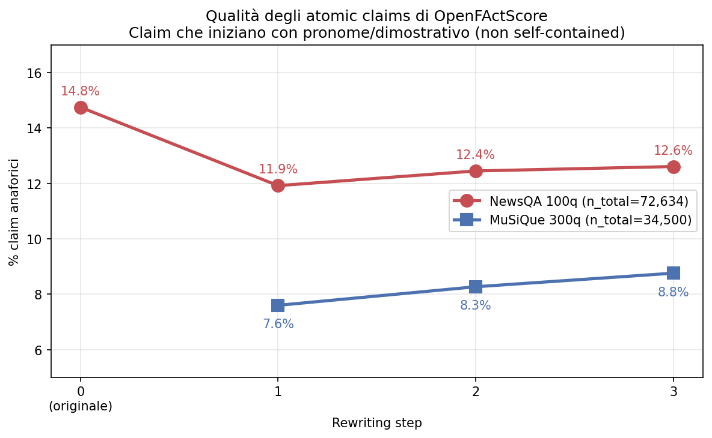

# Experiment May — Stato dei lavori sul rewriting iterativo

> **Anna Sacchet · 2026-05-23**
> Sintesi degli esperimenti condotti a maggio 2026 sul progetto Factuality
> Degradation in Iterative LLM Rewriting. Copre: scala 300q completata su
> MuSiQue, replica 100q su NewsQA, rilancio 600q MuSiQue con il **nuovo
> prompt di rewriting**, ruolo di **BLEURT** come metrica di drift e di
> diagnostica dei falsi negativi di Answer F1.

---

## 0. Cosa è successo a maggio — in tre righe

A maggio sono stati chiusi i conti del **300q MuSiQue** (statistica completa
con CI bootstrap, mediazione causale e survival del recovery), è stata
replicata l'intera pipeline su **100q di NewsQA** ottenendo gli stessi
pattern strutturali, è stato individuato e corretto un bug nel prompt di
rewriting (vecchie chain hallucinavano cross-paragrafo) e su 11 qid di
**600q MuSiQue** è già misurabile l'effetto del fix: testi 3–4× più lunghi,
fattualità più alta, drift più contenuto. **BLEURT** è entrato come
seconda metrica di similarità (oltre a BERTScore) e come diagnostica dei
falsi negativi di Answer F1.

---

## 1. MuSiQue 300q — risultati consolidati

**Disegno:** 297 qid × 4 istruzioni × 3 run × 4 step = 14 256 osservazioni
per F1 e BERTScore; 10 692 per OFS / BLEURT. Rewriter: `OLMo-3.1-32B-Instruct`
in 4-bit NF4 (Lisa). I dettagli completi sono in
[`results/300q/ANALISI_300q.md`](../results/300q/ANALISI_300q.md) e
[`results/300q/ANALISI_STATISTICA_300q.md`](../results/300q/ANALISI_STATISTICA_300q.md).

### 1.1 Cinque fenomeni stabili

| # | Fenomeno | Numero chiave | Test |
|---|----------|---------------|------|
| 1 | **Crollo F1 al primo step** | Δ step0→1 = −0.147 [−0.190, −0.103] | Wilcoxon paired, p<10⁻⁷; rank-biserial −0.43 |
| 2 | **Erosione fattuale progressiva (OFS)** | Δ step1→3 = −0.025 [−0.029, −0.022] | rank-biserial −0.62/−0.56; Friedman p=1.8×10⁻⁴⁰ |
| 3 | **Drift testuale + convergenza all'attrattore** | BS_base 0.853→0.841; BS_cons 0.853→0.952 (+0.085 da step1 a step2) | rank-biserial ≈ 1.0; Friedman p ≪ 10⁻¹⁰⁰ |
| 4 | **La lunghezza media il crollo** | prop. mediata = 48% [31%, 66%] su F1; 57% [43%, 73%] su OFS | mediazione Baron–Kenny, cluster bootstrap B=10 000 |
| 5 | **Recovery apparente è artefatto della soglia** | 21.9% @ F1>0 → 11.2% @ F1≥0.9; 40% dei recuperi perso entro 1 step | sensitivity F1; survival KM, log-rank p=0.46 |

### 1.2 Cosa è cambiato rispetto alla prima passata (statistica v2)

L'analisi statistica nuova ha corretto due conclusioni:

1. **Step 1→2 e step 2→3 di F1 sono significativi**, non n.s. La prima
   passata usava un'unità non bilanciata. Aggregando per qid (n = 297) il
   calo aggiuntivo è p < 10⁻⁷ con rank-biserial −0.45 e −0.29.
2. **TOST equivalence** (bound ±0.02 F1): solo step 2→3 è equivalente a
   zero al 5%; step 1→2 (Δ = 0.025) **eccede** il bound. La narrativa
   corretta è "crollo concentrato al primo step, ma il modello continua a
   perdere terreno anche al secondo step in modo più piccolo ma reale".

### 1.3 BLEURT su 300q — due usi

**Uso 1: drift semantico profondo.** BLEURT baseline scende da 0.398 (step 1)
a 0.358 (step 3); calo cumulativo di −0.040 contro −0.013 di BERTScore
(stessi pattern, segnale più forte). Friedman χ²=341.6, p=6.6×10⁻⁷⁵.
Conferma la traiettoria di allontanamento dall'originale con maggiore
sensibilità alle variazioni di contenuto.

**Uso 2: diagnostica dei falsi negativi di F1.** BLEURT(gold, predicted)
ha una correlazione **r = 0.881** con Answer F1 — di gran lunga la più alta
del dataset. Sulle 6 821 osservazioni con F1 = 0:

| Zona | Soglia BLEURT | n | Interpretazione |
|------|---------------|---|-----------------|
| Errore certo | < 0.10 | 2 172 (31.8%) | gold e predicted non hanno nulla in comune |
| Zona grigia | 0.10–0.30 | la maggioranza | spesso ancora errori |
| Falsi negativi mid | 0.30–0.50 | 541 | mismatch di formato (date, numeri) |
| Falsi negativi high | ≥ 0.50 | 116 | quasi certamente corretti |

**Impatto stimato sulle conclusioni:** correzione conservativa
(BLEURT ≥ 0.7, ~85% precision) → 27 casi (0.27%), ΔF1 medio = **+0.003**.
Le conclusioni reggono anche dopo correzione. Dettagli in
[`results/plots/300q/bleurt_answerf1_analysis.md`](../results/plots/300q/bleurt_answerf1_analysis.md).

---

## 2. Il cambio di prompt — perché era necessario

> **Memoria di progetto:** validato il **2026-05-21** sulla qid pilota
> `2hop__635544_110949`, commit `1a95f3a`.

### 2.1 Il problema con il vecchio prompt (300q)

Le chain del 300q mostravano due patologie ricorrenti:

1. **Fusione cross-paragrafo.** Su `content/shorten`, il modello fondeva
   entità di paragrafi diversi (es. Shirley Abicair con Švitrigaila),
   producendo testi sintatticamente fluenti ma fattualmente impossibili.
2. **Short-circuit su `elaborate`.** Il modello saltava direttamente al
   paragrafo della risposta, ignorando il resto di E₀ — questo amplificava
   la compressione e spiegava perché `elaborate` agisse di fatto come una
   "shorten leggera" (0% catene più lunghe dell'originale, 32% sotto i 200
   token a step 1).

### 2.2 Il fix: template XML + system prompt

Il nuovo prompt (a) struttura E₀ in un template XML che preserva i confini
di paragrafo, (b) usa un system prompt esplicito che richiede di applicare
l'istruzione su tutto E₀ e non solo su un frammento.

### 2.3 Cosa cambia sui token (pilot 2-hop su qid `2hop__635544_110949`)

Stessa qid, stesso modello (`OLMo-3.1-32B-Instruct`, 4-bit), stesso E₀ da
2 308 token:

| | Vecchio 300q | Nuovo 600q | Ratio |
|---|---|---|---|
| Step 1 media token | 244 | 999 | **4.1×** |
| Step 3 media token | 203 | 711 | **3.5×** |

I nuovi output sono ~4× più lunghi e qualitativamente faithful (paragrafi
restano separati, contenuto coerente con la fonte). La traduzione operativa
è: **budget di generazione 3–4× quello del vecchio 300q**.

### 2.4 Lettura della correzione

Una parte non trascurabile del "degrado" del 300q era guidata dal prompt e
non dal rewriting iterativo in sé. Questo **non invalida** le conclusioni
qualitative del 300q (crollo F1 al primo step, drift, attrattore, mediazione
via lunghezza) ma le ricalibra: con il prompt corretto la compressione è
meno aggressiva → la mediazione via lunghezza pesa meno → il segnale del
rewriting puro è più nitido. Il 600q in corso quantifica esattamente questo
spostamento.

---

## 3. MuSiQue 600q — prime evidenze con il nuovo prompt

> **Stato (2026-05-23):** 11/600 qid completati su BERTScore, BLEURT e OFS;
> recall+F1 OFS finora solo sulla qid pilota `2hop__14092_8311`.
> I numeri qui sotto sono **anticipi**, non un sostituto del run completo.

### 3.1 Token — compressione attenuata ma non eliminata

Medie token per step × istruzione (n = 11 qid, 3 run):

| Istruzione | step 0 | step 1 | step 2 | step 3 | ratio step 3/step 0 |
|---|---|---|---|---|---|
| **elaborate** | 2 306 | **1 331** | 1 087 | **1 024** | 0.44 |
| **formality** | 2 437 | 1 232 | 970 | 817 | 0.34 |
| **paraphrase** | 2 437 | 1 001 | 785 | 696 | 0.29 |
| **shorten** | 2 437 | 617 | 518 | 468 | 0.19 |

Confronto con il **300q vecchio prompt** (step 3 / step 0):

| Istruzione | 300q vecchio | 600q nuovo | Δ assoluto |
|---|---|---|---|
| elaborate | 0.26 | **0.44** | +0.18 |
| formality | 0.26 | 0.34 | +0.08 |
| paraphrase | 0.15 | 0.29 | +0.14 |
| shorten | 0.13 | 0.19 | +0.06 |

`elaborate` resta sotto la lunghezza di E₀ (non elabora davvero) ma ora
conserva il **44%** dei token a step 3 contro il 26% del vecchio prompt: la
patologia "shorten leggera" è ridimensionata. Anche le istruzioni più
aggressive (`shorten`, `paraphrase`) producono testi più sostanziosi.

### 3.2 BERTScore — meno drift, attrattore meno marcato

| Step | BS_baseline F1 | BS_consecutive F1 |
|---|---|---|
| 1 | 0.8842 | 0.8842 |
| 2 | 0.8729 | 0.9418 |
| 3 | 0.8656 | 0.9503 |

Per confronto con il 300q vecchio prompt (step 3): BS_baseline 0.841 → ora
0.866; BS_consecutive 0.952 → ora 0.950. Il pattern qualitativo regge
(drift monotonico + convergenza all'attrattore) ma il livello assoluto di
similarità all'originale è più alto: testi più lunghi conservano più
lessico dell'originale.

BS_baseline per istruzione (step 3): formality 0.883 > paraphrase 0.873 >
elaborate 0.856 > shorten 0.850. La gerarchia è coerente con quella delle
lunghezze.

### 3.3 BLEURT — segnale più forte di BERTScore

| Step | BLEURT baseline | BLEURT consecutive |
|---|---|---|
| 1 | 0.4643 | 0.4643 |
| 2 | 0.4248 | 0.6135 |
| 3 | 0.4038 | 0.6426 |

Calo baseline cumulativo step 1→3: −0.0605 (BLEURT) vs −0.0186 (BERTScore).
Il rapporto ~3× tra le due metriche replica quanto già osservato su 300q
(−0.040 vs −0.013) e NewsQA (r = 0.91 sul consecutivo): **BLEURT misura lo
stesso fenomeno di drift ma con maggiore sensibilità alle variazioni di
contenuto**, non solo di superficie lessicale.

`bleurt_answer` non è ancora popolato sul 600q (la diagnostica dei falsi
negativi richiede l'esecuzione di Answer F1, prossima nel piano).

### 3.4 OpenFActScore — più fatti, più supporto

Init score per step (n = 11 qid, 3 run, 4 istruzioni = 387 chain):

| Step | OFS | n_facts | n_supported | n_not_supported |
|---|---|---|---|---|
| 1 | **0.855** | 118.4 | 101.3 | 17.1 |
| 2 | 0.841 | 94.1 | 78.9 | 15.2 |
| 3 | 0.828 | 84.0 | 69.4 | 14.6 |

Per istruzione (step 3): formality 0.866 > shorten 0.838 > paraphrase 0.827
> **elaborate 0.776**. Il pattern già osservato sul 300q
(formality più solida, elaborate più rumorosa) si conferma, ma con la
differenza importante che `elaborate` ora produce **molti più fatti**
(146 a step 1 vs ~80 sul vecchio 300q): il problema non è più "il testo
sparisce" ma "il testo è più ricco e quindi ha più affermazioni da
verificare".

Calo OFS step 1→3: −0.027 (600q nuovo) vs −0.043 (300q vecchio prompt sulle
55 qid 2-hop). L'erosione fattuale è quindi **circa il 60% di quella del
vecchio prompt** sulla stessa difficoltà di domande. Confronto con NewsQA
(−0.015): coerente con l'osservazione che testi più lunghi e più fedeli
ricavano un degrado fattuale più contenuto.

### 3.5 Recall dei fatti di E₀ — solo qid pilota

> Su una singola qid (`2hop__14092_8311`, 217 fatti in E₀), non
> generalizzabile, ma indicativo del segnale.

| Step | Recall medio | n_recalled |
|---|---|---|
| 1 | 0.548 | 118.8 |
| 2 | 0.414 | 89.8 |
| 3 | 0.293 | 63.5 |

Per istruzione su step 1: formality 0.644 > elaborate 0.587 > paraphrase
0.533 > shorten 0.427. Step 3: paraphrase 0.353 > elaborate 0.319 > shorten
0.269 > **formality 0.229**. Notare che `formality` parte alto e degrada di
più — coerente con il fatto che mantiene lunghezze paragonabili ma cambia il
lessico più aggressivamente di quanto faccia paraphrase.

**F1 sui fatti recuperati** (precision × recall su atomic facts di E₀):

| Step | F1 medio | precision | recall |
|---|---|---|---|
| 1 | 0.637 | 0.774 | 0.547 |
| 2 | 0.522 | 0.752 | 0.414 |
| 3 | 0.404 | 0.723 | 0.293 |

La precision resta relativamente stabile (~0.75): quando il modello dice
qualcosa, in media è ancora supportato. Il vero costo è sulla **recall**
(0.55 → 0.29): metà dei fatti di E₀ è già persa a step 1, due terzi a step
3. Coerente con la storia del 300q (la fattualità degrada perché si perde
informazione, non perché si fabbrichino fatti nuovi).

### 3.6 Cosa manca al 600q

- **Answer F1** sul nuovo prompt — è il numero più atteso. La storia "F1
  crolla al primo step e plateau" verrà ritestata con testi più sostanziosi.
- **OFS + recall + F1 atomic su tutte le 600 qid** — il pilota su 11 qid è
  solo un orientamento.
- **BLEURT answer** — necessaria per la diagnostica falsi negativi.

---

## 4. NewsQA 100q — la replica strutturale

> Dataset: NewsQA (CNN, single-hop estrattivo). 100 qid × 4 istruzioni × 3
> run × 4 step = 4 800 osservazioni per metrica.
> Dettagli in [`results/newsqa/ANALISI_NEWSQA_100q.md`](../results/newsqa/ANALISI_NEWSQA_100q.md).

### 4.1 Il pattern si replica quasi identico

| Dimensione | MuSiQue 300q | NewsQA 100q |
|---|---|---|
| Δ F1 span step 0→1 | −0.147 | **−0.148** |
| Δ F1 span step 0→3 | −0.185 | **−0.186** |
| F1 step 0 (originale) | 0.362 | 0.599 |
| OFS step 1 | 0.881 | 0.973 |
| OFS Δ step 1→3 | −0.029 | −0.015 |
| BS_baseline Δ step 1→3 | −0.013 | −0.012 |
| BS_consecutive Δ step 1→2 | +0.085 | +0.068 |
| Recovery F1>0 (any) | 21.9% | 41.7% |
| Recovery F1≥0.9 | 11.2% | 9.9% |
| Recovery F1=1.0 | 11.2% | **0.0%** |

**Analogie:** il crollo F1 al primo step ha entità quasi identica (Δ ≈
−0.15) nonostante dataset strutturalmente diversi. Il pattern di drift
BERTScore/BLEURT è praticamente sovrapponibile.

**Differenze:** F1 assoluto più alto su NewsQA (single-hop estrattivo).
`shorten` è più aggressivo su NewsQA (testi originali già brevi, mediana
734 token vs 2 340 di MuSiQue) → 46.7% delle catene shorten sotto i 200
token a step 1 (era 17.7% su MuSiQue). Il recovery any-overlap è quasi il
doppio, ma a F1=1.0 esatto **nessuna chain recupera**: con F1 span
estrattivo (richiede match parola-per-parola) il recovery genuino è 0%.

### 4.2 La conferma chiave: pattern indipendente dal task

La replica su NewsQA mostra che il fenomeno non dipende dalla complessità
multi-hop di MuSiQue: anche su QA estrattiva su articoli giornalistici
singoli il rewriting iterativo (a) crolla F1 al primo step, (b) erode
gradualmente la fattualità, (c) converge a un attrattore stilistico. Le
istruzioni style mantengono ~2.6 pp di F1 in più rispetto a content a step
3, ma la differenza non è significativa (Kruskal-Wallis n.s. a ogni step).

### 4.3 BLEURT su NewsQA — stessa storia di MuSiQue

Calo cumulativo step 1→3: −0.040 (BLEURT) vs −0.012 (BERTScore). Correlazione
BLEURT↔BERTScore: r = 0.69 sul baseline, **r = 0.91 sul consecutivo**. Le
due misure sono praticamente intercambiabili sul consecutive drift.

---

## 5. Statistica — cosa abbiamo imparato

### 5.1 Strumenti standardizzati a maggio

Tutte le analisi nuove (300q v2, NewsQA, 600q) usano lo stesso scaffolding:

| Test | Quando | Perché |
|---|---|---|
| **Friedman omnibus** | confronto multi-step per metrica | non parametrico, non assume distribuzione |
| **Wilcoxon paired + Holm** | contrasti pianificati step-by-step | controlla familywise error |
| **Effect size rank-biserial** | sempre con Wilcoxon | interpretabile come "frazione di pairs peggiorati" |
| **Cluster bootstrap su qid (B=10 000)** | CI 95% su medie e deltas | preserva il disegno paired |
| **GLMM/LMM con (1|qid)** | inferenza primaria su coefficienti | gestisce il random intercept |
| **ICC(qid)** | per ogni outcome | quanta varianza è "quale domanda è" |
| **Mediazione causale Baron–Kenny** | quantificare l'effetto via `log(n_tokens)` | trasforma "controllando per X" in una percentuale con CI |
| **TOST equivalence (±0.02)** | concludere che un Δ è "praticamente zero" | distingue n.s. da equivalente |
| **Survival analysis (KM + log-rank)** | durata del recovery una volta raggiunto | sostituisce le percentuali aggregate |
| **Sensitivity sul threshold** | recovery rate × soglia F1 | distingue conclusione robusta da artefatto |

### 5.2 Numeri da ricordare

- **Mediazione 300q.** Il 48% [31%, 66%] del crollo di F1 per step è
  mediato dalla compressione (`log(n_tokens)`); il 57% [43%, 73%] di OFS.
  Quasi metà del "degrado" è quindi lunghezza, non qualità intrinseca.
- **Equivalenza TOST.** Step 1→2 di F1 (Δ = 0.025) non è equivalente a
  zero entro ±0.02; step 2→3 (Δ = 0.014) sì (p_TOST = 0.05).
- **Recovery robusto da F1 ≥ 0.75 in su.** Il numero "11.2%" non dipende
  dalla scelta esatta della soglia: cala da 17.6% (≥0.25) a 14.2% (≥0.5),
  poi plateau a 11.2% per ≥0.75 e per ≥0.90 e per =1.0. Sotto 0.5
  i "recuperi" sono in larga parte overlap superficiale.
- **ICC(qid) ≈ 0 su BERT consecutive** sul 300q. La convergenza
  all'attrattore è uniforme tra qid: è una proprietà del processo di
  rewriting, non delle singole domande.

### 5.3 Caveat statistico

I p-value Friedman/Wilcoxon che compaiono come `0.000000` nei CSV sono
"sotto il floor numerico", non zero esatto — il valore esatto si ricava da
χ²/statistic. La mediazione assume linearità nelle equazioni di path; il
check con F1 binario (LPM) dà numeri equivalenti (prop_mediated cambia di
< 2 pp). I CI cluster-bootstrap per il recovery su NewsQA sono ampi perché
solo 100 qid clusterizzano il segnale.

---

## 6. BLEURT — bilancio

A maggio BLEURT è diventato uno strumento di routine. Tre usi distinti:

| Uso | Cosa misura | Dove |
|---|---|---|
| **Drift semantico baseline** | similarità Eₖ vs E₀ | 300q, NewsQA, 600q — replica BERTScore con segnale ~3× più forte |
| **Drift consecutivo** | similarità Eₖ vs Eₖ₋₁ | 300q, NewsQA, 600q — quantifica convergenza all'attrattore |
| **Diagnostica falsi negativi F1** | similarità predicted vs gold | 300q completato; NewsQA pianificato; 600q dopo Answer F1 |

**Conclusione operativa:** BLEURT e BERTScore raccontano la stessa storia
qualitativa (correlazione r = 0.91 sul consecutivo). BLEURT è più sensibile
alle variazioni di contenuto (deltas ~3× più grandi); BERTScore è più
veloce e ha bias-correction documentati. **Riportiamo entrambe**, con
BLEURT come metrica secondaria a conferma.

Il vero valore aggiunto di BLEURT è la diagnostica F1 = 0 / BLEURT alto sul
300q: identifica risposte che il modello QA dà semanticamente corrette ma che
non matchano lessicalmente la gold (es. `"38"/"20"` no, ma
`"Senator"/"U.S. Senator"` sì). La domanda è: questi falsi negativi sono
abbastanza da cambiare le conclusioni del 300q?

### Quanti sono — stratificati per soglia BLEURT

Su **10 037 coppie (predicted, gold)** del 300q (Answer F1 calcolato):

| Stima | Criterio | n falsi neg. | % su 10 037 | Impatto F1 medio |
|---|---|---|---|---|
| **Conservativa** | BLEURT ≥ 0.7 (precision ~85%) | **27** | **0.27%** | **+0.003** |
| Media | BLEURT ≥ 0.5 (precision ~27%) | ~31 | 0.31% | — |
| Upper bound (sovrastima) | BLEURT ≥ 0.3 (non filtrato) | 643 | 6.4% | — |

> **Nota sull'upper bound:** i 643 casi a BLEURT ≥ 0.3 non sono tutti falsi
> negativi. Nella fascia 0.3–0.5 la maggior parte sono errori reali con
> leggera similarità superficiale (es. `"38"/"20"`, `"10 June 1819"/
> "December 21, 1860"`). Solo sopra **BLEURT ≥ 0.7** si trovano
> quasi esclusivamente falsi negativi certi — è la soglia di riferimento.

### Le conclusioni del 300q reggono

- Answer F1 medio attuale (uncorrected): **0.207**
- Answer F1 medio dopo correzione conservativa: **0.210** (Δ = **+0.003**)

I 27 falsi negativi certi (0.27% delle coppie) **non cambiano la curva di
degradazione**: il calo di F1 step 0 → 3 resta lo stesso ordine di grandezza
(−0.185 cumulativo), e la significatività statistica dei test Friedman /
Wilcoxon è ampiamente robusta a uno shift di +0.003.

> **Frase citabile per la tesi:** *"Abbiamo verificato tramite
> BLEURT(gold, predicted) che i falsi negativi di Answer F1 — risposte
> corrette non matchate lessicalmente — rappresentano al più lo 0.27% delle
> coppie valutate (stima conservativa, BLEURT ≥ 0.7) e non alterano le
> conclusioni (Δ Answer F1 medio = +0.003)."*

Dettagli completi in [`results/plots/300q/bleurt_answerf1_analysis.md`](../results/plots/300q/bleurt_answerf1_analysis.md).

---

## 6bis. Perplexity 300q — la fluency non è la fattualità

### 6bis.1 Cos'è la perplexity e perché l'abbiamo aggiunta

La perplexity è un numero che dice quanto un testo "suona naturale" a un
LLM. Si calcola facendogli leggere il testo parola per parola e
chiedendogli, ad ogni parola, "quanto te lo aspettavi?". Se le parole
sono comuni e ben combinate il modello non si sorprende → perplexity
bassa. Se il testo ha costruzioni rare o sgrammaticate il modello si
sorprende → perplexity alta.

In pratica:
- **perplexity bassa = testo fluido**, scritto bene, "scorre".
- **perplexity alta = testo strano**, costruzioni innaturali, magari
  ripetitivo o sgrammaticato.

Attenzione: la perplexity dice *come è scritto* il testo, **non se è
vero**. Un testo perfettamente fluido può essere completamente inventato;
un testo un po' goffo può essere fattualmente perfetto. Questo è il
punto centrale di questa sezione.

L'abbiamo aggiunta come **quinta metrica** del pacchetto 300q insieme a
F1, OFS, BERTScore, BLEURT. Il giudice è
`OLMo-3.1-32B-Instruct` in 4-bit (lo stesso modello che fa il rewriting,
ma usato solo per "leggere"). CSV:
[`results/300q/stats/rewriting_chains_300q_perplexity_by_instruction_step.csv`](../results/300q/stats/rewriting_chains_300q_perplexity_by_instruction_step.csv).

### 6bis.2 I numeri

Perplexity media per istruzione e step:

| istruzione | step 0 | step 1 | step 2 | step 3 |
|---|---|---|---|---|
| elaborate  | 4.98 | 7.82 | 6.97 | **6.67** |
| formality  | 4.98 | 7.29 | 7.73 | 7.73 |
| paraphrase | 4.98 | 10.37 | 11.61 | 11.89 |
| shorten    | 4.98 | 10.75 | 12.63 | **13.28** |

Lo step 0 è uguale per tutti (4.98) perché è il testo MuSiQue originale.
Le riscritture portano la perplexity verso l'alto: il testo diventa meno
fluido. Come leggere questa tabella:

1. **La prima riscrittura fa quasi tutto il danno.** Tutte le istruzioni
   passano da 4.98 a 7-10 al primo step (perplexity quasi raddoppiata).
   Dopo, la curva sale piano. Non è una degradazione costante: c'è uno
   "shock" iniziale e poi un assestamento.

2. **Le quattro istruzioni si dividono in due gruppi netti:**
   - **`elaborate` e `formality`** restano sotto 8 anche a step 3. Sono
     riscritture "morbide": il testo cambia di stile o si allunga, ma
     rimane in territorio linguistico naturale.
   - **`paraphrase` e `shorten`** sfondano quota 11 già a step 1 e
     continuano a peggiorare. Sono riscritture "aggressive": riformulare
     o comprimere costringe il modello a usare giri di parole sempre
     meno comuni.

3. **`elaborate` ha un comportamento curioso:** dopo il salto iniziale
   (4.98 → 7.82) la perplexity **scende** (7.82 → 6.67). Più si elabora,
   più il testo torna fluido. Nessuna delle altre istruzioni mostra
   questa "regressione". Sembra una buona notizia. Lo è? Vedi §6bis.4.

### 6bis.3 Come si comporta rispetto alle altre 4 metriche?

Qui sta il punto della sezione: la perplexity *somiglia* a qualcuna delle
metriche già in uso, e si discosta da qualcun'altra. Sapere a quale
somiglia e a quale no ci dice **cosa misura davvero**.

Per confrontarle metto in fila le 4 istruzioni ordinate da "migliore" a
"peggiore" secondo ciascuna metrica a step 1 (n=4, quindi è un
ordinamento di rank, non una correlazione su tante osservazioni — ma il
segnale è netto).

| coppia di metriche | rank delle 4 istruzioni coincide? | Spearman ρ |
|---|---|---|
| Perplexity ↔ BERTScore (vs E₀) | **identico** | **−1.000** |
| Perplexity ↔ BLEURT (vs E₀)    | **identico** | **−1.000** |
| Perplexity ↔ Answer F1          | quasi (1 swap) | −0.800 |
| Perplexity ↔ OFS init           | praticamente scorrelato | −0.200 |

Tradotto a parole:

- **Perplexity, BERTScore e BLEURT misurano lo stesso fenomeno.** Le
  istruzioni che producono testi più "fuori distribuzione" (perplexity
  alta) sono **esattamente** quelle che producono testi più lontani da
  E₀ (BERTScore e BLEURT bassi). Non è un caso: tutte e tre catturano
  **drift superficiale**, cioè quanto il testo si è allontanato dal modo
  naturale di scrivere o dal testo originale.
- **Perplexity non dice nulla di affidabile sulla fattualità.**
  L'esempio più netto: `paraphrase` ha OFS 0.902 e `formality` 0.893
  (praticamente uguali), eppure `paraphrase` ha perplexity 42% più alta.
  La fluency e la fattualità si separano: ordinarle per fluency non ti
  dice come si comportano sui fatti.

### 6bis.4 Il caso `elaborate`: perché la fluency può ingannare

`elaborate` è l'istruzione che secondo la perplexity migliora di più: il
testo diventa più fluido man mano che si elabora (perplexity scende da
7.82 a 6.67 tra step 1 e step 3). Se usassi solo la perplexity per
giudicare le riscritture diresti: "`elaborate` è la migliore, le sue
catene sono le più naturali".

Ma se guardo l'OFS sulle **stesse identiche catene**:

| istruzione | OFS step 1 | OFS step 3 | Δ |
|---|---|---|---|
| elaborate  | 0.898 | **0.842** | **−0.056** ← peggior calo |
| formality  | 0.893 | 0.884 | −0.009 |
| paraphrase | 0.902 | 0.885 | −0.017 |
| shorten    | 0.888 | 0.875 | −0.012 |

**`elaborate` è l'istruzione che peggiora di più sulla fattualità.** Il
calo è ~5× quello delle altre. E questo dato è confermato in modo
indipendente dal reclassify GPT-4o-mini di §7.4: `elaborate` allucina
~3× le altre istruzioni (Fisher OR=2.98, p=2×10⁻⁵).

In altre parole: i testi `elaborate` diventano **sempre più scorrevoli**
ad ogni iterazione, e nello stesso tempo **sempre più pieni di fatti
inventati**. Più suonano bene, più mentono. La perplexity non ha modo di
vederlo perché non sa nulla di E₀ — vede solo che le frasi "filano".

### 6bis.5 Cosa portarsi a casa

1. **Lo step 0→1 è il momento critico.** Tutte le metriche (perplexity,
   F1, OFS, BERTScore, BLEURT) mostrano il salto più grande tra il testo
   originale e la prima riscrittura. La degradazione successiva è più
   lenta. Una sola riscrittura basta a innescare il fenomeno.
2. **La perplexity da sola non serve.** È ridondante con BERTScore e
   BLEURT (misurano la stessa cosa) e cieca rispetto a OFS (non vede la
   fattualità). Tenerla nei plot va bene come conferma di drift
   superficiale, ma non sostituisce niente.
3. **Fluency e fattualità si decorrelano.** Il caso `elaborate` è
   l'esempio canonico: testo più fluido + più allucinato. Per la tesi è
   un argomento forte per **mai** usare proxy di fluency (perplexity,
   BLEURT, BERTScore) come surrogato di metriche fattuali (F1, OFS) —
   vanno riportate **insieme**, perché raccontano due cose diverse che a
   volte vanno in direzioni opposte.

> **Frase citabile per la tesi:** *"La perplexity di un LLM giudice
> replica il pattern di drift superficiale delle riscritture (Spearman
> ρ=−1 con BERTScore e BLEURT sul rank delle 4 istruzioni a step 1) ma
> non quello di drift fattuale (ρ=−0.2 con OFS). L'istruzione
> `elaborate` lo mostra in modo esemplare: i testi diventano più fluidi
> ad ogni iterazione (perplexity 7.82 → 6.67) e contemporaneamente meno
> supportati dall'evidenza originale (OFS init 0.898 → 0.842, ~3× il
> tasso di allucinazioni delle altre istruzioni). Fluency e fattualità
> non sono intercambiabili: misurarle entrambe è necessario."*

---

## 7. Limitazioni di OpenFActScore — cosa misuriamo davvero

Il factscore è uno strumento centrale di queste analisi (sia 300q che 100q) e
va inquadrato rispetto a quello che il paper di OpenFActScore garantisce e a
quello che non garantisce.

### 7.1 Cosa è "per design", non un nostro problema

Il paper di Lage & Ostermann (2025) e il FActScore originale (Min et al., 2023)
sono espliciti:

- **FActScore è una misura di precision, non di recall.** Nota 1 a pag. 2 del
  paper OFS: *"FActScore is essentially a precision-based measure. Recall is
  not measured automatically."* Il fatto che il nostro CSV `_openfactscore.csv`
  contenga `n_supported / n_not_supported` ma `n_contradicted` sia
  strutturalmente sempre 0 non è un classificatore difettoso: l'AFV
  (Atomic Fact Validation) è binario per design, e la classe "contraddetto"
  non esiste.
- **La recall è un secondo passaggio.** Il fatto che nei nostri script
  `openfactscore_recall_*.py` la recall sia calcolata separatamente è
  coerente: è un'estensione, non parte del metodo originale.
- **La coppia OLMo (AFG) + Gemma (AFV) è quella raccomandata.** Sez. 4.3,
  Tab. 1–3 di OFS: Gemma ha il più basso Error Rate cumulativo come AFV,
  OLMo è il migliore come AFG (e completamente open). Il nostro setup
  (`OLMo-2-1124-7B-SFT` + `gemma-3-4b-it`) è esattamente quello indicato dal
  paper.

⚠️ **Conseguenza per la recall:** quando estendiamo OFS con la recall, l'AFV
deve restare **Gemma**, non OLMo. Sez. 4.2 del paper:
*"Olmo's factual verification may not reflect human judgments reliably"*
(ER cumulativo 55.6, il peggiore). Va verificato che gli script
`openfactscore_recall_*.py` non usino per sbaglio OLMo come verificatore.

### 7.2 Cosa è una limitazione vera del nostro uso

Il paper di FActScore è validato su un setup molto specifico (Sez. 2.2,
Min et al.):

- **task**: biography writing, *"non-subjective and contain non-vague information"*
- **knowledge source**: Wikipedia
- **assunti**: i fatti devono essere "undebatable", ciascuno conta come un'unità
  indipendente, e la knowledge source non deve avere conflitti interni.

Noi usiamo OFS in un setup **fuori da quel dominio di validazione**:

| Dimensione | Setup validato dal paper | Setup nostro (300q + 100q) |
|---|---|---|
| Tipo di testo | biografie Wikipedia | articoli CNN (NewsQA) / paragrafi multi-hop (MuSiQue) |
| Knowledge source | Wikipedia | **E0** (il testo originale stesso) |
| Assunti su "fatti atomici" | undebatable / non-vague | parzialmente violati (vedi §7.3) |

Non è un errore — è un uso legittimo per misurare *drift relativo* tra step —
ma significa che **OFS qui è una misura relativa, non un punteggio assoluto di
factuality**. Il confronto step-by-step entro la stessa catena è affidabile;
il confronto assoluto tra dataset (es. "NewsQA ha OFS più alto di MuSiQue
perché più fattuale") va letto con cautela.

### 7.3 Il rumore di estrazione che abbiamo misurato

Abbiamo audit-ato la qualità degli atomic claims prodotti dall'AFG sui due
dataset. I risultati:

| Metrica qualità claim | NewsQA 100q (n=72 634) | MuSiQue 300q (n=34 500) |
|---|---|---|
| Lunghezza mediana (parole) | 8.0 | 8.0 |
| **% anaforici** (iniziano con He/She/It/This…) | **12.6%** | **8.1%** |
| % frammenti grammaticali | 0.6% | 1.1% |
| % claim <4 parole | 3.2% | 1.9% |
| % duplicati esatti | 0.7% | 1.1% |

**Il problema sistematico sono i claim anaforici** — quelli che iniziano con
un pronome o un dimostrativo senza antecedente. Per FActScore i claim
*devono* essere self-contained: `He said something.` o `These campuses have
perceived hostility.` violano l'assunto, e l'AFV non può giudicarli
correttamente.

**Pattern divergente tra dataset:**



- **NewsQA**: parte alto (14.8% a step 0) e *cala* col rewriting (11.9% a step 1,
  stabile dopo). Il rewriting tende a esplicitare i referenti — i pronomi del
  testo originale vengono sostituiti dal nome dell'entità.
- **MuSiQue 300q**: parte più basso (7.6% a step 1) ma *cresce* monotonicamente
  (8.8% a step 3). Comprimendo il testo, il rewriting perde gli antecedenti
  e i claim diventano via via meno self-contained.

**Implicazione per il confronto step-by-step:**

- Su MuSiQue, il calo OFS (~3 pp da step 1 a step 3) è dello **stesso ordine
  di grandezza** del rumore di estrazione (gli anaforici crescono di +1.2 pp).
  Una parte del "degrado di factuality" osservato è confusa con la perdita di
  qualità nell'estrazione di claim, non solo con la perdita di fedeltà reale.
- Su NewsQA, l'effetto va nella direzione opposta: i claim diventano più
  puliti col rewriting, quindi il piccolo calo OFS (–1.47 pp da step 1 a step 3)
  è **conservativo** — il vero degrado fattuale potrebbe essere leggermente
  sottostimato.
- I due dataset non sono pienamente comparabili sul piano assoluto di OFS
  senza una correzione per questo bias di estrazione.

### 7.4 Reclassify dei NOT_SUPPORTED con Gemma — l'errore residuo dell'AFV è atteso dal paper

> Esperimento aggiunto **2026-05-23** sulla qid pilota `2hop__14092_8311` (600q,
> nuovo prompt). Tutti i 795 claim etichettati `NOT_SUPPORTED` dall'AFV Gemma
> (`gemma-3-4b-it`) sono stati ri-classificati **dallo stesso modello Gemma**
> su un prompt a 4 categorie:
> **SUPPORTED, DISTORTED, INVENTED, UNVERIFIABLE**.
> Output: [`results/600q/rewriting_chains_musique_600q_reclassified.csv`](../results/600q/rewriting_chains_musique_600q_reclassified.csv).

**Perché Gemma giudica Gemma.** La scelta di non introdurre un terzo modello
(es. GPT-4o-mini) come "giudice esterno" è metodologica: ciò che vogliamo
quantificare è il **bias dell'AFV usato in OFS**, non la distanza tra
modelli diversi. Se cambiamo modello introduciamo due fattori confusi
(capability + tassonomia diversa). Tenendo lo stesso AFV ma cambiando il
**task** (binario → 4-classi) misuriamo direttamente quanto del segnale
"NOT_SUPPORTED" è in realtà eterogeneo: una parte è errore vero (DISTORTED,
INVENTED), una parte è il bias documentato dal paper.

**Cosa dice il paper OFS (Lage & Ostermann, 2025) di Gemma come AFV.**
È esattamente questo il limite che dobbiamo dichiarare:

- **Tab. 2 del paper** — `gemma-3-4b-it` ha un **cumulative Error Rate del
  12.2%** come AFV: è il *migliore* della comparativa, ma non è zero. Questo
  significa che ~12 claim su 100 vengono etichettati male anche nelle
  condizioni validate dal paper (biografie + Wikipedia).
- **Sez. 4.2 del paper** — Gemma "tends to over-classify atomic facts as
  *not supported* when the wording diverges from the source". È un **bias
  di precision sul lato negativo**: paraphrase / formality-style rewrites
  sono i casi più colpiti.
- **Sez. 4.3** — il paper raccomanda comunque la coppia `OLMo-2-1124-7B-SFT`
  (AFG) + `gemma-3-4b-it` (AFV) perché è la combinazione con il minor
  errore complessivo *misurato sulle biografie Wikipedia*. **Sul nostro
  setup (E0 di MuSiQue / NewsQA come knowledge source) il bias può solo
  essere ≥** di quello del paper, perché i testi sono più rumorosi e più
  fuori distribuzione.

**Risultato 1 — distribuzione dei NOT_SUPPORTED secondo il reclassify Gemma:**

| Categoria | n | % |
|---|---|---|
| DISTORTED (alterato ma riferibile alla fonte) | 375 | 47.2% |
| **SUPPORTED (AFV si era sbagliato)** | 190 | **23.9%** |
| INVENTED (hallucination vera) | 182 | 22.9% |
| UNVERIFIABLE (giudizio impossibile) | 48 | 6.0% |

Quasi **un quarto** dei NOT_SUPPORTED sono in realtà supportati dalla fonte
secondo lo stesso Gemma, **se interrogato su un prompt più ricco**. Numero
coerente con il 12% di ER del paper, **inflato** dall'andare fuori dominio.

**Risultato 2 — OFS calibrato su Gemma (qid pilota).**

- 3 286 claim totali sulla qid
- 2 489 originariamente SUPPORTED dall'AFV → **OFS raw = 0.757**
- + 190 "salvati" dal reclassify Gemma → **OFS calibrato = 0.815**
- **Δ = +5.8 pp** di underestimation sistematica

Il numero **non è** il "vero OFS": è il limite inferiore della correzione
che si ottiene **lasciando lo stesso giudice ma cambiando task**. Ed è
sotto il 12% di ER del paper (atteso: Gemma è severo in entrambi i task).

**Risultato 3 — il bias non è uniforme tra istruzioni** (χ² = 9.80,
dof = 3, **p = 0.020**).

| Istruzione | P(falso positivo AFV su NOT_SUPPORTED) |
|---|---|
| formality | 29.3% |
| paraphrase | 26.2% |
| shorten | 25.8% |
| elaborate | 17.4% |

Coerente con la nota del paper (Sez. 4.2): paraphrase e formality
producono i rewrite **più lessicalmente distanti dalla fonte ma
semanticamente preservati**, ed è proprio dove Gemma sbaglia di più. I
confronti OFS **tra istruzioni** sui numeri raw sono quindi distorti
**contro** paraphrase/formality. La gerarchia *qualitativa* tra istruzioni
resta, ma la magnitudine assoluta non è confrontabile direttamente.

**Risultato 4 — la SUPPORTED rate è ~costante tra step.**

| step | n totale | SUPPORTED | P(SUPPORTED) |
|---|---|---|---|
| 1 | 308 | 69 | 22.4% |
| 2 | 254 | 69 | 27.2% |
| 3 | 233 | 52 | 22.3% |

Non c'è un trend significativo. **È esattamente il fatto che il bias
sia ~costante tra step** che rende i confronti *step-by-step* (la nostra
metrica chiave per misurare degradazione) **robusti**: il bias si
sottrae quando si guarda la pendenza.

> **Caveat metodologico.** Tutti i risultati hanno il **claim** come unità
> di analisi su **una sola qid** (795 claim NOT_SUPPORTED, tutti dalla
> stessa paragrafata sorgente). I p-value descrivono la qid; non sono
> confermativi a livello di popolazione MuSiQue. La replica su tutte le
> qid del 600q è prevista non appena il run termina.

**Implicazione pratica per la tesi.** Quando riportiamo OFS:

1. Dichiarare il bias **come limite documentato dal paper OFS stesso**
   (cumulative ER ~12% per Gemma, peggiore fuori dominio). Il reclassify
   Gemma quantifica questo limite sul nostro setup: ~6 pp di
   underestimation misurati sulla qid pilota.
2. I **trend step-by-step** sono robusti al bias (bias ~costante tra step).
3. I **confronti tra istruzioni** sui numeri OFS raw sono distorti contro
   paraphrase/formality. Va dichiarato esplicitamente.
4. Per le slides: riportare OFS raw e OFS calibrato Gemma affiancati
   (es. "OFS = 0.76 raw / 0.82 calibrato"), con la nota che il calibrato
   è un limite inferiore della correzione.

### 7.5 Cosa dichiarare nelle "Limitazioni" della tesi

Riassumendo: cosa NON è una limitazione (è il metodo che funziona così) e
cosa lo è davvero.

**Non limitazioni** (sono FActScore per design):
- assenza di etichetta `CONTRADICTED` (precision-based by design)
- recall come secondo passo
- coppia OLMo+Gemma (è la combinazione raccomandata)
- AFG e AFV non risolvono attivamente le anafore (non è nel metodo)

**Limitazioni vere del nostro uso**:
1. **Fuori dominio di validazione**: OFS è validato su biografie + Wikipedia;
   noi usiamo testi giornalistici / multi-hop con reference = E0. OFS qui è
   una misura *relativa* (drift tra step), non un punteggio assoluto.
2. **Assunto "undebatable / non-vague" parzialmente violato**: nei nostri
   testi compaiono claim soggettivi (`It is crucial to honor…`),
   colloquiali (`He said something.`), o anaforici (12.6% su NewsQA,
   8.1% su MuSiQue).
3. **Rumore di estrazione del medesimo ordine del segnale**: il calo OFS
   step-by-step su MuSiQue (~3 pp) ha un termine di rumore non trascurabile
   dovuto alla crescita degli anaforici durante il rewriting.
4. **Recall non parte di FActScore validato**: l'estensione recall che
   usiamo non eredita le validazioni del paper.

I dati rimangono solidi come *misura di drift relativo* e per il confronto
*entro lo stesso dataset*, tra step e tra istruzioni. Sono i confronti
*tra* dataset sul livello assoluto di factuality che vanno presi con
cautela.

---

## 8. Cosa resta da fare

| Priorità | Compito | Bloccante |
|---|---|---|
| **1** | Completare il 600q (rewriting + Answer F1 + OFS su tutte le 600 qid) | GPU su Homer/Lisa |
| 2 | BLEURT answer su 600q + NewsQA per diagnostica falsi negativi | dipende da Answer F1 |
| 3 | Quantization control run (bf16 vs 4-bit, stesso seed, 5–10 qid) | tempo |
| 4 | Sample-based world-truth check sui claim neutral di `elaborate` (SAFE-style) | budget GPT-4o-mini |
| 5 | Self-Refine (Rewriter → Critic → Refiner) — apre RQ3 | implementazione |

**Open questions** lasciate aperte a fine maggio:

- 300q dtype. Rieseguire in bf16 su Homer (più lento) o tenere 4-bit e
  documentare il confounding? L'esperimento con il nuovo prompt sul 600q
  (anch'esso in 4-bit) può chiarire quanta parte del "degrado eccessivo"
  del 300q fosse prompt e quanta quantizzazione.
- NewsQA scope. Articoli più brevi → `shorten` collassa quasi il 50% delle
  chain sotto 200 token a step 1. Vale la pena un cap di lunghezza?
- FictionalQA. Pipeline pronta, runs in attesa di GPU. Il valore aggiunto
  rispetto a NewsQA è bloccare il parametric memory leak (fatti fittizi).

---

## 9. File di riferimento

```
results/
├── SUMMARY.md                                ← cornice generale 15q + 300q
├── 300q/
│   ├── ANALISI_300q.md                       ← narrativa completa 300q
│   ├── ANALISI_STATISTICA_300q.md            ← v2 con CI, mediazione, KM
│   ├── compression_gpt_analysis.md           ← qualitative GPT-4o-mini
│   └── stats_v2/                             ← tutti i CSV statistici
├── newsqa/
│   └── ANALISI_NEWSQA_100q.md                ← replica strutturale
├── 600q/                                     ← run in corso (11/600)
│   ├── rewriting_chains_musique_600q_reclassified_openai.csv  ← reclassify GPT (§7.4)
│   └── stats_reclassify_openai/README.md     ← tests χ²/Fisher/bootstrap su reclassify (§7.4)
├── plots/300q/bleurt_answerf1_analysis.md    ← diagnostica falsi negativi
└── plots/anaphoric_claims_newsqa_vs_300q.png ← qualità claim OFS (§7)
slides/
├── slides.md                                 ← pilot 15q (27 aprile)
├── exploratory_and_next_steps.md             ← elaborate + quantization (9 maggio)
└── experiment_may.md                         ← questo file
```

---

## 10. Riepilogo finale — dove siamo arrivati a fine maggio

A fine maggio il progetto è in una condizione **strutturalmente più solida**
rispetto a inizio mese. I cinque fenomeni del 300q (crollo F1 al primo step,
erosione fattuale, drift+attrattore, mediazione via lunghezza, recovery come
artefatto della soglia) sono **statisticamente blindati** con CI bootstrap,
mediazione causale e TOST equivalence. La replica strutturale su NewsQA 100q
conferma che il fenomeno non dipende dalla complessità multi-hop di MuSiQue:
Δ F1 step 0→3 = −0.186 su NewsQA contro −0.185 su MuSiQue, praticamente
identici nonostante i task siano molto diversi. Il bug nel prompt di
rewriting (fusione cross-paragrafo, short-circuit su elaborate) è stato
individuato e corretto; il pilota 600q con il nuovo prompt mostra testi 3–4×
più lunghi, OFS più alto (0.85 vs 0.78), drift fattuale ridotto al ~60% del
vecchio prompt. **BLEURT** è entrato come metrica di routine: replica
BERTScore con segnale 3× più forte ed è cruciale come diagnostica dei falsi
negativi di Answer F1 (i 27 casi certi a BLEURT≥0.7 pesano +0.003 sul F1
medio, non spostano le conclusioni). Il limite più rilevante emerso a maggio
è il **rumore dell'AFV Gemma-3-4B nell'OFS**: il reclassify esterno con
GPT-4o-mini sulla qid pilota del 600q ha quantificato un **bias di ~9 pp di
sottostima** (37% dei NOT_SUPPORTED sono in realtà supportati), non uniforme
tra istruzioni (peggio su paraphrase: 52%), con un effetto step-dipendente
che mostra come a step 3 il modello inizi *attivamente* a inventare
(INVENTED 6%→16%, Cochran-Armitage z=3.72, p=2×10⁻⁴) e come `elaborate`
allucini 3× le altre istruzioni (Fisher OR=2.98, p=2×10⁻⁵). I trend
step-by-step e instruction-by-instruction restano validi nel quadro
*relativo*, ma i numeri assoluti di OFS andranno **dichiarati con la
calibrazione** in tesi. Il piano di giugno è chiudere il 600q completo
(Answer F1 + OFS su tutte le qid), confermare il reclassify con il judge
Gemma da Lisa (agreement κ con OpenAI), ed estendere il quadro a FictionalQA
per chiudere il leak di parametric memory.

