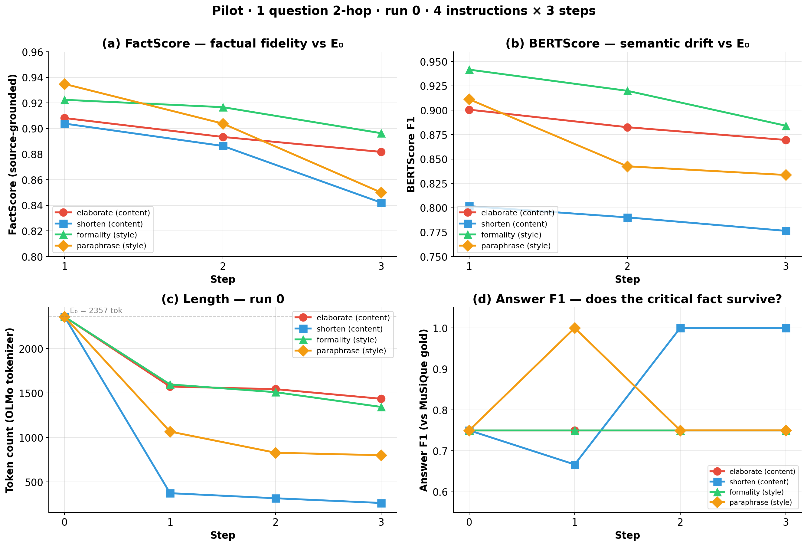
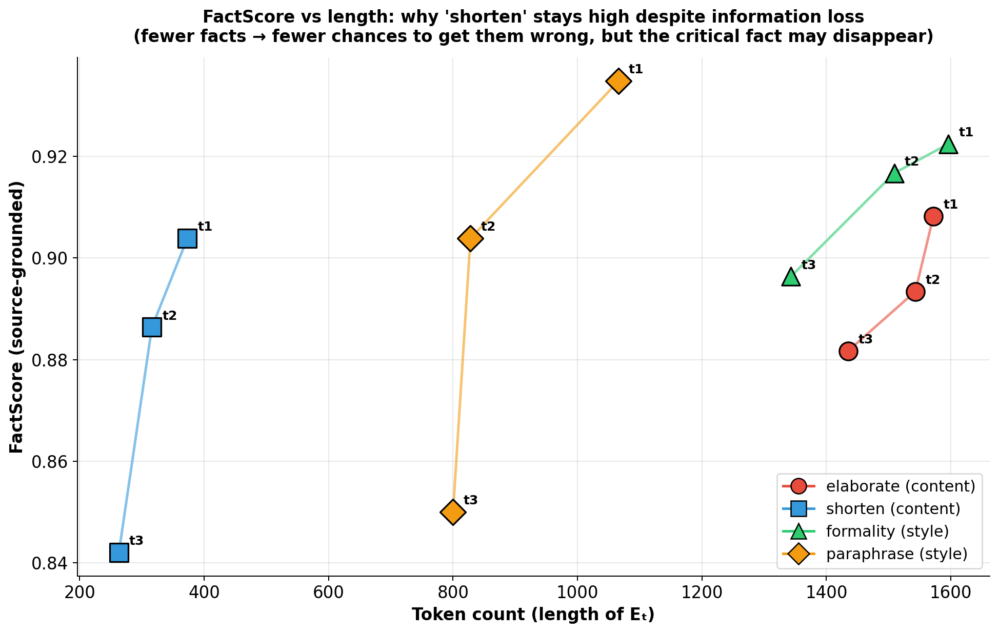
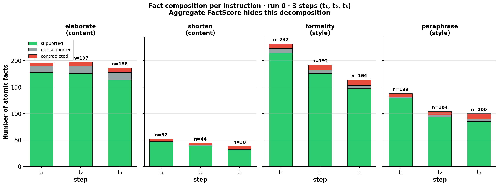

<!-- _class: lead -->

# Factuality Degradation in Iterative LLM Rewriting

### Pilot results

**Anna Sacchet**

27 April 2026

---

## Goal of this pilot

The pilot has one purpose: **build the full evaluation pipeline end-to-end and check that it works on real data**, before scaling to the whole MuSiQue dataset.

To keep the pilot small and self-contained, I picked:

- **one MuSiQue question** (2-hop, `2hop__635544_110949`)
- **the rewriter model OLMo-3 32B Instruct**
- **all 4 rewriting instructions** I plan to use later (2 style + 2 content)
- **all 3 runs for token length** (just the tokenizer)
- **one run only for the metrics** — FactScore, BERTScore, Answer F1

This is a pipeline test, not a measurement of degradation. The numbers are real, but they are signals from a single chain, not statistics.

---

## Why the rewriter is the 32B and not the 7B

I first tested **OLMo-3 7B Instruct** as rewriter. The output of t₁ on the same input (`shorten`) shows the problem clearly:

| Model | t₁ output (excerpt) |
|---|---|
| **7B Instruct** | *"Shir 19. With the turn, he was 18. On and only 19 years later, he was born in and had become 20, and this date was 19 and his, at age 17, he was born, he was 17, he was born 19 in 14, near and, a Rist was…"* |
| **32B** | *"Shirley Abicair, born in Melbourne, was likely born in 1935, given her age upon arriving in Britain. Švitrigaila's birth date is unknown, but he was young in 1382. The U.S. Constitution's natural born citizen clause means a citizen at birth…"* |

The 7B already showed problems at the first iteration: broken syntax, invented dates ("1944", "1945", "1980") that are not in E₀. To test the correctness of the pipeline I therefore moved directly to a 32B Instruct model, whose output at t₁ stays grounded in E₀.

---

## Experimental design

The pilot has three orthogonal dimensions, taken from the brainstorming document:

- **Group / Instruction** — 4 instructions: `formality` and `paraphrase` (style group), `elaborate` and `shorten` (content group)
- **Run** — for each instruction, 3 alternative wordings of the same prompt, drawn from OpenRewriteEval (Shu et al. 2023)
- **Step** — 3 iterative rewriting steps: t₀ (= E₀, the original MuSiQue evidence) → t₁ → t₂ → t₃. At t₁ the model rewrites E₀; at t₂ it rewrites its own t₁ output; and so on.

This produces **4 × 3 × 3 = 36 rewritten texts**, plus the 4 step-0 baselines (one per instruction, all identical) → **48 texts in total**.

---

## The 4 instructions and the 3 wordings

| Group | Instruction | run 0 | run 1 | run 2 |
|---|---|---|---|---|
| **Style** | `formality` | "Make the text more formal." | "Rephrase it to be more formal." | "Too conversational, rephrase it to be more formal." |
| **Style** | `paraphrase` | "Paraphrase this." | "Reword this text." | "Use different wording." |
| **Content** | `elaborate` | "Elaborate on the content, adding relevant details while staying faithful to the source text." | "Expand the text with more context, without introducing information that is not supported by the original." | "Add more detail, keeping every fact grounded in the source material." |
| **Content** | `shorten` | "Make wording more concise." | "Rephrase for clarity and conciseness." | "Improve accuracy, clarity, and conciseness of language." |

---

## Run 0, all numbers

| Instruction | Group | tok t₀ | tok t₁ | tok t₂ | tok t₃ | FS@1 | FS@2 | FS@3 | BS@1 | BS@2 | BS@3 | n_facts t₁ | n_facts t₃ |
|---|---|---:|---:|---:|---:|---:|---:|---:|---:|---:|---:|---:|---:|
| elaborate  | content | 2357 | 1572 | 1543 | 1435 | 0.908 | 0.893 | 0.882 | 0.901 | 0.883 | 0.869 | 196 | 186 |
| shorten    | content | 2357 |  373 |  316 |  263 | 0.904 | 0.886 | 0.842 | 0.802 | 0.790 | 0.776 |  52 |  38 |
| formality  | style   | 2357 | 1596 | 1509 | 1343 | 0.922 | 0.917 | 0.896 | 0.942 | 0.920 | 0.884 | 232 | 164 |
| paraphrase | style   | 2357 | 1066 |  828 |  800 | 0.935 | 0.904 | 0.850 | 0.911 | 0.842 | 0.834 | 138 | 100 |

---

## Metrics — and how they differ from canonical use

**FactScore** (Min et al. 2023). The default knowledge source is Wikipedia, but the official FactScore repository explicitly supports a **custom knowledge source**. I use this option: the knowledge source is **E₀** of each chain, so atomic claims of Eₜ are verified against E₀ instead of Wikipedia.

**BERTScore** (Zhang et al. 2020). Original: candidate against gold reference. Here: Eₜ against E₀, used as **cumulative semantic drift**, not as a quality score. This use is explicit in the brainstorming (§6.2).

**Token counts**. Computed with the model's own tokenizer, so the values reflect the actual generation load.

---

## Results — overview

---

## A subtle point about FactScore

---

## Fact composition behind the score

---

## Answer F1 — results

| Instruction | F1@t₀ | F1@t₁ | F1@t₂ | F1@t₃ | Δ (t₀→t₃) |
|---|---:|---:|---:|---:|---:|
| elaborate (content) | 0.75 | 0.75 | 0.75 | 0.75 | 0.00 |
| shorten (content) | 0.75 | 0.67 | 1.00 | 1.00 | **+0.25** |
| formality (style) | 0.75 | 0.75 | 0.75 | 0.75 | 0.00 |
| paraphrase (style) | 0.75 | 1.00 | 0.75 | 0.75 | 0.00 |

The gold answer (`11 September 1962`) survives in every rewriting, in every instruction, all the way to t₃. F1 = 0.75 is the ceiling of the QA reader on this question: OLMo answers `"Mauro Scocco; 11 September 1962"` instead of just the date, and SQuAD-style F1 penalises the extra tokens as precision errors even when all gold tokens are present.

---

## Next steps

This week the plan is to extend the pilot to **3-hop and 4-hop questions**. For now, the goal has been — and will continue to be — testing the pipeline, rather than scaling up the number of questions.

In parallel, I will start implementing **Self-Refine** (RQ3): the `Rewriter → Critic → Refiner` loop described in §5.4 of the brainstorming, where the critic has access to E₀ and corrects factual errors in the draft Eₜ before it becomes the input for the next iteration.
